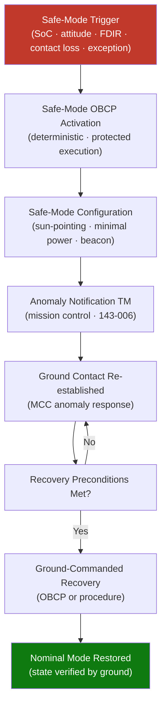

# STA 140-149 · Section 04 · Subsection 144 · Subsubject 007 — Safe-Mode Transition and Recovery Logic

## 1. Purpose

Defines the **autonomous safe-mode entry logic, safe-mode spacecraft configuration, recovery sequences, and ground-handover protocols** for Q+ATLANTIDE STA-band spacecraft, in coordination with flight software safe-mode management (→ `142`) and mission control (→ `143`).

## 2. Scope

- **Safe-mode entry triggers** — safe-mode trigger conditions: battery state-of-charge below critical threshold; attitude loss (GNC divergence detected); multiple simultaneous FDIR activations without successful recovery; loss of ground contact beyond defined duration; software exception rate above safe-mode activation threshold; manual safe-mode command (ground or crew); safe-mode entry is deterministic: defined trigger conditions map to unambiguous safe-mode entry action.
- **Safe-mode spacecraft configuration** — safe-mode configuration target: minimal power consumption, sun-pointing attitude for power generation, minimal avionics activity, maximum telemetry beacon rate, all non-essential loads off; safe-mode OBCP: verified OBCP sequence executing the transition to safe-mode configuration; safe-mode configuration verification: onboard check of achieved configuration against safe-mode target; safe-mode communication mode: periodic housekeeping beacon at maximum RF power on backup antenna.
- **Safe-mode OBCP architecture** — safe-mode OBCP structure: time-sequenced commands with success criteria verification at each step; fallback steps: if step N fails, safe-mode OBCP executes predefined fallback action; safe-mode OBCP execution context: safe-mode OBCP runs in protected execution context with highest priority, cannot be pre-empted by other autonomous functions.
- **Recovery from safe mode** — recovery initiation: explicit ground command required to initiate recovery from safe mode; autonomy recovery authority: no autonomous recovery from safe mode without ground command; recovery sequence: ground-commanded OBCP or procedure sequence to restore nominal spacecraft configuration; recovery validation: ground-verified spacecraft state confirmation before exit from safe mode; recovery preconditions: defined minimum criteria (power, thermal, communications) that must be met before recovery is permitted.
- **Coordination with FSW and mission control** — safe-mode interface with FSW `142`: autonomy triggers the safe-mode entry command via the FSW OBCP execution engine; FSW safe-mode software (→ `142`) manages the low-level command execution; mission control interface (→ `143`): safe-mode entry generates mandatory anomaly notification telemetry; mission control receives safe-mode notification and initiates anomaly response (→ `143-006`); recovery requires mission control ORR before execution.

## 3. Diagram — Safe-Mode Entry and Recovery Flow

## 4. Footprint

| Metric | Value |
|---|---|
| Architecture | `STA` — Space Technology Architecture |
| Master range | `100–199` |
| Code range | `140-149` |
| Section | `04` — Aviónica y Control de Misión Espacial |
| Subsection | `144` — Autonomía |
| Subsubject | `007` — Safe-Mode Transition and Recovery Logic |
| Primary Q-Division | Q-SPACE[^qdiv] |
| ORB support | ORB-PMO, ORB-LEG |
| Governance class | `baseline`[^gov] |
| Document | `007_Safe-Mode-Transition-and-Recovery-Logic.md` (this file) |
| Parent subsection | [`README.md`](./README.md) · [`000_Overview.md`](./000_Overview.md) |

## 5. References & Citations

[^ecssest40c]: **ECSS-E-ST-40C — Software Engineering** — Safe-mode software architecture and OBCP execution requirements.

[^ecssest70c]: **ECSS-E-ST-70C — Ground Systems and Operations** — Ground-commanded recovery and mission control safe-mode response.

[^ecssest7041c]: **ECSS-E-ST-70-41C — Space FDIR** — Safe-mode entry criteria and FDIR recovery architecture.

[^qdiv]: **Q-Division authority** — See [`organization/Q+ATLANTIDE.md` §4](../../../../organization/Q+ATLANTIDE.md#4-notes).

[^gov]: **Governance class** — `baseline`.

### Applicable industry standards

- ECSS-E-ST-40C — Software Engineering[^ecssest40c]
- ECSS-E-ST-70C — Ground Systems and Operations[^ecssest70c]
- ECSS-E-ST-70-41C — Space FDIR[^ecssest7041c]
