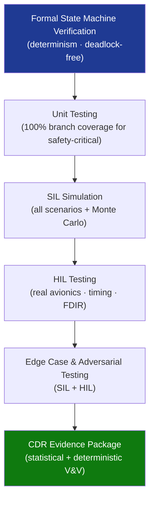

# STA 140-149 · Section 04 · Subsection 144 · Subsubject 008 — Verification, Validation, Simulation and HIL Testing

## 1. Purpose

Defines the **V&V strategy, simulation environment, HIL test architecture, Monte Carlo campaign, and edge case testing requirements** for autonomous functions in Q+ATLANTIDE STA-band spacecraft.

## 2. Scope

- **V&V strategy for autonomous functions** — V&V approach: combination of formal verification (state machine properties), unit testing (individual decision logic components), integration testing (autonomy layer with FSW and avionics interfaces), software-in-the-loop (SIL) simulation, hardware-in-the-loop (HIL) testing, and operational rehearsal; criticality-based V&V depth: autonomy functions classified by safety criticality level, with V&V depth scaled accordingly; coverage targets: 100% branch coverage for safety-critical autonomy decision logic.
- **Simulation environment for autonomy** — high-fidelity spacecraft simulator: reproduces spacecraft dynamics, onboard sensor outputs, FDIR event injection, and telemetry generation; autonomy function test harness: software-in-the-loop environment embedding actual autonomy software in simulation context; simulation scenarios: full nominal mission timeline, LEOP autonomous monitoring, all FDIR trigger scenarios, all safe-mode entry triggers, anomaly injection and recovery sequences, edge cases (simultaneous events, boundary conditions).
- **Hardware-in-the-loop (HIL) testing** — HIL test bench: actual avionics hardware (OBC, avionics units) integrated with spacecraft dynamics simulator; HIL test objectives: verify autonomy software timing in real hardware context; validate OBCP execution timing and response; confirm FDIR isolation actions with real redundancy switchover; test safe-mode OBCP on actual flight hardware; HIL pass criteria: all autonomy responses within specified timing and performance boundaries.
- **Monte Carlo simulation campaign** — Monte Carlo approach: statistical simulation of autonomy function performance across dispersed initial conditions and random anomaly injection; campaign scope: safe-mode entry reliability (no missed entry on valid triggers), false-positive suppression (no spurious safe-mode on nominal conditions), FDIR recovery success rate across component degradation scenarios; Monte Carlo results: statistical evidence of autonomy function robustness presented at CDR.
- **Edge case and adversarial testing** — edge cases: minimum and maximum rate events, simultaneous multi-fault injection, sensor saturation, communication blackout during FDIR activation, power boundary conditions; adversarial scenarios: out-of-range sensor outputs, corrupted OBCP uplink (rejected by validation), conflicting concurrent event triggers; edge case coverage: all identified edge cases exercised in SIL or HIL environment.

## 3. Diagram — Autonomy V&V and Testing Campaign

## 4. Footprint

| Metric | Value |
|---|---|
| Architecture | `STA` — Space Technology Architecture |
| Master range | `100–199` |
| Code range | `140-149` |
| Section | `04` — Aviónica y Control de Misión Espacial |
| Subsection | `144` — Autonomía |
| Subsubject | `008` — Verification, Validation, Simulation and HIL Testing |
| Primary Q-Division | Q-SPACE[^qdiv] |
| ORB support | ORB-PMO, ORB-LEG |
| Governance class | `baseline`[^gov] |
| Document | `008_Verification-Validation-Simulation-and-HIL-Testing.md` (this file) |
| Parent subsection | [`README.md`](./README.md) · [`000_Overview.md`](./000_Overview.md) |

## 5. References & Citations

[^ecssest40c]: **ECSS-E-ST-40C — Software Engineering** — FSW V&V requirements including SIL and HIL testing.

[^ecssest1002c]: **ECSS-E-ST-10-02C — Verification** — General spacecraft verification methodology applicable to autonomy V&V.

[^nasastd87398]: **NASA-STD-8739.8 — Software Assurance Standard** — Software V&V requirements for mission-critical autonomous functions.

[^qdiv]: **Q-Division authority** — See [`organization/Q+ATLANTIDE.md` §4](../../../../organization/Q+ATLANTIDE.md#4-notes).

[^gov]: **Governance class** — `baseline`.

### Applicable industry standards

- ECSS-E-ST-40C — Software Engineering[^ecssest40c]
- ECSS-E-ST-10-02C — Verification[^ecssest1002c]
- NASA-STD-8739.8 — Software Assurance Standard[^nasastd87398]
