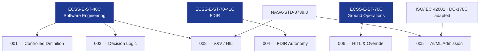

# STA 140-149 · Section 04 · Subsection 144 · Subsubject 009 — ECSS-NASA Autonomy Standards Mapping

## 1. Purpose

Maps the applicable **ECSS and NASA standards** to the spacecraft autonomy functional areas within STA `144`, establishing the normative standards hierarchy for Q+ATLANTIDE STA-band autonomous spacecraft systems.

## 2. Scope

- **ECSS standards applicable to autonomy** — ECSS-E-ST-40C (Software Engineering): primary standard for autonomous software development lifecycle, criticality classification, and V&V requirements; ECSS-E-ST-70-41C (Fault Detection, Isolation and Recovery): FDIR architecture and autonomy interaction requirements; ECSS-E-ST-10-02C (Verification): general verification methodology applicable to autonomy V&V evidence gates; ECSS-E-ST-70C (Ground Systems and Operations): human-in-the-loop and ground override interface requirements; ECSS-Q-ST-80C (Software Product Assurance): autonomy software product assurance and configuration control requirements.
- **NASA standards applicable to autonomy** — NASA-STD-8739.8 (Software Assurance Standard): software assurance requirements for mission-critical autonomous functions; NASA-NPR-7120.5 (Space Systems Development): autonomy requirements within the system development lifecycle; NASA-STD-3001 (Human Integration Design Requirements): crew authority and override interfaces for crewed mission autonomous functions; NASA-HDBK-7120.6 (Lessons Learned): autonomy lessons-learned capture and heritage assessment.
- **Emerging AI/ML standards references** — ISO/IEC 42001 (AI Management System): organisational governance framework for AI systems; DO-178C (adapted): software assurance methodology adapted for AI/ML qualification in space applications; EASA AI Roadmap: aviation AI assurance methodology adapted as reference for space AI/ML autonomy admission.
- **Standards applicability matrix** — mapping of each standards requirement to applicable STA `144` subsubject; identification of deviations and waivers; standards version control and update monitoring; tailoring rationale documented for any standards clause not fully applicable.
- **Standards evolution monitoring** — autonomy and AI/ML standards are actively developing; Q+ATLANTIDE baseline shall monitor ECSS and NASA standards updates in autonomy and AI/ML domains; baseline update process triggered on issuance of new autonomy-relevant standards.

## 3. Diagram — Autonomy Standards Hierarchy

## 4. Footprint

| Metric | Value |
|---|---|
| Architecture | `STA` — Space Technology Architecture |
| Master range | `100–199` |
| Code range | `140-149` |
| Section | `04` — Aviónica y Control de Misión Espacial |
| Subsection | `144` — Autonomía |
| Subsubject | `009` — ECSS-NASA Autonomy Standards Mapping |
| Primary Q-Division | Q-SPACE[^qdiv] |
| ORB support | ORB-PMO, ORB-LEG |
| Governance class | `baseline`[^gov] |
| Document | `009_ECSS-NASA-Autonomy-Standards-Mapping.md` (this file) |
| Parent subsection | [`README.md`](./README.md) · [`000_Overview.md`](./000_Overview.md) |

## 5. References & Citations

[^ecssest40c]: **ECSS-E-ST-40C — Software Engineering** — Primary autonomous software development standard.

[^ecssest7041c]: **ECSS-E-ST-70-41C — Space FDIR** — FDIR architecture and autonomy interaction.

[^ecssest70c]: **ECSS-E-ST-70C — Ground Systems and Operations** — HITL and ground override requirements.

[^nasastd87398]: **NASA-STD-8739.8 — Software Assurance Standard** — NASA autonomy software assurance.

[^isoiec42001]: **ISO/IEC 42001 — AI Management System** — AI governance framework reference.

[^qdiv]: **Q-Division authority** — See [`organization/Q+ATLANTIDE.md` §4](../../../../organization/Q+ATLANTIDE.md#4-notes).

[^gov]: **Governance class** — `baseline`.

### Applicable industry standards

- ECSS-E-ST-40C — Software Engineering[^ecssest40c]
- ECSS-E-ST-70-41C — Space FDIR[^ecssest7041c]
- ECSS-E-ST-70C — Ground Systems and Operations[^ecssest70c]
- NASA-STD-8739.8 — Software Assurance Standard[^nasastd87398]
- ISO/IEC 42001 — AI Management System[^isoiec42001]
