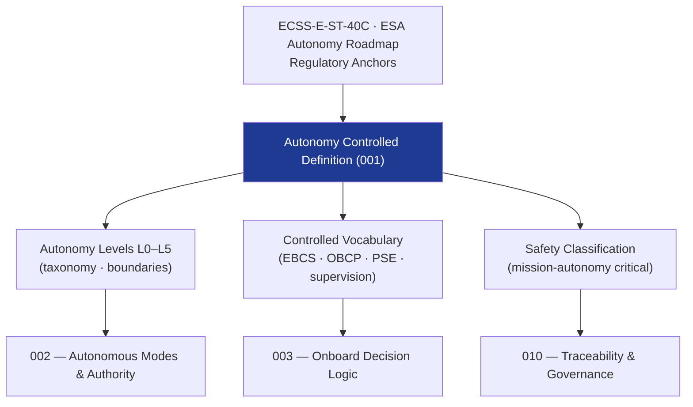

# STA 140-149 · 144-010 — Autonomy Controlled Definition

## 1. Purpose

Establishes the **normative definition and controlled scope** of Spacecraft Autonomy within the Q+ATLANTIDE STA band, per ECSS-E-ST-40C[^ecssest40c] and ESA Autonomy Roadmap[^esaautonomyroadmap].

## 2. Scope

- **Controlled definition** — Spacecraft Autonomy encompasses all onboard functions that enable the spacecraft to detect events, make decisions, and execute actions without real-time ground command intervention, within defined authority boundaries and under verified supervision logic. Autonomy functions operate within the flight software (FSW) framework defined in `142_Software-de-Vuelo`.
- **Applicability boundary** — STA `144` covers onboard autonomous functions (event detection, decision logic, execution management, autonomous FDIR, safe-mode management); excludes GNC algorithm mathematical formulation (→ `140`), avionics hardware design (→ `141`), ground-executed FSW functions (→ `142`), and ground-operated mission control functions (→ `143`).
- **Autonomy levels taxonomy** — Level 0: no autonomy (ground command required for all actions); Level 1: onboard execution of pre-loaded command sequences; Level 2: onboard monitoring with automated safe-mode entry; Level 3: onboard event detection and response within pre-approved decision tables; Level 4: onboard adaptive mission management with goal-driven planning (requires special admission per `005`); Level 5: full autonomous goal management (restricted; requires highest-level admission evidence).
- **Controlled vocabulary** — *Event-Based Command Sequencing (EBCS)*: autonomous command execution triggered by onboard events; *Onboard Control Procedure (OBCP)*: pre-loaded, verified autonomous procedure; *Planning and Scheduling Engine (PSE)*: onboard activity planner; *Supervision logic*: monitoring and intervention logic that constrains autonomous actions within approved boundaries; *authority boundary*: the defined scope of actions an autonomous function may execute without ground confirmation.
- **Safety classification** — mission-autonomy critical; incorrect autonomous decisions may result in loss of spacecraft control, crew safety events, or loss of mission.

## 3. Diagram — Autonomy Scope and Level Classification

## 4. Footprint

| Metric | Value |
|---|---|
| Architecture | `STA` — Space Technology Architecture |
| Master range | `100–199` |
| Code range | `140-149` |
| Section | `04` — Aviónica y Control de Misión Espacial |
| Subsection | `144` — Autonomía |
| Subsubject | `001` — Autonomy Controlled Definition |
| Primary Q-Division | Q-SPACE[^qdiv] |
| ORB support | ORB-PMO, ORB-LEG |
| Governance class | `baseline`[^gov] |
| Document | `144-010-Autonomy-Controlled-Definition.md` (this file) |
| Parent subsection | [`README.md`](./README.md) · [`144-000-General.md`](./144-000-General.md) |

## 5. References & Citations

[^ecssest40c]: **ECSS-E-ST-40C — Software Engineering** — FSW development lifecycle and criticality classification applicable to autonomous software.

[^esaautonomyroadmap]: **ESA Autonomy Roadmap** — ESA strategic guidance on spacecraft autonomy levels and assurance requirements.

[^qdiv]: **Q-Division authority** — See [`organization/Q+ATLANTIDE.md` §4](../../../../organization/Q+ATLANTIDE.md#4-notes).

[^gov]: **Governance class** — `baseline`.

### Applicable industry standards

- ECSS-E-ST-40C — Software Engineering[^ecssest40c]
- ESA Autonomy Roadmap[^esaautonomyroadmap]
