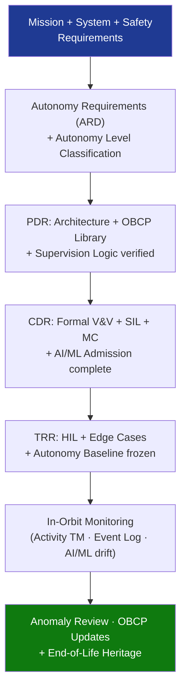

# STA 140-149 · 144-090 — Traceability Evidence and Lifecycle Governance

## 1. Purpose

Establishes **autonomy requirements traceability, design evidence gates, AI/ML admission evidence, in-orbit autonomy monitoring, and lifecycle configuration control** for spacecraft autonomous functions on Q+ATLANTIDE STA-band missions.

## 2. Scope

- **Autonomy requirements traceability** — all autonomy requirements traced from mission requirements, spacecraft system requirements, and safety requirements; traceability matrix: requirement → autonomy function → decision logic component → test case → SIL/HIL evidence → V&V evidence artefact; bidirectional traceability maintained throughout development; deviations and waivers formally registered and approved; AI/ML admission decisions maintained as separate register entries with full evidence citations.
- **Evidence gates** — SRR: autonomy requirements baselined (Autonomy Requirements Document approved), autonomy level classification for each function defined; PDR: autonomy architecture design frozen, OBCP library architecture defined, supervision logic architecture verified; CDR: formal state machine verification complete, 100% branch coverage demonstrated for safety-critical autonomy functions, SIL simulation campaign complete (including Monte Carlo), all AI/ML admission decisions documented; TRR: HIL campaign complete, all edge cases tested, all V&V evidence reviewed, autonomy baseline frozen; ORR: operational autonomy configuration validated in simulation rehearsal; pre-launch: final autonomy configuration baseline frozen, all OBCP library items validated.
- **AI/ML admission evidence register** — for each AI/ML algorithm admitted per `005`: admission decision record (criteria checklist, evidence summary, approving authority); performance characterisation report (test dataset, coverage statistics, confidence intervals, out-of-distribution sensitivity); assurance evidence package (formal verification results or test evidence); post-admission monitoring plan; re-admission trigger conditions.
- **In-orbit autonomy monitoring** — autonomy activity telemetry: continuous reporting of active autonomy mode, inhibit states, OBCP execution status; autonomy event log: all event detections, autonomous actions, FDIR activations, safe-mode entries/exits with timestamps; AI/ML performance monitoring: in-flight distribution shift monitoring with alert thresholds; anomaly-triggered autonomy review: formal review of autonomy behaviour following Level 2+ anomalies where autonomy was active.
- **Lifecycle configuration control** — controlled configuration items: OBCP library, event-action tables, autonomy mode configuration, AI/ML algorithm instances and parameters; change control board (CCB) for all autonomy configuration changes; in-orbit OBCP update process: simulation validation → uplink validation → ground approval → in-orbit update → in-orbit verification; end-of-life governance: autonomy function decommissioning review, heritage database contribution, lessons-learned capture.

## 3. Diagram — Autonomy Traceability and Lifecycle Governance

## 4. Footprint

| Metric | Value |
|---|---|
| Architecture | `STA` — Space Technology Architecture |
| Master range | `100–199` |
| Code range | `140-149` |
| Section | `04` — Aviónica y Control de Misión Espacial |
| Subsection | `144` — Autonomía |
| Subsubject | `010` — Traceability, Evidence and Lifecycle Governance |
| Primary Q-Division | Q-SPACE[^qdiv] |
| ORB support | ORB-PMO, ORB-LEG |
| Governance class | `baseline`[^gov] |
| Document | `144-090-Traceability-Evidence-and-Lifecycle-Governance.md` (this file) |
| Parent subsection | [`README.md`](./README.md) · [`144-000-General.md`](./144-000-General.md) |

## 5. References & Citations

[^ecssest40c]: **ECSS-E-ST-40C — Software Engineering** — FSW lifecycle documentation, traceability, and configuration control requirements.

[^ecssqst80c]: **ECSS-Q-ST-80C — Software Product Assurance** — Software product assurance and configuration control requirements.

[^ecssest1002c]: **ECSS-E-ST-10-02C — Verification** — General verification methodology including evidence gates and lifecycle records.

[^qdiv]: **Q-Division authority** — See [`organization/Q+ATLANTIDE.md` §4](../../../../organization/Q+ATLANTIDE.md#4-notes).

[^gov]: **Governance class** — `baseline`.

### Applicable industry standards

- ECSS-E-ST-40C — Software Engineering[^ecssest40c]
- ECSS-Q-ST-80C — Software Product Assurance[^ecssqst80c]
- ECSS-E-ST-10-02C — Verification[^ecssest1002c]
