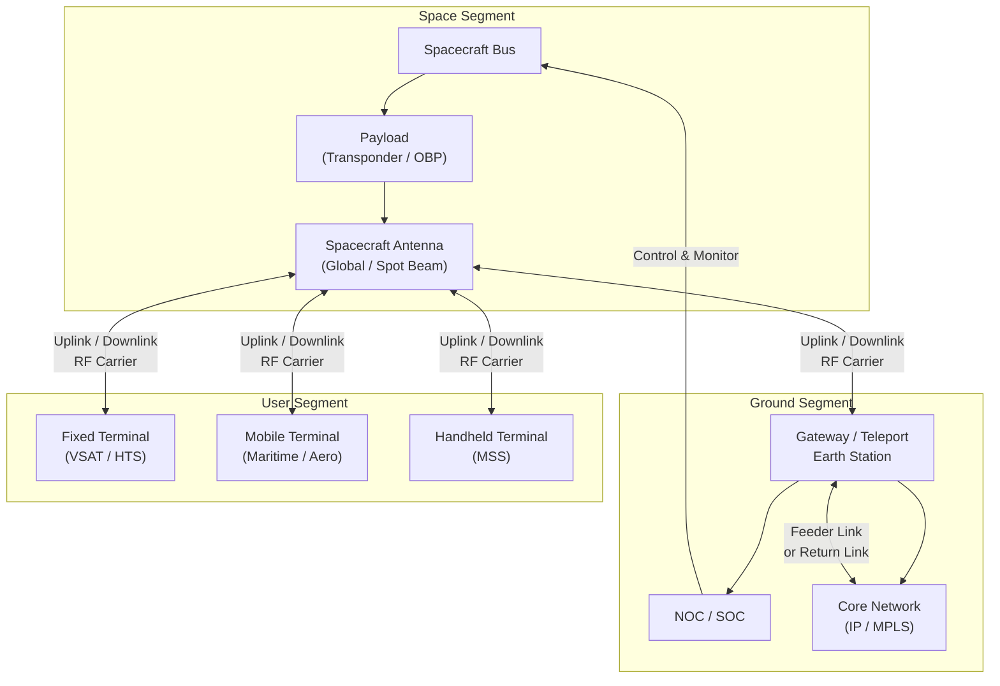

# STA 150-159 · 05.150.002 — Satellite Communication Architecture

## §1 Purpose

This document defines the complete three-segment link architecture for satellite communications within Q+ATLANTIDE: the **space segment**, the **ground segment**, and the **user segment**.[^baseline] It establishes the functional decomposition of each segment, the inter-segment interfaces, and the architecture-level constraints that govern transponder selection, network topology design, and power/mass budget trade-offs.[^ecss50] All SATCOM architecture artefacts produced within Q+ATLANTIDE missions shall conform to the segment model defined here.[^n001]

## §2 Scope

**In scope:**

- Space segment definition: spacecraft bus, payload (transponders, amplifiers, antennas), attitude and orbit control, and power subsystem as architecture drivers.
- Transponder types: bent-pipe (frequency-translating) transponders vs. regenerative (on-board processing, OBP) transponders — functional characteristics and applicability criteria.
- Ground segment definition: gateway earth stations, teleport facilities, network operations centres (NOC), satellite operations centres (SOC), and ground-segment redundancy architecture.
- User segment definition: user terminals (fixed, mobile, maritime, aeronautical), user-segment interface standards, and terminal mobility management.
- Network topology classification: star topology (hub-and-spoke), mesh topology (direct inter-terminal), and multi-beam HTS topology — applicability per mission type.
- Beam coverage architecture: single global beam, regional beam, spot beam, and frequency-reuse schemes; and power/mass budget drivers for each topology.[^ccsds401]

**Out of scope:** Physical-layer link-budget calculations (subsubject 003), RF antenna specifications (subsubject 004), and ground-station network interfaces (subsubject 006).

## §3 Diagram

## §4 Footprint

| Attribute | Value |
|-----------|-------|
| Architecture | Space Technology Architecture (STA) |
| Master range | 100–199 |
| Code range | 150-159 |
| Section | 05 |
| Subsection | 150 |
| Subsubject | 002 |
| Primary Q-Division | Q-SPACE[^qdiv] |
| Support Q-Divisions | Q-DATAGOV, Q-HPC |
| ORB support | ORB-PMO, ORB-LEG |
| Governance class | baseline[^gov] |
| Folder path | `Q+ATLANTIDE/100-199_STA/150-159_Comunicaciones-Espaciales/150_SATCOM/` |
| Document | `002_Satellite-Communication-Architecture.md` |
| Parent subsection | [README.md](../README.md) · [000_Overview.md](./000_Overview.md) |
| Parent architecture | [../../README.md](../../README.md) |
| Parent baseline | [organization/Q+ATLANTIDE.md](../../../../organization/Q+ATLANTIDE.md) |

## §5 References & Citations

[^baseline]: Q+ATLANTIDE controlled baseline — the authoritative taxonomy and traceability ecosystem governing all Space Technology Architecture documents.
[^archtable]: §3 Architecture Table (parent) — see [../../README.md](../../README.md) for the master architecture index.
[^qdiv]: Q-Division authority — Q-SPACE is the primary authority for all space-segment and satellite communication standards within Q+ATLANTIDE.
[^gov]: Governance class `baseline` — documents in this class are subject to formal change control under ORB-PMO and ORB-LEG review gates.
[^n001]: Note N-001: Q+ATLANTIDE is a taxonomy and traceability ecosystem; definitions herein are normative within the Q+ATLANTIDE register only.
[^ecss50]: ECSS-E-ST-50C — *Space engineering: Communications*, European Cooperation for Space Standardization, 31 July 2008.
[^ccsds401]: CCSDS 401.0-B — *Radio Frequency and Modulation Systems*, Consultative Committee for Space Data Systems, Blue Book.
[^itur]: ITU-R S.1003 — *Environmental protection of the geostationary-satellite orbit*, International Telecommunication Union Radiocommunication Sector.
[^nasa4005]: NASA-STD-4005 — *Low Earth Orbit Spacecraft Charging Design Standard*, NASA Technical Standards Program.

### Applicable industry standards

| Standard | Title | Body |
|----------|-------|------|
| ECSS-E-ST-50C | Space engineering: Communications | ECSS |
| CCSDS 401.0-B | Radio Frequency and Modulation Systems | CCSDS |
| ITU-R S.1003 | Environmental protection of the geostationary-satellite orbit | ITU-R |
| NASA-STD-4005 | Low Earth Orbit Spacecraft Charging Design Standard | NASA |
