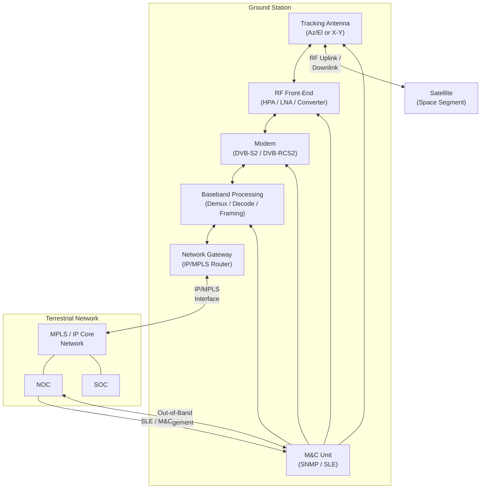

# STA 150-159 · 05.150.006 — Ground Station and Network Interfaces

## §1 Purpose

This document defines the functional elements of the SATCOM ground station and the normative interface specifications between the ground station and the terrestrial network infrastructure within Q+ATLANTIDE.[^baseline] It establishes the decomposition of the ground station into antenna, front-end, modem, baseband, and network-gateway subsystems, and specifies the applicable ground-to-network interface standards (IP/MPLS, DVB-S2/DVB-RCS2).[^ecss50] NOC/SOC connectivity architecture and antenna tracking requirements are also governed herein.[^n001]

## §2 Scope

**In scope:**

- Ground station functional element definitions: tracking antenna subsystem (Az/El or X-Y mount with auto-tracking), RF front-end (HPA, LNA, frequency converter), modem subsystem (DVB-S2/DVB-S2X forward link, DVB-RCS2 return link), baseband processing unit (demultiplexer, decoding, frame processing), and network gateway (IP/MPLS router/switch).
- Ground-to-network interface standards: IP encapsulation over DVB-S2 (EN 301 790), Generic Stream Encapsulation (GSE, EN 302 307-2), MPLS transport, and VLAN segmentation requirements for multi-mission ground stations.
- Antenna tracking modes: programme-track (ephemeris-driven), auto-track (beacon-based), and hybrid mode — pointing accuracy budgets and handover procedures for LEO pass contacts.
- NOC/SOC connectivity: secure management plane (out-of-band), monitor-and-control (M&C) interface protocol (SNMP/CORBA/SLE), and Space Link Extension (SLE) return-all-frames and forward-TC services (CCSDS 911.1-B).[^ccsds401]
- Ground station redundancy and availability requirements: active/standby antenna configurations, N+1 modem redundancy, and diversity site planning for rain-fade mitigation.

**Out of scope:** TC/TM protocol layer definitions (subsubject 005), COMSEC architecture (subsubject 007), and interference coordination (subsubject 008).

## §3 Diagram

## §4 Footprint

| Attribute | Value |
|-----------|-------|
| Architecture | Space Technology Architecture (STA) |
| Master range | 100–199 |
| Code range | 150-159 |
| Section | 05 |
| Subsection | 150 |
| Subsubject | 006 |
| Primary Q-Division | Q-SPACE[^qdiv] |
| Support Q-Divisions | Q-DATAGOV, Q-HPC |
| ORB support | ORB-PMO, ORB-LEG |
| Governance class | baseline[^gov] |
| Folder path | `Q+ATLANTIDE/100-199_STA/150-159_Comunicaciones-Espaciales/150_SATCOM/` |
| Document | `006_Ground-Station-and-Network-Interfaces.md` |
| Parent subsection | [README.md](../README.md) · [000_Overview.md](./000_Overview.md) |
| Parent architecture | [../../README.md](../../README.md) |
| Parent baseline | [organization/Q+ATLANTIDE.md](../../../../organization/Q+ATLANTIDE.md) |

## §5 References & Citations

[^baseline]: Q+ATLANTIDE controlled baseline — the authoritative taxonomy and traceability ecosystem governing all Space Technology Architecture documents.
[^archtable]: §3 Architecture Table (parent) — see [../../README.md](../../README.md) for the master architecture index.
[^qdiv]: Q-Division authority — Q-SPACE is the primary authority for all space-segment and satellite communication standards within Q+ATLANTIDE.
[^gov]: Governance class `baseline` — documents in this class are subject to formal change control under ORB-PMO and ORB-LEG review gates.
[^n001]: Note N-001: Q+ATLANTIDE is a taxonomy and traceability ecosystem; definitions herein are normative within the Q+ATLANTIDE register only.
[^ecss50]: ECSS-E-ST-50C — *Space engineering: Communications*, European Cooperation for Space Standardization, 31 July 2008.
[^ccsds401]: CCSDS 401.0-B — *Radio Frequency and Modulation Systems*, Consultative Committee for Space Data Systems, Blue Book.
[^ccsds131]: CCSDS 131.0-B — *TM Synchronization and Channel Coding*, Consultative Committee for Space Data Systems, Blue Book.
[^ccsds132]: CCSDS 132.0-B — *TM Space Data Link Protocol*, Consultative Committee for Space Data Systems, Blue Book.
[^ccsds133]: CCSDS 133.0-B — *Encapsulation Service*, Consultative Committee for Space Data Systems, Blue Book.
[^itur]: ITU-R S.1003 — *Environmental protection of the geostationary-satellite orbit*, International Telecommunication Union Radiocommunication Sector.
[^nasa4005]: NASA-STD-4005 — *Low Earth Orbit Spacecraft Charging Design Standard*, NASA Technical Standards Program.

### Applicable industry standards

| Standard | Title | Body |
|----------|-------|------|
| ECSS-E-ST-50C | Space engineering: Communications | ECSS |
| CCSDS 401.0-B | Radio Frequency and Modulation Systems | CCSDS |
| CCSDS 131.0-B | TM Synchronization and Channel Coding | CCSDS |
| CCSDS 132.0-B | TM Space Data Link Protocol | CCSDS |
| CCSDS 133.0-B | Encapsulation Service | CCSDS |
| ITU-R S.1003 | Environmental protection of the geostationary-satellite orbit | ITU-R |
| NASA-STD-4005 | Low Earth Orbit Spacecraft Charging Design Standard | NASA |
