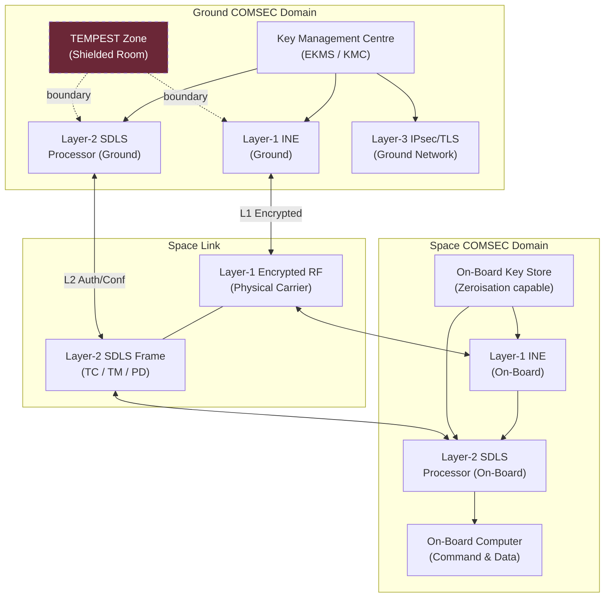

# STA 150-159 · 05.150.007 — Encryption, Authentication and COMSEC Boundaries

## §1 Purpose

This document defines the Communications Security (COMSEC) architecture applicable to all SATCOM links within Q+ATLANTIDE registered missions.[^baseline] It establishes the encryption boundary model across Layer 1 (physical), Layer 2 (data link), and Layer 3 (network) — with specific applicability to TC, TM, and payload data links — and governs key management integration with the Electronic Key Management System (EKMS).[^ecss50] TEMPEST considerations and the formal Q+ATLANTIDE COMSEC boundary declarations required in ICDs are also specified herein.[^n001]

## §2 Scope

**In scope:**

- Link encryption classification: Layer 1 physical-layer encryption (inline network encryptor, INE), Layer 2 CCSDS Space Data Link Security (SDLS, CCSDS 355.0-B) authentication and confidentiality, and Layer 3 IPsec/TLS for ground-segment IP bearers.
- Key management architecture: Electronic Key Management System (EKMS) integration, key generation and distribution procedures, key lifetime and re-keying intervals, split-key authority, and zeroisation requirements for on-board and ground key stores.
- Authentication protocols: HMAC-SHA-256 for TC command authentication (CCSDS SDLS), mutual authentication for SLE ground interfaces, and PKI certificate management for ground-network equipment.[^ccsds132]
- TEMPEST considerations: emission security classification per NATO SDIP-27 Level A/B/C, shielding requirements for ground-station equipment rooms, and tempest-zone boundary declaration.
- Q+ATLANTIDE COMSEC boundary declarations: formal identification of encryption domain boundaries in ICDs — plaintext vs. ciphertext segments, classification break points, and cross-domain interface control.

**Out of scope:** Physical RF interference and jamming countermeasures (subsubject 008), ground-station network architecture (subsubject 006), and classification authority for national cryptographic material.

## §3 Diagram

## §4 Footprint

| Attribute | Value |
|-----------|-------|
| Architecture | Space Technology Architecture (STA) |
| Master range | 100–199 |
| Code range | 150-159 |
| Section | 05 |
| Subsection | 150 |
| Subsubject | 007 |
| Primary Q-Division | Q-SPACE[^qdiv] |
| Support Q-Divisions | Q-DATAGOV, Q-HPC |
| ORB support | ORB-PMO, ORB-LEG |
| Governance class | baseline[^gov] |
| Folder path | `Q+ATLANTIDE/100-199_STA/150-159_Comunicaciones-Espaciales/150_SATCOM/` |
| Document | `007_Encryption-Authentication-and-COMSEC-Boundaries.md` |
| Parent subsection | [README.md](../README.md) · [000_Overview.md](./000_Overview.md) |
| Parent architecture | [../../README.md](../../README.md) |
| Parent baseline | [organization/Q+ATLANTIDE.md](../../../../organization/Q+ATLANTIDE.md) |

## §5 References & Citations

[^baseline]: Q+ATLANTIDE controlled baseline — the authoritative taxonomy and traceability ecosystem governing all Space Technology Architecture documents.
[^archtable]: §3 Architecture Table (parent) — see [../../README.md](../../README.md) for the master architecture index.
[^qdiv]: Q-Division authority — Q-SPACE is the primary authority for all space-segment and satellite communication standards within Q+ATLANTIDE.
[^gov]: Governance class `baseline` — documents in this class are subject to formal change control under ORB-PMO and ORB-LEG review gates.
[^n001]: Note N-001: Q+ATLANTIDE is a taxonomy and traceability ecosystem; definitions herein are normative within the Q+ATLANTIDE register only.
[^ecss50]: ECSS-E-ST-50C — *Space engineering: Communications*, European Cooperation for Space Standardization, 31 July 2008.
[^ccsds401]: CCSDS 401.0-B — *Radio Frequency and Modulation Systems*, Consultative Committee for Space Data Systems, Blue Book.
[^ccsds131]: CCSDS 131.0-B — *TM Synchronization and Channel Coding*, Consultative Committee for Space Data Systems, Blue Book.
[^ccsds132]: CCSDS 132.0-B — *TM Space Data Link Protocol*, Consultative Committee for Space Data Systems, Blue Book.
[^ccsds133]: CCSDS 133.0-B — *Encapsulation Service*, Consultative Committee for Space Data Systems, Blue Book.
[^itur]: ITU-R S.1003 — *Environmental protection of the geostationary-satellite orbit*, International Telecommunication Union Radiocommunication Sector.
[^nasa4005]: NASA-STD-4005 — *Low Earth Orbit Spacecraft Charging Design Standard*, NASA Technical Standards Program.

### Applicable industry standards

| Standard | Title | Body |
|----------|-------|------|
| ECSS-E-ST-50C | Space engineering: Communications | ECSS |
| CCSDS 401.0-B | Radio Frequency and Modulation Systems | CCSDS |
| CCSDS 131.0-B | TM Synchronization and Channel Coding | CCSDS |
| CCSDS 132.0-B | TM Space Data Link Protocol | CCSDS |
| CCSDS 133.0-B | Encapsulation Service | CCSDS |
| ITU-R S.1003 | Environmental protection of the geostationary-satellite orbit | ITU-R |
| NASA-STD-4005 | Low Earth Orbit Spacecraft Charging Design Standard | NASA |
