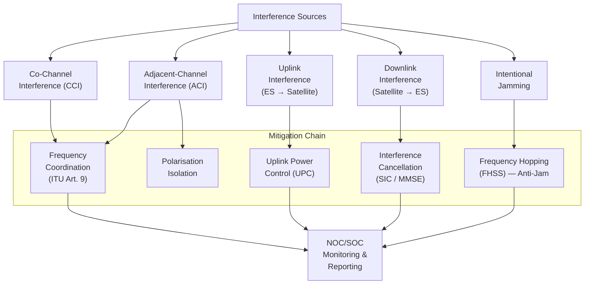

# STA 150-159 · 05.150.008 — Interference, Spectrum and Regulatory Constraints

## §1 Purpose

This document defines the interference classification taxonomy, spectrum-coordination obligations, and mitigation techniques applicable to SATCOM links within Q+ATLANTIDE.[^baseline] It establishes the normative framework for identifying, characterising, and mitigating all interference types — co-channel, adjacent-channel, uplink, downlink, and intentional jamming — and maps the ITU Radio Regulations Article 9 coordination process to Q+ATLANTIDE mission lifecycle gates.[^itur][^ecss50] Compliance with this document is mandatory for all Q+ATLANTIDE missions filing frequencies with the ITU.[^n001]

## §2 Scope

**In scope:**

- Interference type classification: co-channel interference (CCI), adjacent-channel interference (ACI), uplink interference (earth-station to satellite), downlink interference (satellite to earth-station), inter-satellite interference, and intentional jamming — definitions, C/I threshold criteria, and mission impact classification.
- Spectrum coordination under ITU Radio Regulations Article 9: coordination trigger thresholds (pfd levels per ITU-R S.1432), advance publication, coordination request, and notification procedures; national administration roles and timelines.
- Mitigation techniques: frequency coordination and guard-band allocation, uplink power control (UPC) and automatic level control (ALC), polarisation isolation for frequency reuse, interference cancellation algorithms (SIC, MMSE), and frequency-hopping spread-spectrum (FHSS) for anti-jamming.[^ccsds401]
- Spectrum monitoring and anomaly reporting: in-orbit interference monitoring, carrier-ID (DVB CID per EN 303 961), and mandatory interference reporting to NOC/SOC and ITU.
- Regulatory constraint register: per-mission table of allocated frequencies, coordination agreements, and regulatory filing status — linkage to evidence package in subsubject 010.

**Out of scope:** COMSEC anti-jamming key management (subsubject 007), link-budget rain-fade margin (subsubject 003), and antenna sidelobe suppression design (subsubject 004).

## §3 Diagram

## §4 Footprint

| Attribute | Value |
|-----------|-------|
| Architecture | Space Technology Architecture (STA) |
| Master range | 100–199 |
| Code range | 150-159 |
| Section | 05 |
| Subsection | 150 |
| Subsubject | 008 |
| Primary Q-Division | Q-SPACE[^qdiv] |
| Support Q-Divisions | Q-DATAGOV, Q-HPC |
| ORB support | ORB-PMO, ORB-LEG |
| Governance class | baseline[^gov] |
| Folder path | `Q+ATLANTIDE/100-199_STA/150-159_Comunicaciones-Espaciales/150_SATCOM/` |
| Document | `008_Interference-Spectrum-and-Regulatory-Constraints.md` |
| Parent subsection | [README.md](../README.md) · [000_Overview.md](./000_Overview.md) |
| Parent architecture | [../../README.md](../../README.md) |
| Parent baseline | [organization/Q+ATLANTIDE.md](../../../../organization/Q+ATLANTIDE.md) |

## §5 References & Citations

[^baseline]: Q+ATLANTIDE controlled baseline — the authoritative taxonomy and traceability ecosystem governing all Space Technology Architecture documents.
[^archtable]: §3 Architecture Table (parent) — see [../../README.md](../../README.md) for the master architecture index.
[^qdiv]: Q-Division authority — Q-SPACE is the primary authority for all space-segment and satellite communication standards within Q+ATLANTIDE.
[^gov]: Governance class `baseline` — documents in this class are subject to formal change control under ORB-PMO and ORB-LEG review gates.
[^n001]: Note N-001: Q+ATLANTIDE is a taxonomy and traceability ecosystem; definitions herein are normative within the Q+ATLANTIDE register only.
[^ecss50]: ECSS-E-ST-50C — *Space engineering: Communications*, European Cooperation for Space Standardization, 31 July 2008.
[^ccsds401]: CCSDS 401.0-B — *Radio Frequency and Modulation Systems*, Consultative Committee for Space Data Systems, Blue Book.
[^itur]: ITU-R S.1003 — *Environmental protection of the geostationary-satellite orbit*, International Telecommunication Union Radiocommunication Sector.
[^nasa4005]: NASA-STD-4005 — *Low Earth Orbit Spacecraft Charging Design Standard*, NASA Technical Standards Program.

### Applicable industry standards

| Standard | Title | Body |
|----------|-------|------|
| ECSS-E-ST-50C | Space engineering: Communications | ECSS |
| CCSDS 401.0-B | Radio Frequency and Modulation Systems | CCSDS |
| ITU-R S.1003 | Environmental protection of the geostationary-satellite orbit | ITU-R |
| NASA-STD-4005 | Low Earth Orbit Spacecraft Charging Design Standard | NASA |
