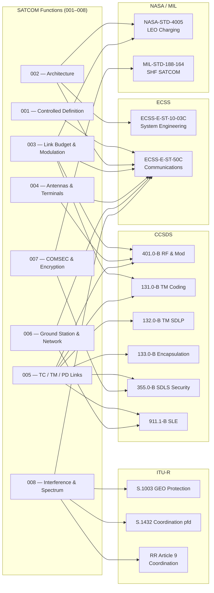

# STA 150-159 · 05.150.009 — ECSS, CCSDS, ITU and NASA Standards Mapping

## §1 Purpose

This document provides the authoritative mapping of each SATCOM function defined in subsubjects 001–008 to the applicable normative standard, covering ECSS, CCSDS, ITU-R, NASA, and MIL-STD bodies.[^baseline] It is the single reference for standards applicability within Q+ATLANTIDE SATCOM artefacts, enabling traceability from functional requirement to normative source in ICDs, design justification files, and review-gate checklists.[^ecss50][^ccsds401] Any deviation from a mapped standard shall be recorded in a formal non-conformance waiver traceable to this document.[^n001]

## §2 Scope

**In scope:**

- Function-to-standard mapping for: system engineering (ECSS-E-ST-10-03C), communications (ECSS-E-ST-50C), RF and modulation (CCSDS 401.0-B), TM channel coding (CCSDS 131.0-B), TM space data link protocol (CCSDS 132.0-B), encapsulation service (CCSDS 133.0-B), TC synchronisation and channel coding (CCSDS 231.0-B), TC space data link protocol (CCSDS 232.0-B), space data link security (CCSDS 355.0-B), file delivery (CCSDS 727.0-B), and space link extension (CCSDS 911.1-B).[^ccsds131][^ccsds132][^ccsds133]
- ITU-R S-series standards applicability: S.580 (GEO arc protection), S.1003 (GEO orbit environmental protection), S.1432 (pfd coordination threshold), S.1503 (FSS power flux-density limits), and ITU Radio Regulations Article 9 coordination procedure.[^itur]
- NASA standards: NASA-STD-4005 (LEO spacecraft charging), NASA-HDBK-4006 (LEO charging design handbook), and NASA-STD-7003 (pyroshock).[^nasa4005]
- Military standards: MIL-STD-188-164 (interoperability and performance standards for SHF SATCOM terminals).
- Mapping table structure: Function | Subsubject ref | Standard | Standard body | Applicability condition | Waiver path.

**Out of scope:** Internal Q+ATLANTIDE process standards (ORB-PMO), national cryptographic standards (classified), and standards for optical/laser links (separate STA subsection).

## §3 Diagram

## §4 Footprint

| Attribute | Value |
|-----------|-------|
| Architecture | Space Technology Architecture (STA) |
| Master range | 100–199 |
| Code range | 150-159 |
| Section | 05 |
| Subsection | 150 |
| Subsubject | 009 |
| Primary Q-Division | Q-SPACE[^qdiv] |
| Support Q-Divisions | Q-DATAGOV, Q-HPC |
| ORB support | ORB-PMO, ORB-LEG |
| Governance class | baseline[^gov] |
| Folder path | `Q+ATLANTIDE/100-199_STA/150-159_Comunicaciones-Espaciales/150_SATCOM/` |
| Document | `009_ECSS-CCSDS-ITU-and-NASA-Standards-Mapping.md` |
| Parent subsection | [README.md](../README.md) · [000_Overview.md](./000_Overview.md) |
| Parent architecture | [../../README.md](../../README.md) |
| Parent baseline | [organization/Q+ATLANTIDE.md](../../../../organization/Q+ATLANTIDE.md) |

## §5 References & Citations

[^baseline]: Q+ATLANTIDE controlled baseline — the authoritative taxonomy and traceability ecosystem governing all Space Technology Architecture documents.
[^archtable]: §3 Architecture Table (parent) — see [../../README.md](../../README.md) for the master architecture index.
[^qdiv]: Q-Division authority — Q-SPACE is the primary authority for all space-segment and satellite communication standards within Q+ATLANTIDE.
[^gov]: Governance class `baseline` — documents in this class are subject to formal change control under ORB-PMO and ORB-LEG review gates.
[^n001]: Note N-001: Q+ATLANTIDE is a taxonomy and traceability ecosystem; definitions herein are normative within the Q+ATLANTIDE register only.
[^ecss50]: ECSS-E-ST-50C — *Space engineering: Communications*, European Cooperation for Space Standardization, 31 July 2008.
[^ccsds401]: CCSDS 401.0-B — *Radio Frequency and Modulation Systems*, Consultative Committee for Space Data Systems, Blue Book.
[^ccsds131]: CCSDS 131.0-B — *TM Synchronization and Channel Coding*, Consultative Committee for Space Data Systems, Blue Book.
[^ccsds132]: CCSDS 132.0-B — *TM Space Data Link Protocol*, Consultative Committee for Space Data Systems, Blue Book.
[^ccsds133]: CCSDS 133.0-B — *Encapsulation Service*, Consultative Committee for Space Data Systems, Blue Book.
[^itur]: ITU-R S.1003 — *Environmental protection of the geostationary-satellite orbit*, International Telecommunication Union Radiocommunication Sector.
[^nasa4005]: NASA-STD-4005 — *Low Earth Orbit Spacecraft Charging Design Standard*, NASA Technical Standards Program.

### Applicable industry standards

| Standard | Title | Body |
|----------|-------|------|
| ECSS-E-ST-10-03C | Space engineering: Testing | ECSS |
| ECSS-E-ST-50C | Space engineering: Communications | ECSS |
| CCSDS 401.0-B | Radio Frequency and Modulation Systems | CCSDS |
| CCSDS 131.0-B | TM Synchronization and Channel Coding | CCSDS |
| CCSDS 132.0-B | TM Space Data Link Protocol | CCSDS |
| CCSDS 133.0-B | Encapsulation Service | CCSDS |
| CCSDS 355.0-B | Space Data Link Security Protocol | CCSDS |
| CCSDS 911.1-B | Space Link Extension — Return All Frames | CCSDS |
| ITU-R S.1003 | Environmental protection of the geostationary-satellite orbit | ITU-R |
| ITU-R S.1432 | Apportionment of the allowable error performance degradations | ITU-R |
| ITU RR Article 9 | Coordination procedures | ITU |
| NASA-STD-4005 | Low Earth Orbit Spacecraft Charging Design Standard | NASA |
| MIL-STD-188-164 | Interoperability and Performance Standards for SHF SATCOM Terminals | DoD |
