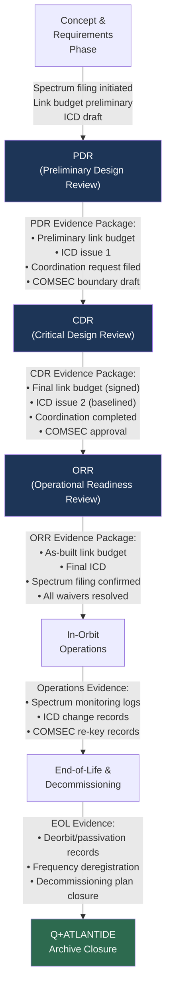

# STA 150-159 · 05.150.010 — Traceability, Evidence and Lifecycle Governance

## §1 Purpose

This document defines the evidence package requirements, traceability obligations, and lifecycle governance framework for the entire SATCOM subsection (`150`) within Q+ATLANTIDE.[^baseline] It establishes what artefacts must be produced and retained at each mission lifecycle phase — from concept definition through launch, operations, and end-of-life decommissioning — and specifies the formal review gates (PDR, CDR, ORR) at which SATCOM evidence packages are assessed.[^ecss50] All missions registered under Q+ATLANTIDE shall maintain a living SATCOM evidence register traceable to this document.[^n001]

## §2 Scope

**In scope:**

- Link-budget evidence packages: formal link-budget calculation files (Excel/MathCAD/Python), worst-case margin analysis, seasonal and solar-flux variation analysis, and closure confirmation signed-off at CDR.
- ICD traceability: Interface Control Documents for each SATCOM interface (space–ground TC/TM, space–ground HRDL, ground–network), requirements allocation matrix (RAM) linking ICD items to system requirements, and ICD change control records.
- Spectrum filing evidence: ITU advance publication submission, coordination agreement records (Article 9 outcome), national frequency assignment authorisation, and in-orbit spectrum monitoring compliance records referenced to subsubject 008.
- COMSEC approval records: EKMS key-generation authorisation, COMSEC boundary approval authority sign-off, TEMPEST zone certification, and periodic re-key compliance evidence referenced to subsubject 007.
- Review gate evidence matrix: PDR (link-budget preliminary closure, ICD issue 1, spectrum coordination initiated), CDR (link-budget final closure, ICD issue 2 baselined, spectrum coordination completed, COMSEC boundary approved), ORR (as-built link budget, final ICD, spectrum filing confirmed, all waivers closed or accepted).
- Lifecycle end-of-life records: decommissioning plan, frequency deregistration with national administration, satellite passivation/deorbit evidence per ECSS-U-AS-10C, and Q+ATLANTIDE archive closure notice.

**Out of scope:** Day-to-day operational monitoring procedures (covered by SOC operations manual), in-orbit anomaly resolution procedures, and non-SATCOM mission evidence packages.

## §3 Diagram

## §4 Footprint

| Attribute | Value |
|-----------|-------|
| Architecture | Space Technology Architecture (STA) |
| Master range | 100–199 |
| Code range | 150-159 |
| Section | 05 |
| Subsection | 150 |
| Subsubject | 010 |
| Primary Q-Division | Q-SPACE[^qdiv] |
| Support Q-Divisions | Q-DATAGOV, Q-HPC |
| ORB support | ORB-PMO, ORB-LEG |
| Governance class | baseline[^gov] |
| Folder path | `Q+ATLANTIDE/100-199_STA/150-159_Comunicaciones-Espaciales/150_SATCOM/` |
| Document | `010_Traceability-Evidence-and-Lifecycle-Governance.md` |
| Parent subsection | [README.md](../README.md) · [000_Overview.md](./000_Overview.md) |
| Parent architecture | [../../README.md](../../README.md) |
| Parent baseline | [organization/Q+ATLANTIDE.md](../../../../organization/Q+ATLANTIDE.md) |

## §5 References & Citations

[^baseline]: Q+ATLANTIDE controlled baseline — the authoritative taxonomy and traceability ecosystem governing all Space Technology Architecture documents.
[^archtable]: §3 Architecture Table (parent) — see [../../README.md](../../README.md) for the master architecture index.
[^qdiv]: Q-Division authority — Q-SPACE is the primary authority for all space-segment and satellite communication standards within Q+ATLANTIDE.
[^gov]: Governance class `baseline` — documents in this class are subject to formal change control under ORB-PMO and ORB-LEG review gates.
[^n001]: Note N-001: Q+ATLANTIDE is a taxonomy and traceability ecosystem; definitions herein are normative within the Q+ATLANTIDE register only.
[^ecss50]: ECSS-E-ST-50C — *Space engineering: Communications*, European Cooperation for Space Standardization, 31 July 2008.
[^ccsds401]: CCSDS 401.0-B — *Radio Frequency and Modulation Systems*, Consultative Committee for Space Data Systems, Blue Book.
[^ccsds131]: CCSDS 131.0-B — *TM Synchronization and Channel Coding*, Consultative Committee for Space Data Systems, Blue Book.
[^ccsds132]: CCSDS 132.0-B — *TM Space Data Link Protocol*, Consultative Committee for Space Data Systems, Blue Book.
[^ccsds133]: CCSDS 133.0-B — *Encapsulation Service*, Consultative Committee for Space Data Systems, Blue Book.
[^itur]: ITU-R S.1003 — *Environmental protection of the geostationary-satellite orbit*, International Telecommunication Union Radiocommunication Sector.
[^nasa4005]: NASA-STD-4005 — *Low Earth Orbit Spacecraft Charging Design Standard*, NASA Technical Standards Program.

### Applicable industry standards

| Standard | Title | Body |
|----------|-------|------|
| ECSS-E-ST-50C | Space engineering: Communications | ECSS |
| ECSS-U-AS-10C | Space sustainability: Adoption notice for IADC Space Debris Mitigation Guidelines | ECSS |
| CCSDS 401.0-B | Radio Frequency and Modulation Systems | CCSDS |
| CCSDS 131.0-B | TM Synchronization and Channel Coding | CCSDS |
| CCSDS 132.0-B | TM Space Data Link Protocol | CCSDS |
| CCSDS 133.0-B | Encapsulation Service | CCSDS |
| ITU-R S.1003 | Environmental protection of the geostationary-satellite orbit | ITU-R |
| NASA-STD-4005 | Low Earth Orbit Spacecraft Charging Design Standard | NASA |
