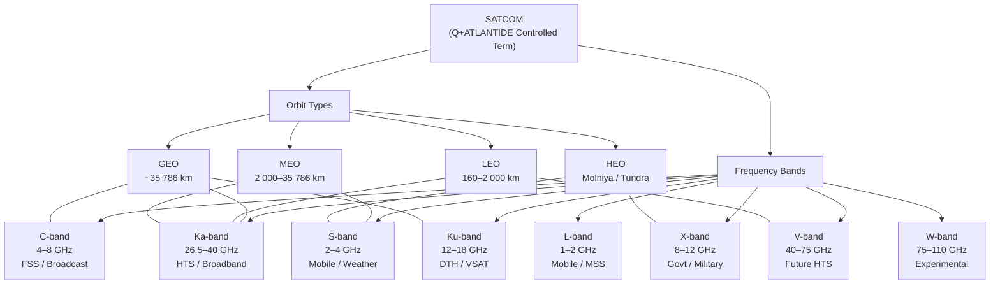

# STA 150-159 · 150-010 — SATCOM Controlled Definition

## §1 Purpose

This document establishes the controlled Q+ATLANTIDE definition of the term **SATCOM** (Satellite Communications) as used across all documents within the Space Technology Architecture (STA) register.[^baseline] It aligns the internal taxonomy with the ITU Radio Regulations definition and maps each recognised orbit type and frequency band to its Q+ATLANTIDE identifier. All subordinate SATCOM documents in subsection `150` derive their terminology from this controlled definition.[^n001]

## §2 Scope

**In scope:**

- ITU Radio Regulations definition of satellite communication service and the Q+ATLANTIDE normative extension.
- Frequency band allocation table: L-band (1–2 GHz), S-band (2–4 GHz), C-band (4–8 GHz), X-band (8–12 GHz), Ku-band (12–18 GHz), Ka-band (26.5–40 GHz), V-band (40–75 GHz), W-band (75–110 GHz) — including ITU-R designations and typical SATCOM services per band.[^ecss50][^ccsds401]
- Orbit-type classification: GEO (Geostationary Earth Orbit, ~35 786 km), MEO (Medium Earth Orbit, 2 000–35 786 km), LEO (Low Earth Orbit, 160–2 000 km), HEO (Highly Elliptical Orbit, e.g. Molniya, Tundra).
- Q+ATLANTIDE SATCOM taxonomy tree: mapping each orbit/band combination to a Q+ATLANTIDE taxonomy node identifier.
- Exclusion and disambiguation rules for related terms (e.g. SATCOM vs. SatNav, SATCOM vs. Inter-Satellite Link).

**Out of scope:** Navigation-satellite services (GNSS), Inter-Satellite Links (ISL), and optical/laser communication links, which are governed by separate STA subsections.

## §3 Diagram

## §4 Footprint

| Attribute | Value |
|-----------|-------|
| Architecture | Space Technology Architecture (STA) |
| Master range | 100–199 |
| Code range | 150-159 |
| Section | 05 |
| Subsection | 150 |
| Subsubject | 001 |
| Primary Q-Division | Q-SPACE[^qdiv] |
| Support Q-Divisions | Q-DATAGOV, Q-HPC |
| ORB support | ORB-PMO, ORB-LEG |
| Governance class | baseline[^gov] |
| Folder path | `Q+ATLANTIDE/100-199_STA/150-159_Comunicaciones-Espaciales/150_SATCOM/` |
| Document | `150-010-SATCOM-Controlled-Definition.md` |
| Parent subsection | [README.md](../README.md) · [`150-000-General.md`](./150-000-General.md) |
| Parent architecture | [../../README.md](../../README.md) |
| Parent baseline | [organization/Q+ATLANTIDE.md](../../../../organization/Q+ATLANTIDE.md) |

## §5 References & Citations

[^baseline]: Q+ATLANTIDE controlled baseline — the authoritative taxonomy and traceability ecosystem governing all Space Technology Architecture documents.
[^archtable]: §3 Architecture Table (parent) — see [../../README.md](../../README.md) for the master architecture index.
[^qdiv]: Q-Division authority — Q-SPACE is the primary authority for all space-segment and satellite communication standards within Q+ATLANTIDE.
[^gov]: Governance class `baseline` — documents in this class are subject to formal change control under ORB-PMO and ORB-LEG review gates.
[^n001]: Note N-001: Q+ATLANTIDE is a taxonomy and traceability ecosystem; definitions herein are normative within the Q+ATLANTIDE register only.
[^ecss50]: ECSS-E-ST-50C — *Space engineering: Communications*, European Cooperation for Space Standardization, 31 July 2008.
[^ccsds401]: CCSDS 401.0-B — *Radio Frequency and Modulation Systems*, Consultative Committee for Space Data Systems, Blue Book.
[^itur]: ITU-R S.1003 — *Environmental protection of the geostationary-satellite orbit*, International Telecommunication Union Radiocommunication Sector.
[^nasa4005]: NASA-STD-4005 — *Low Earth Orbit Spacecraft Charging Design Standard*, NASA Technical Standards Program.

### Applicable industry standards

| Standard | Title | Body |
|----------|-------|------|
| ECSS-E-ST-50C | Space engineering: Communications | ECSS |
| CCSDS 401.0-B | Radio Frequency and Modulation Systems | CCSDS |
| ITU-R S.1003 | Environmental protection of the geostationary-satellite orbit | ITU-R |
| NASA-STD-4005 | Low Earth Orbit Spacecraft Charging Design Standard | NASA |
