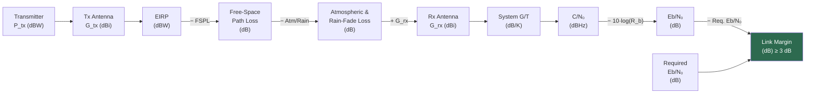

# STA 150-159 · 150-030 — Link Budget Frequency Bands and Modulation

## §1 Purpose

This document defines the mandatory link-budget methodology for all SATCOM links operating within Q+ATLANTIDE registered missions.[^baseline] It specifies the chain of parameters — from transmit EIRP through free-space path loss, atmospheric and rain-fade margins, receive G/T, and demodulator Eb/N0 threshold — that must be evaluated to demonstrate adequate link margin at all mission phases.[^ecss50][^ccsds401] Frequency band assignments and modulation/coding scheme selections are governed by the rules established herein.[^n001]

## §2 Scope

**In scope:**

- Link-budget parameter definitions: EIRP (dBW), free-space path loss (FSPL, dB), atmospheric absorption, rain-fade margin (ITU-R P.618), receive system noise temperature, G/T (dB/K), carrier-to-noise density C/N0, bit energy-to-noise Eb/N0, required Eb/N0 per modulation/coding scheme, and resulting link margin (dB).
- Frequency band assignment table aligned with ITU Radio Regulations: L, S, C, X, Ku, Ka, V, W bands — typical uplink/downlink frequencies and SATCOM service designations.[^itur]
- Modulation schemes: BPSK, QPSK, 8PSK, 16APSK, 32APSK — spectral efficiency, required Eb/N0, and applicable DVB-S2/DVB-S2X MODCODs.
- Channel coding: Reed-Solomon (RS), concatenated RS+convolutional, Turbo codes, LDPC — code rates and performance curves referenced to CCSDS and DVB standards.[^ccsds131]
- Rain-fade margin methodology per ITU-R P.618 for GEO and low-elevation LEO links; uplink power control (UPC) as a countermeasure.

**Out of scope:** Antenna gain pattern calculations (subsubject 004), TC/TM protocol layer design (subsubject 005), and interference analysis (subsubject 008).

## §3 Diagram

## §4 Footprint

| Attribute | Value |
|-----------|-------|
| Architecture | Space Technology Architecture (STA) |
| Master range | 100–199 |
| Code range | 150-159 |
| Section | 05 |
| Subsection | 150 |
| Subsubject | 003 |
| Primary Q-Division | Q-SPACE[^qdiv] |
| Support Q-Divisions | Q-DATAGOV, Q-HPC |
| ORB support | ORB-PMO, ORB-LEG |
| Governance class | baseline[^gov] |
| Folder path | `Q+ATLANTIDE/100-199_STA/150-159_Comunicaciones-Espaciales/150_SATCOM/` |
| Document | `150-030-Link-Budget-Frequency-Bands-and-Modulation.md` |
| Parent subsection | [README.md](../README.md) · [`150-000-General.md`](./150-000-General.md) |
| Parent architecture | [../../README.md](../../README.md) |
| Parent baseline | [organization/Q+ATLANTIDE.md](../../../../organization/Q+ATLANTIDE.md) |

## §5 References & Citations

[^baseline]: Q+ATLANTIDE controlled baseline — the authoritative taxonomy and traceability ecosystem governing all Space Technology Architecture documents.
[^archtable]: §3 Architecture Table (parent) — see [../../README.md](../../README.md) for the master architecture index.
[^qdiv]: Q-Division authority — Q-SPACE is the primary authority for all space-segment and satellite communication standards within Q+ATLANTIDE.
[^gov]: Governance class `baseline` — documents in this class are subject to formal change control under ORB-PMO and ORB-LEG review gates.
[^n001]: Note N-001: Q+ATLANTIDE is a taxonomy and traceability ecosystem; definitions herein are normative within the Q+ATLANTIDE register only.
[^ecss50]: ECSS-E-ST-50C — *Space engineering: Communications*, European Cooperation for Space Standardization, 31 July 2008.
[^ccsds401]: CCSDS 401.0-B — *Radio Frequency and Modulation Systems*, Consultative Committee for Space Data Systems, Blue Book.
[^ccsds131]: CCSDS 131.0-B — *TM Synchronization and Channel Coding*, Consultative Committee for Space Data Systems, Blue Book.
[^itur]: ITU-R S.1003 — *Environmental protection of the geostationary-satellite orbit*, International Telecommunication Union Radiocommunication Sector.
[^nasa4005]: NASA-STD-4005 — *Low Earth Orbit Spacecraft Charging Design Standard*, NASA Technical Standards Program.

### Applicable industry standards

| Standard | Title | Body |
|----------|-------|------|
| ECSS-E-ST-50C | Space engineering: Communications | ECSS |
| CCSDS 401.0-B | Radio Frequency and Modulation Systems | CCSDS |
| CCSDS 131.0-B | TM Synchronization and Channel Coding | CCSDS |
| ITU-R S.1003 | Environmental protection of the geostationary-satellite orbit | ITU-R |
| NASA-STD-4005 | Low Earth Orbit Spacecraft Charging Design Standard | NASA |
