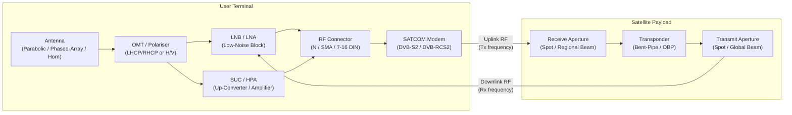

# STA 150-159 · 150-040 — Antennas Terminals and RF Interfaces

## §1 Purpose

This document defines the antenna types, user terminal classes, and RF interface specifications recognised within Q+ATLANTIDE for SATCOM applications.[^baseline] It governs the selection criteria for antenna technology (parabolic reflector, phased-array, horn) and terminal form factors (VSAT, GEO HTS user terminal, LEO flat-panel), and establishes the normative RF interface parameters — connector type, impedance, VSWR, and isolation — that must be declared in all mission Interface Control Documents (ICDs).[^ecss50][^n001]

## §2 Scope

**In scope:**

- Antenna types: parabolic reflector (prime-focus, offset-fed, dual-reflector Cassegrain/Gregorian), active phased-array (electronically steered), passive phased-array, and horn antennas — gain, beamwidth, sidelobe envelope, and cross-polar discrimination requirements.
- Terminal classes: VSAT (C/Ku/Ka GEO fixed), GEO HTS user terminal (flat-panel or offset dish, Ka-band), LEO broadband flat-panel terminal (Ka/V-band, multi-beam electronically steered), MSS handheld terminal (L/S-band), and maritime/aeronautical stabilised antenna platform.
- RF interface specifications: connector types (N-type, SMA, 7/16 DIN, WR-waveguide flanges), characteristic impedance (50 Ω), VSWR limits, insertion loss budgets, input/output power limits, and phase noise requirements.
- Polarisation schemes: linear (H/V), circular (LHCP/RHCP), and dual polarisation for frequency reuse — ICD declaration requirements.
- Terminal pointing and tracking: fixed pointing, motorised Az/El mount, and electronically steered beam — acquisition, tracking, and pointing loss allocation.[^ccsds401]

**Out of scope:** Link-budget Eb/N0 calculations (subsubject 003), ground-station front-end racks and baseband processing (subsubject 006), and TC/TM antennas governed by the spacecraft ICD.

## §3 Diagram

## §4 Footprint

| Attribute | Value |
|-----------|-------|
| Architecture | Space Technology Architecture (STA) |
| Master range | 100–199 |
| Code range | 150-159 |
| Section | 05 |
| Subsection | 150 |
| Subsubject | 004 |
| Primary Q-Division | Q-SPACE[^qdiv] |
| Support Q-Divisions | Q-DATAGOV, Q-HPC |
| ORB support | ORB-PMO, ORB-LEG |
| Governance class | baseline[^gov] |
| Folder path | `Q+ATLANTIDE/100-199_STA/150-159_Comunicaciones-Espaciales/150_SATCOM/` |
| Document | `150-040-Antennas-Terminals-and-RF-Interfaces.md` |
| Parent subsection | [README.md](../README.md) · [`150-000-General.md`](./150-000-General.md) |
| Parent architecture | [../../README.md](../../README.md) |
| Parent baseline | [organization/Q+ATLANTIDE.md](../../../../organization/Q+ATLANTIDE.md) |

## §5 References & Citations

[^baseline]: Q+ATLANTIDE controlled baseline — the authoritative taxonomy and traceability ecosystem governing all Space Technology Architecture documents.
[^archtable]: §3 Architecture Table (parent) — see [../../README.md](../../README.md) for the master architecture index.
[^qdiv]: Q-Division authority — Q-SPACE is the primary authority for all space-segment and satellite communication standards within Q+ATLANTIDE.
[^gov]: Governance class `baseline` — documents in this class are subject to formal change control under ORB-PMO and ORB-LEG review gates.
[^n001]: Note N-001: Q+ATLANTIDE is a taxonomy and traceability ecosystem; definitions herein are normative within the Q+ATLANTIDE register only.
[^ecss50]: ECSS-E-ST-50C — *Space engineering: Communications*, European Cooperation for Space Standardization, 31 July 2008.
[^ccsds401]: CCSDS 401.0-B — *Radio Frequency and Modulation Systems*, Consultative Committee for Space Data Systems, Blue Book.
[^itur]: ITU-R S.1003 — *Environmental protection of the geostationary-satellite orbit*, International Telecommunication Union Radiocommunication Sector.
[^nasa4005]: NASA-STD-4005 — *Low Earth Orbit Spacecraft Charging Design Standard*, NASA Technical Standards Program.

### Applicable industry standards

| Standard | Title | Body |
|----------|-------|------|
| ECSS-E-ST-50C | Space engineering: Communications | ECSS |
| CCSDS 401.0-B | Radio Frequency and Modulation Systems | CCSDS |
| ITU-R S.1003 | Environmental protection of the geostationary-satellite orbit | ITU-R |
| NASA-STD-4005 | Low Earth Orbit Spacecraft Charging Design Standard | NASA |
