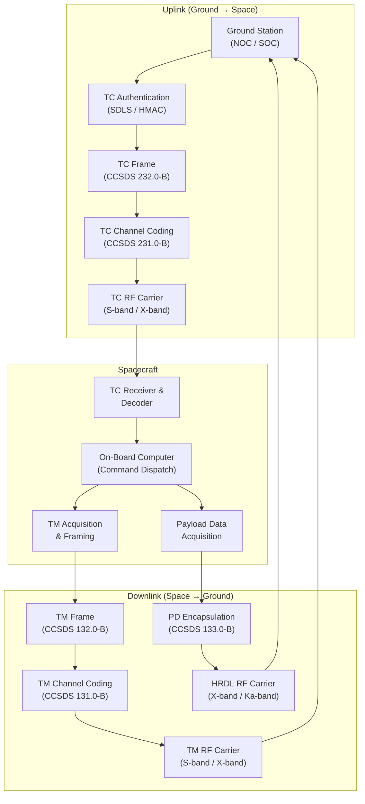

# STA 150-159 · 150-050 — Telecommand Telemetry and Payload Data Links

## §1 Purpose

This document defines the three link classes used in satellite missions — **Telecommand (TC)**, **Telemetry (TM)**, and **Payload Data (PD)** — and assigns the applicable CCSDS protocol stack to each.[^baseline][^ccsds401] It establishes the normative requirements for TC uplink synchronisation and channel coding, TM downlink frame protocol, high-rate payload data downlink (HRDL), and the mission-critical data authentication mechanisms that must be applied to each link class.[^ccsds131][^ccsds132][^n001]

## §2 Scope

**In scope:**

- TC link class: CCSDS Telecommand Synchronisation and Channel Coding (CCSDS 231.0-B), CCSDS Space Data Link Protocol — TC (CCSDS 232.0-B), command authentication using CCSDS Space Data Link Security (SDLS) protocol, and command bit-rate constraints per orbit phase.
- TM link class: CCSDS TM Synchronisation and Channel Coding (CCSDS 131.0-B), CCSDS TM Space Data Link Protocol (CCSDS 132.0-B), virtual channel allocation, and Reed-Solomon / Turbo / LDPC coding options.[^ccsds131][^ccsds132]
- Payload Data (PD) link class: High-Rate Data Link (HRDL) for science and mission payload data, X-band / Ka-band downlink configurations, CCSDS Encapsulation Service (CCSDS 133.0-B) for heterogeneous packet types, and file-delivery protocol (CFDP, CCSDS 727.0-B).[^ccsds133]
- Mission-critical data authentication: CCSDS SDLS layer-2 authentication, hash-based message authentication codes (HMAC), and key management integration with COMSEC (cross-reference subsubject 007).
- Link priority and pre-emption rules for TC vs. TM vs. PD during contingency operations.

**Out of scope:** Physical RF layer and link-budget parameters (subsubject 003), COMSEC key management architecture (subsubject 007), and ground-station network delivery of TM/PD frames (subsubject 006).

## §3 Diagram

## §4 Footprint

| Attribute | Value |
|-----------|-------|
| Architecture | Space Technology Architecture (STA) |
| Master range | 100–199 |
| Code range | 150-159 |
| Section | 05 |
| Subsection | 150 |
| Subsubject | 005 |
| Primary Q-Division | Q-SPACE[^qdiv] |
| Support Q-Divisions | Q-DATAGOV, Q-HPC |
| ORB support | ORB-PMO, ORB-LEG |
| Governance class | baseline[^gov] |
| Folder path | `Q+ATLANTIDE/100-199_STA/150-159_Comunicaciones-Espaciales/150_SATCOM/` |
| Document | `150-050-Telecommand-Telemetry-and-Payload-Data-Links.md` |
| Parent subsection | [README.md](../README.md) · [`150-000-General.md`](./150-000-General.md) |
| Parent architecture | [../../README.md](../../README.md) |
| Parent baseline | [organization/Q+ATLANTIDE.md](../../../../organization/Q+ATLANTIDE.md) |

## §5 References & Citations

[^baseline]: Q+ATLANTIDE controlled baseline — the authoritative taxonomy and traceability ecosystem governing all Space Technology Architecture documents.
[^archtable]: §3 Architecture Table (parent) — see [../../README.md](../../README.md) for the master architecture index.
[^qdiv]: Q-Division authority — Q-SPACE is the primary authority for all space-segment and satellite communication standards within Q+ATLANTIDE.
[^gov]: Governance class `baseline` — documents in this class are subject to formal change control under ORB-PMO and ORB-LEG review gates.
[^n001]: Note N-001: Q+ATLANTIDE is a taxonomy and traceability ecosystem; definitions herein are normative within the Q+ATLANTIDE register only.
[^ecss50]: ECSS-E-ST-50C — *Space engineering: Communications*, European Cooperation for Space Standardization, 31 July 2008.
[^ccsds401]: CCSDS 401.0-B — *Radio Frequency and Modulation Systems*, Consultative Committee for Space Data Systems, Blue Book.
[^ccsds131]: CCSDS 131.0-B — *TM Synchronization and Channel Coding*, Consultative Committee for Space Data Systems, Blue Book.
[^ccsds132]: CCSDS 132.0-B — *TM Space Data Link Protocol*, Consultative Committee for Space Data Systems, Blue Book.
[^ccsds133]: CCSDS 133.0-B — *Encapsulation Service*, Consultative Committee for Space Data Systems, Blue Book.
[^itur]: ITU-R S.1003 — *Environmental protection of the geostationary-satellite orbit*, International Telecommunication Union Radiocommunication Sector.
[^nasa4005]: NASA-STD-4005 — *Low Earth Orbit Spacecraft Charging Design Standard*, NASA Technical Standards Program.

### Applicable industry standards

| Standard | Title | Body |
|----------|-------|------|
| ECSS-E-ST-50C | Space engineering: Communications | ECSS |
| CCSDS 401.0-B | Radio Frequency and Modulation Systems | CCSDS |
| CCSDS 131.0-B | TM Synchronization and Channel Coding | CCSDS |
| CCSDS 132.0-B | TM Space Data Link Protocol | CCSDS |
| CCSDS 133.0-B | Encapsulation Service | CCSDS |
| ITU-R S.1003 | Environmental protection of the geostationary-satellite orbit | ITU-R |
| NASA-STD-4005 | Low Earth Orbit Spacecraft Charging Design Standard | NASA |
