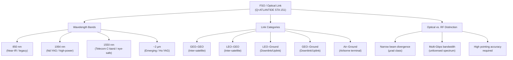

# STA 150-159 · 05.151.001 — Optical Links Controlled Definition

## §1 Purpose

This document establishes the controlled Q+ATLANTIDE definition of a **Free-Space Optical (FSO) link**, also referred to as an *optical link*, within the Space Technology Architecture (STA) register.[^baseline] It canonises the terminology, wavelength band taxonomy, link-category hierarchy, and the distinction between optical and RF communications that all downstream 151 subsubject documents must adopt.[^qdiv]

The controlled definition is binding for all Q+ATLANTIDE STA artefacts in code range 150-159, Section 05, Subsection 151, and for any interfacing document that references FSO communications.[^gov]

## §2 Scope

**In scope:**

- Controlled definition of FSO / optical link as used across Q+ATLANTIDE STA 151
- Wavelength band taxonomy: 850 nm (near-IR, legacy), 1064 nm (Nd:YAG class, high-power), 1550 nm (telecom C-band, eye-safe window), and emerging 2-µm bands
- Link category hierarchy: GEO-GEO inter-satellite, LEO-GEO inter-satellite, LEO-ground downlink, GEO-ground downlink, and air-to-ground
- Optical vs. RF distinction: divergence, bandwidth, regulatory spectrum, and pointing requirement contrast
- Q+ATLANTIDE taxonomy codes and cross-references for each link category

**Out of scope:** RF microwave or millimetre-wave links; optical fibre terrestrial links; quantum key distribution (QKD) overlay protocols (covered under separate baseline entries).

## §3 Diagram

## §4 Footprint

| Attribute | Value |
|-----------|-------|
| Architecture | Space Technology Architecture (STA) |
| Master range | 100–199 |
| Code range | 150-159 |
| Section | 05 — Comunicaciones Espaciales |
| Subsection | 151 — Enlaces Ópticos |
| Subsubject | 001 — Optical Links Controlled Definition |
| Primary Q-Division | Q-SPACE |
| Support Q-Divisions | Q-DATAGOV, Q-HPC |
| ORB support | ORB-PMO, ORB-LEG |
| Governance class | baseline |
| Folder path | `Q+ATLANTIDE/100-199_STA/150-159_Comunicaciones-Espaciales/151_Enlaces-Opticos/` |
| Document | `001_Optical-Links-Controlled-Definition.md` |
| Parent subsection | [README.md](./README.md) · [000_Overview.md](./000_Overview.md) |
| Parent architecture | [../../README.md](../../README.md) |
| Parent baseline | [organization/Q+ATLANTIDE.md](../../../../organization/Q+ATLANTIDE.md) |

## §5 References & Citations

[^baseline]: Q+ATLANTIDE controlled baseline (v1.0.0).[^n001]
[^archtable]: §3 Architecture Table (parent) — see [../../README.md](../../README.md).
[^qdiv]: Q-Division authority — Q-SPACE is the primary division authority for STA 151 optical-link definitions.
[^gov]: Governance class — baseline. Changes to controlled definitions require formal ORB-PMO change request.
[^ecss50]: ECSS-E-ST-50C — *Space engineering: Communications* (ESA, 2008).
[^ccsds141]: CCSDS 141.0-B — *Optical Communications — Optical Link* (CCSDS, 2015).
[^iec60825]: IEC 60825-1 — *Safety of laser products* (IEC, 2014).
[^itur]: ITU-R S.1714 — *Free-space optical links on Earth* (ITU, 2005).
[^nasa4005]: NASA-STD-4005 — *LEO Spacecraft Charging Design Standard* (NASA, 2013).
[^n001]: Note N-001: Q+ATLANTIDE is a taxonomy and traceability ecosystem, not a mission or programme.

### Applicable industry standards

- ECSS-E-ST-50C — Space engineering: Communications (ESA, 2008)[^ecss50]
- CCSDS 141.0-B — Optical Communications — Optical Link (CCSDS, 2015)[^ccsds141]
- ITU-R S.1714 — Free-space optical links on Earth (ITU, 2005)[^itur]
- IEC 60825-1 — Safety of laser products (IEC, 2014)[^iec60825]
- NASA-TM-2013-217496 — Overview of NASA's Optical Communications Program (NASA, 2013)
- ETSI GS QKD 002 — Quantum Key Distribution; Use Cases (ETSI, 2010)
