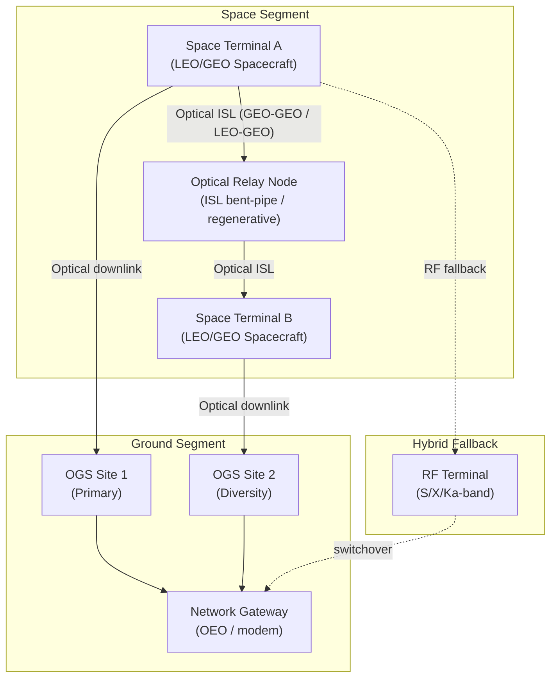

# STA 150-159 · 05.151.002 — Free-Space Optical Communication Architecture

## §1 Purpose

This document defines the complete **Free-Space Optical (FSO) communication system architecture** as adopted within the Q+ATLANTIDE STA baseline, covering all major functional segments from space terminal through optical relay nodes to ground terminal.[^baseline] The architecture description provides the structural context for all subordinate subsubject documents (003–010) and establishes segment interfaces, link modes, and fallback strategies.[^archtable]

The architecture is compliant with CCSDS 141.0-B optical link recommendations and ECSS-E-ST-50C communication system requirements, adapted to the Q+ATLANTIDE taxonomy and governance framework.[^gov][^qdiv]

## §2 Scope

**In scope:**

- Space terminal segment: on-board laser terminal, pointing subsystem, and telescope assembly
- Ground terminal segment: Optical Ground Station (OGS) telescope, adaptive optics, and modem
- Optical relay node architecture: inter-satellite optical relay, bent-pipe and regenerative relay modes
- Duplex vs. simplex link configurations and their trade-space
- Relay constellation topology for global optical coverage
- Hybrid RF/optical fallback strategy and switchover criteria
- Beam-steering architecture: body-pointing, gimballed telescope, and fast-steering mirror (FSM) options

**Out of scope:** Detailed laser terminal hardware design (see 003); APT control loop detail (see 004); link budget calculation methodology (see 005).

## §3 Diagram

## §4 Footprint

| Attribute | Value |
|-----------|-------|
| Architecture | Space Technology Architecture (STA) |
| Master range | 100–199 |
| Code range | 150-159 |
| Section | 05 — Comunicaciones Espaciales |
| Subsection | 151 — Enlaces Ópticos |
| Subsubject | 002 — Free-Space Optical Communication Architecture |
| Primary Q-Division | Q-SPACE |
| Support Q-Divisions | Q-DATAGOV, Q-HPC |
| ORB support | ORB-PMO, ORB-LEG |
| Governance class | baseline |
| Folder path | `Q+ATLANTIDE/100-199_STA/150-159_Comunicaciones-Espaciales/151_Enlaces-Opticos/` |
| Document | `002_Free-Space-Optical-Communication-Architecture.md` |
| Parent subsection | [README.md](./README.md) · [000_Overview.md](./000_Overview.md) |
| Parent architecture | [../../README.md](../../README.md) |
| Parent baseline | [organization/Q+ATLANTIDE.md](../../../../organization/Q+ATLANTIDE.md) |

## §5 References & Citations

[^baseline]: Q+ATLANTIDE controlled baseline (v1.0.0).[^n001]
[^archtable]: §3 Architecture Table (parent) — see [../../README.md](../../README.md).
[^qdiv]: Q-Division authority — Q-SPACE.
[^gov]: Governance class — baseline.
[^ecss50]: ECSS-E-ST-50C — *Space engineering: Communications* (ESA, 2008).
[^ccsds141]: CCSDS 141.0-B — *Optical Communications — Optical Link* (CCSDS, 2015).
[^iec60825]: IEC 60825-1 — *Safety of laser products* (IEC, 2014).
[^itur]: ITU-R S.1714 — *Free-space optical links on Earth* (ITU, 2005).
[^nasa4005]: NASA-STD-4005 — *LEO Spacecraft Charging Design Standard* (NASA, 2013).
[^n001]: Note N-001: Q+ATLANTIDE is a taxonomy and traceability ecosystem, not a mission or programme.

### Applicable industry standards

- ECSS-E-ST-50C — Space engineering: Communications (ESA, 2008)[^ecss50]
- ECSS-E-ST-10-03C — Space engineering: Testing (ESA, 2012)
- CCSDS 141.0-B — Optical Communications — Optical Link (CCSDS, 2015)[^ccsds141]
- ITU-R S.1714 — Free-space optical links on Earth (ITU, 2005)[^itur]
- IEC 60825-1 — Safety of laser products (IEC, 2014)[^iec60825]
- NASA-TM-2013-217496 — Overview of NASA's Optical Communications Program (NASA, 2013)
