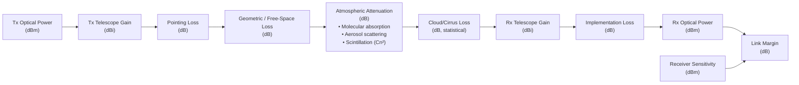

# STA 150-159 · 05.151.005 — Link Budget Beam Divergence and Atmospheric Losses

## §1 Purpose

This document defines the **optical link-budget methodology** adopted within the Q+ATLANTIDE STA 151 baseline, providing a structured approach to computing received optical power from transmit power through all loss mechanisms.[^baseline] It establishes the controlled definitions, parameter classes, and calculation conventions that govern trade-off analyses and performance verification for all FSO link categories.[^qdiv]

The methodology is aligned with CCSDS 141.0-B link analysis guidance and ITU-R S.1714 atmospheric loss models, adapted to Q+ATLANTIDE governance requirements.[^gov]

## §2 Scope

**In scope:**

- Transmit power parameter class: optical output power (dBm), wall-plug efficiency, EDFA output limit
- Beam divergence: full-angle divergence (θ_div), diffraction-limited beam quality (M² factor), and far-field pattern
- Geometric (free-space) loss: derivation from link range and aperture diameters
- Atmospheric attenuation: molecular absorption, aerosol scattering, Cn² refractive-index structure constant (turbulence), and scintillation index
- Cloud/cirrus blockage statistics and site-diversity fade mitigation
- Fade margin definition and availability target (e.g., 99.9% annual link availability)
- Receiver sensitivity: minimum detectable power (dBm), noise-equivalent power (NEP), and SNR threshold

**Out of scope:** Detailed modulation-scheme sensitivity calculations (see 006); adaptive optics wavefront correction (see 007); laser terminal hardware design parameters (see 003).

## §3 Diagram

## §4 Footprint

| Attribute | Value |
|-----------|-------|
| Architecture | Space Technology Architecture (STA) |
| Master range | 100–199 |
| Code range | 150-159 |
| Section | 05 — Comunicaciones Espaciales |
| Subsection | 151 — Enlaces Ópticos |
| Subsubject | 005 — Link Budget Beam Divergence and Atmospheric Losses |
| Primary Q-Division | Q-SPACE |
| Support Q-Divisions | Q-DATAGOV, Q-HPC |
| ORB support | ORB-PMO, ORB-LEG |
| Governance class | baseline |
| Folder path | `Q+ATLANTIDE/100-199_STA/150-159_Comunicaciones-Espaciales/151_Enlaces-Opticos/` |
| Document | `005_Link-Budget-Beam-Divergence-and-Atmospheric-Losses.md` |
| Parent subsection | [README.md](./README.md) · [000_Overview.md](./000_Overview.md) |
| Parent architecture | [../../README.md](../../README.md) |
| Parent baseline | [organization/Q+ATLANTIDE.md](../../../../organization/Q+ATLANTIDE.md) |

## §5 References & Citations

[^baseline]: Q+ATLANTIDE controlled baseline (v1.0.0).[^n001]
[^archtable]: §3 Architecture Table (parent) — see [../../README.md](../../README.md).
[^qdiv]: Q-Division authority — Q-SPACE.
[^gov]: Governance class — baseline.
[^ecss50]: ECSS-E-ST-50C — *Space engineering: Communications* (ESA, 2008).
[^ccsds141]: CCSDS 141.0-B — *Optical Communications — Optical Link* (CCSDS, 2015).
[^iec60825]: IEC 60825-1 — *Safety of laser products* (IEC, 2014).
[^itur]: ITU-R S.1714 — *Free-space optical links on Earth* (ITU, 2005).
[^nasa4005]: NASA-STD-4005 — *LEO Spacecraft Charging Design Standard* (NASA, 2013).
[^n001]: Note N-001: Q+ATLANTIDE is a taxonomy and traceability ecosystem, not a mission or programme.

### Applicable industry standards

- ECSS-E-ST-50C — Space engineering: Communications (ESA, 2008)[^ecss50]
- CCSDS 141.0-B — Optical Communications — Optical Link (CCSDS, 2015)[^ccsds141]
- ITU-R S.1714 — Free-space optical links on Earth (ITU, 2005)[^itur]
- IEC 60825-1 — Safety of laser products (IEC, 2014)[^iec60825]
- NASA-TM-2013-217496 — Overview of NASA's Optical Communications Program (NASA, 2013)
- NASA-STD-4005 — LEO Spacecraft Charging Design Standard (NASA, 2013)[^nasa4005]
- ETSI GS QKD 002 — Quantum Key Distribution; Use Cases (ETSI, 2010)
