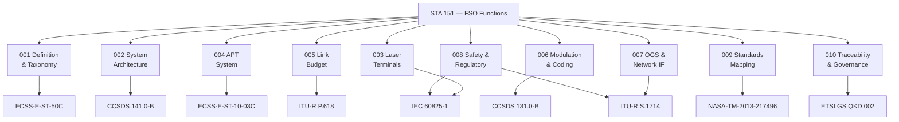

# STA 150-159 · 05.151.009 — ECSS CCSDS ITU and NASA Standards Mapping

## §1 Purpose

This document provides the **normative mapping** between each FSO functional area in Q+ATLANTIDE STA 151 and the applicable external industry standards from ECSS, CCSDS, ITU-R, IEC, NASA, and ETSI.[^baseline] The mapping enables programme teams to identify which standards govern each design, test, and operational activity without ambiguity, supporting compliance planning and gap analysis.[^qdiv]

This standards map is a living baseline artefact and must be updated whenever a new standard revision is incorporated into a Q+ATLANTIDE-governed programme.[^gov]

## §2 Scope

**In scope:**

- Function-to-standard mapping for all ten 151 subsubject areas (001–010)
- ECSS applicability: ECSS-E-ST-50C (communications), ECSS-E-ST-10-03C (testing), ECSS-Q-ST-70C (materials/processes)
- CCSDS applicability: CCSDS 141.0-B (optical link), CCSDS 131.0-B (TM synchronisation), CCSDS 132.0-B (AOS)
- ITU-R applicability: ITU-R S.1714 (FSO links), ITU-R S.521 (interference), ITU-R P.618 (propagation)
- IEC applicability: IEC 60825-1 (laser safety), IEC 62343 (dynamic optical components)
- NASA applicability: NASA-TM-2013-217496 (optical comms overview), NASA-STD-4005 (LEO charging)
- ETSI applicability: ETSI GS QKD 002 (QKD use cases), ETSI GS QKD 011 (component security)

**Out of scope:** Contractual compliance matrix (programme-specific); national regulatory filings (see 008).

## §3 Diagram

## §4 Footprint

| Attribute | Value |
|-----------|-------|
| Architecture | Space Technology Architecture (STA) |
| Master range | 100–199 |
| Code range | 150-159 |
| Section | 05 — Comunicaciones Espaciales |
| Subsection | 151 — Enlaces Ópticos |
| Subsubject | 009 — ECSS CCSDS ITU and NASA Standards Mapping |
| Primary Q-Division | Q-SPACE |
| Support Q-Divisions | Q-DATAGOV, Q-HPC |
| ORB support | ORB-PMO, ORB-LEG |
| Governance class | baseline |
| Folder path | `Q+ATLANTIDE/100-199_STA/150-159_Comunicaciones-Espaciales/151_Enlaces-Opticos/` |
| Document | `009_ECSS-CCSDS-ITU-and-NASA-Standards-Mapping.md` |
| Parent subsection | [README.md](./README.md) · [000_Overview.md](./000_Overview.md) |
| Parent architecture | [../../README.md](../../README.md) |
| Parent baseline | [organization/Q+ATLANTIDE.md](../../../../organization/Q+ATLANTIDE.md) |

## §5 References & Citations

[^baseline]: Q+ATLANTIDE controlled baseline (v1.0.0).[^n001]
[^archtable]: §3 Architecture Table (parent) — see [../../README.md](../../README.md).
[^qdiv]: Q-Division authority — Q-SPACE.
[^gov]: Governance class — baseline.
[^ecss50]: ECSS-E-ST-50C — *Space engineering: Communications* (ESA, 2008).
[^ccsds141]: CCSDS 141.0-B — *Optical Communications — Optical Link* (CCSDS, 2015).
[^iec60825]: IEC 60825-1 — *Safety of laser products* (IEC, 2014).
[^itur]: ITU-R S.1714 — *Free-space optical links on Earth* (ITU, 2005).
[^nasa4005]: NASA-STD-4005 — *LEO Spacecraft Charging Design Standard* (NASA, 2013).
[^n001]: Note N-001: Q+ATLANTIDE is a taxonomy and traceability ecosystem, not a mission or programme.

### Applicable industry standards

- ECSS-E-ST-50C — Space engineering: Communications (ESA, 2008)[^ecss50]
- ECSS-E-ST-10-03C — Space engineering: Testing (ESA, 2012)
- ECSS-Q-ST-70C — Space product assurance: Materials, mechanical parts and processes (ESA, 2008)
- CCSDS 141.0-B — Optical Communications — Optical Link (CCSDS, 2015)[^ccsds141]
- CCSDS 131.0-B — TM Synchronisation and Channel Coding (CCSDS, 2011)
- CCSDS 132.0-B — AOS Space Data Link Protocol (CCSDS, 2006)
- ITU-R S.1714 — Free-space optical links on Earth (ITU, 2005)[^itur]
- ITU-R P.618 — Propagation data and prediction methods required for the design of Earth-space telecommunication systems (ITU, 2017)
- IEC 60825-1 — Safety of laser products (IEC, 2014)[^iec60825]
- IEC 62343 — Dynamic modules: performance standards (IEC, 2006)
- NASA-TM-2013-217496 — Overview of NASA's Optical Communications Program (NASA, 2013)
- NASA-STD-4005 — LEO Spacecraft Charging Design Standard (NASA, 2013)[^nasa4005]
- ETSI GS QKD 002 — Quantum Key Distribution; Use Cases (ETSI, 2010)
- ETSI GS QKD 011 — Quantum Key Distribution; Component security (ETSI, 2016)
