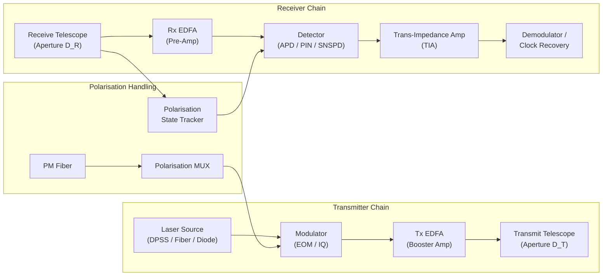

# STA 150-159 · 151-030 — Laser Terminals Transmitters and Receivers

## §1 Purpose

This document defines the hardware design parameters and functional architecture of **laser terminals** — the transmit/receive subsystems at each end of a free-space optical link — within the Q+ATLANTIDE STA 151 baseline.[^baseline] It establishes the controlled classification of laser source classes, aperture sizing, detector technology, amplification stages, and polarisation handling that governs procurement and design trade-off activities.[^qdiv]

All laser terminal design activities within Q+ATLANTIDE-governed programmes must align parameters to the classes and constraints defined herein, with deviations subject to formal ORB-PMO change control.[^gov]

## §2 Scope

**In scope:**

- Laser source classification: diode-pumped solid-state (DPSS), fiber laser (Yb/Er-doped), and semiconductor diode classes
- Transmitter aperture sizing (diameter, obscuration, pointing loss budget allocation)
- Receiver aperture and detector technology: avalanche photodiode (APD), PIN photodiode, superconducting nanowire single-photon detector (SNSPD)
- Erbium-doped fiber amplifier (EDFA) — function, gain stages, noise figure, and placement in Tx/Rx chain
- Polarisation management: polarisation-maintaining fiber, polarisation multiplexing, and state tracking
- Thermal and radiation environment design constraints for space-qualified laser terminals

**Out of scope:** APT gimbal and fast-steering mirror design (see 004); link budget and atmospheric loss modelling (see 005); optical ground station telescope and adaptive optics (see 007).

## §3 Diagram

## §4 Footprint

| Attribute | Value |
|-----------|-------|
| Architecture | Space Technology Architecture (STA) |
| Master range | 100–199 |
| Code range | 150-159 |
| Section | 05 — Comunicaciones Espaciales |
| Subsection | 151 — Enlaces Ópticos |
| Subsubject | 003 — Laser Terminals Transmitters and Receivers |
| Primary Q-Division | Q-SPACE |
| Support Q-Divisions | Q-DATAGOV, Q-HPC |
| ORB support | ORB-PMO, ORB-LEG |
| Governance class | baseline |
| Folder path | `Q+ATLANTIDE/100-199_STA/150-159_Comunicaciones-Espaciales/151_Enlaces-Opticos/` |
| Document | `151-030-Laser-Terminals-Transmitters-and-Receivers.md` |
| Parent subsection | [README.md](./README.md) · [`151-000-General.md`](./151-000-General.md) |
| Parent architecture | [../../README.md](../../README.md) |
| Parent baseline | [organization/Q+ATLANTIDE.md](../../../../organization/Q+ATLANTIDE.md) |

## §5 References & Citations

[^baseline]: Q+ATLANTIDE controlled baseline (v1.0.0).[^n001]
[^archtable]: §3 Architecture Table (parent) — see [../../README.md](../../README.md).
[^qdiv]: Q-Division authority — Q-SPACE.
[^gov]: Governance class — baseline.
[^ecss50]: ECSS-E-ST-50C — *Space engineering: Communications* (ESA, 2008).
[^ccsds141]: CCSDS 141.0-B — *Optical Communications — Optical Link* (CCSDS, 2015).
[^iec60825]: IEC 60825-1 — *Safety of laser products* (IEC, 2014).
[^itur]: ITU-R S.1714 — *Free-space optical links on Earth* (ITU, 2005).
[^nasa4005]: NASA-STD-4005 — *LEO Spacecraft Charging Design Standard* (NASA, 2013).
[^n001]: Note N-001: Q+ATLANTIDE is a taxonomy and traceability ecosystem, not a mission or programme.

### Applicable industry standards

- ECSS-E-ST-50C — Space engineering: Communications (ESA, 2008)[^ecss50]
- ECSS-E-ST-10-03C — Space engineering: Testing (ESA, 2012)
- CCSDS 141.0-B — Optical Communications — Optical Link (CCSDS, 2015)[^ccsds141]
- IEC 60825-1 — Safety of laser products (IEC, 2014)[^iec60825]
- NASA-TM-2013-217496 — Overview of NASA's Optical Communications Program (NASA, 2013)
- NASA-STD-4005 — LEO Spacecraft Charging Design Standard (NASA, 2013)[^nasa4005]
