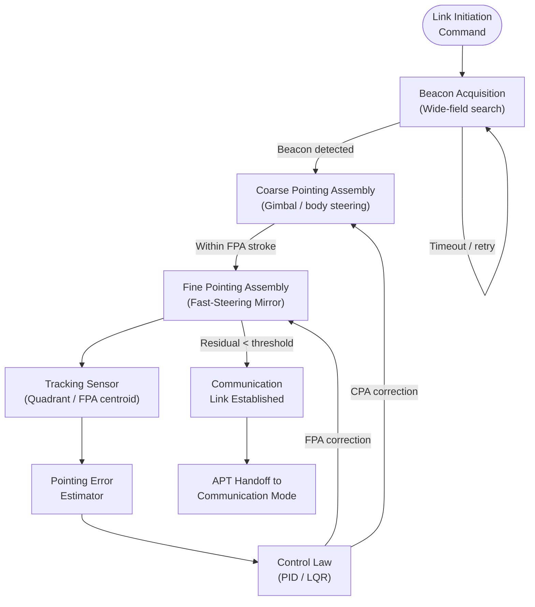

# STA 150-159 · 151-040 — Acquisition Pointing and Tracking APT

## §1 Purpose

This document defines the **Acquisition, Pointing, and Tracking (APT)** system architecture and performance requirements for optical crosslinks and ground-space optical links within the Q+ATLANTIDE STA 151 baseline.[^baseline] APT is the critical enabling subsystem that allows narrow-divergence laser beams (typically 1–100 µrad) to be acquired, locked, and maintained between dynamically moving spacecraft and ground terminals.[^qdiv]

The APT definitions herein govern the performance budgets, control loop topology, and qualification criteria applicable to all Q+ATLANTIDE-registered optical terminal designs.[^gov]

## §2 Scope

**In scope:**

- Beacon acquisition strategy: wide-field search pattern, beacon wavelength selection, and acquisition time budget
- Coarse pointing assembly (CPA): gimbal mechanism, angular range, slew rate, and pointing residual allocation
- Fine pointing assembly (FPA): fast-steering mirror (FSM), piezo-actuated mirror, bandwidth, and stroke
- Tracking sensor: focal-plane array (FPA-sensor), quadrant detector, centroiding algorithm
- Closed-loop pointing residual budget: allocation between CPA, FPA, spacecraft jitter, and thermal drift
- Tracking bandwidth requirements for LEO-LEO, LEO-GEO, and LEO-ground scenarios

**Out of scope:** Laser terminal Tx/Rx hardware design (see 003); link budget atmospheric effects (see 005); OGS adaptive optics for wavefront correction (see 007).

## §3 Diagram

## §4 Footprint

| Attribute | Value |
|-----------|-------|
| Architecture | Space Technology Architecture (STA) |
| Master range | 100–199 |
| Code range | 150-159 |
| Section | 05 — Comunicaciones Espaciales |
| Subsection | 151 — Enlaces Ópticos |
| Subsubject | 004 — Acquisition Pointing and Tracking APT |
| Primary Q-Division | Q-SPACE |
| Support Q-Divisions | Q-DATAGOV, Q-HPC |
| ORB support | ORB-PMO, ORB-LEG |
| Governance class | baseline |
| Folder path | `Q+ATLANTIDE/100-199_STA/150-159_Comunicaciones-Espaciales/151_Enlaces-Opticos/` |
| Document | `151-040-Acquisition-Pointing-and-Tracking-APT.md` |
| Parent subsection | [README.md](./README.md) · [`151-000-General.md`](./151-000-General.md) |
| Parent architecture | [../../README.md](../../README.md) |
| Parent baseline | [organization/Q+ATLANTIDE.md](../../../../organization/Q+ATLANTIDE.md) |

## §5 References & Citations

[^baseline]: Q+ATLANTIDE controlled baseline (v1.0.0).[^n001]
[^archtable]: §3 Architecture Table (parent) — see [../../README.md](../../README.md).
[^qdiv]: Q-Division authority — Q-SPACE.
[^gov]: Governance class — baseline.
[^ecss50]: ECSS-E-ST-50C — *Space engineering: Communications* (ESA, 2008).
[^ccsds141]: CCSDS 141.0-B — *Optical Communications — Optical Link* (CCSDS, 2015).
[^iec60825]: IEC 60825-1 — *Safety of laser products* (IEC, 2014).
[^itur]: ITU-R S.1714 — *Free-space optical links on Earth* (ITU, 2005).
[^nasa4005]: NASA-STD-4005 — *LEO Spacecraft Charging Design Standard* (NASA, 2013).
[^n001]: Note N-001: Q+ATLANTIDE is a taxonomy and traceability ecosystem, not a mission or programme.

### Applicable industry standards

- ECSS-E-ST-50C — Space engineering: Communications (ESA, 2008)[^ecss50]
- ECSS-E-ST-10-03C — Space engineering: Testing (ESA, 2012)
- CCSDS 141.0-B — Optical Communications — Optical Link (CCSDS, 2015)[^ccsds141]
- ITU-R S.1714 — Free-space optical links on Earth (ITU, 2005)[^itur]
- NASA-TM-2013-217496 — Overview of NASA's Optical Communications Program (NASA, 2013)
- NASA-STD-4005 — LEO Spacecraft Charging Design Standard (NASA, 2013)[^nasa4005]
