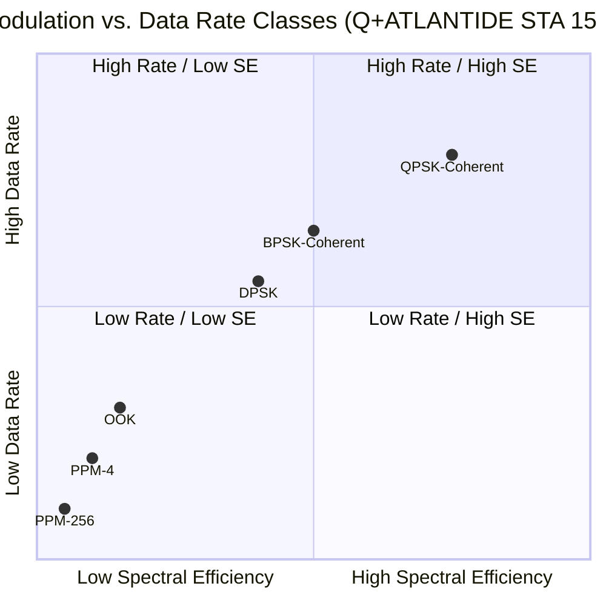

# STA 150-159 · 151-060 — Modulation Coding and Data Rate Classes

## §1 Purpose

This document defines the **optical modulation schemes**, forward error correction (FEC) coding families, and **data rate classes** adopted within the Q+ATLANTIDE STA 151 baseline for free-space optical communications.[^baseline] It establishes the controlled taxonomy of modulation formats, spectral efficiency metrics, and rate-class labels that enable consistent capability declarations and compatibility assessments across Q+ATLANTIDE-governed programmes.[^qdiv]

Rate class designations and modulation format codes defined herein are normative for all Q+ATLANTIDE STA 151 interface documents and procurement specifications.[^gov]

## §2 Scope

**In scope:**

- Intensity-modulation direct-detection (IM/DD) schemes: On-Off Keying (OOK) and Pulse-Position Modulation (PPM — M-PPM, 4-PPM, 16-PPM, 256-PPM)
- Coherent modulation schemes: Differential Phase-Shift Keying (DPSK), Binary Phase-Shift Keying (BPSK coherent), and Quadrature Phase-Shift Keying (QPSK coherent)
- Data rate class taxonomy: Class-100M (100 Mbps), Class-1G (1 Gbps), Class-10G (10 Gbps), Class-100G (100 Gbps)
- FEC coding families: Reed-Solomon (RS), Low-Density Parity-Check (LDPC), and Turbo codes — code rate, overhead, and gain
- Spectral efficiency: bits/s/Hz comparison across modulation schemes
- Q+ATLANTIDE rate-class code assignment rules and interoperability requirements

**Out of scope:** Link-budget power calculations (see 005); laser terminal hardware limits on modulation bandwidth (see 003); optical ground station modem implementation (see 007).

## §3 Diagram

## §4 Footprint

| Attribute | Value |
|-----------|-------|
| Architecture | Space Technology Architecture (STA) |
| Master range | 100–199 |
| Code range | 150-159 |
| Section | 05 — Comunicaciones Espaciales |
| Subsection | 151 — Enlaces Ópticos |
| Subsubject | 006 — Modulation Coding and Data Rate Classes |
| Primary Q-Division | Q-SPACE |
| Support Q-Divisions | Q-DATAGOV, Q-HPC |
| ORB support | ORB-PMO, ORB-LEG |
| Governance class | baseline |
| Folder path | `Q+ATLANTIDE/100-199_STA/150-159_Comunicaciones-Espaciales/151_Enlaces-Opticos/` |
| Document | `151-060-Modulation-Coding-and-Data-Rate-Classes.md` |
| Parent subsection | [README.md](./README.md) · [`151-000-General.md`](./151-000-General.md) |
| Parent architecture | [../../README.md](../../README.md) |
| Parent baseline | [organization/Q+ATLANTIDE.md](../../../../organization/Q+ATLANTIDE.md) |

## §5 References & Citations

[^baseline]: Q+ATLANTIDE controlled baseline (v1.0.0).[^n001]
[^archtable]: §3 Architecture Table (parent) — see [../../README.md](../../README.md).
[^qdiv]: Q-Division authority — Q-SPACE.
[^gov]: Governance class — baseline.
[^ecss50]: ECSS-E-ST-50C — *Space engineering: Communications* (ESA, 2008).
[^ccsds141]: CCSDS 141.0-B — *Optical Communications — Optical Link* (CCSDS, 2015).
[^iec60825]: IEC 60825-1 — *Safety of laser products* (IEC, 2014).
[^itur]: ITU-R S.1714 — *Free-space optical links on Earth* (ITU, 2005).
[^nasa4005]: NASA-STD-4005 — *LEO Spacecraft Charging Design Standard* (NASA, 2013).
[^n001]: Note N-001: Q+ATLANTIDE is a taxonomy and traceability ecosystem, not a mission or programme.

### Applicable industry standards

- ECSS-E-ST-50C — Space engineering: Communications (ESA, 2008)[^ecss50]
- CCSDS 141.0-B — Optical Communications — Optical Link (CCSDS, 2015)[^ccsds141]
- ITU-R S.1714 — Free-space optical links on Earth (ITU, 2005)[^itur]
- NASA-TM-2013-217496 — Overview of NASA's Optical Communications Program (NASA, 2013)
- ETSI GS QKD 002 — Quantum Key Distribution; Use Cases (ETSI, 2010)
