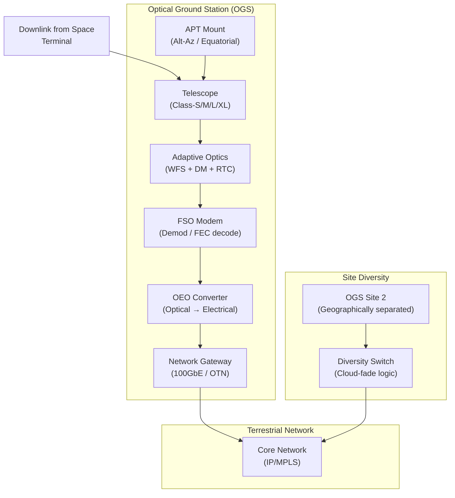

# STA 150-159 · 151-070 — Ground Station and Optical Network Interfaces

## §1 Purpose

This document defines the **Optical Ground Station (OGS) functional architecture** and the network interfaces between the OGS and the terrestrial/space network infrastructure within the Q+ATLANTIDE STA 151 baseline.[^baseline] It establishes the controlled taxonomy of telescope aperture classes, adaptive optics subsystems, tracking mount configurations, modem and optical-electrical-optical (OEO) converter roles, and site diversity strategy.[^qdiv]

The OGS definitions provided herein are normative for all Q+ATLANTIDE-governed ground segment design activities that include free-space optical reception or transmission.[^gov]

## §2 Scope

**In scope:**

- Telescope aperture class taxonomy: Class-S (< 0.5 m), Class-M (0.5–1.0 m), Class-L (1.0–2.0 m), Class-XL (> 2.0 m)
- Adaptive optics (AO) subsystem: wavefront sensor (Shack-Hartmann), deformable mirror (DM), real-time controller, and Strehl ratio budget
- Tracking mount: altitude-azimuth (alt-az), equatorial, hexapod; slew rate, settling time, and wind load constraints
- OGS modem and OEO converter: fiber-coupled output, data interface (100GbE / OTN), clock recovery
- Network gateway function: IP/MPLS handoff, latency budget, and protocol encapsulation
- Site diversity strategy: inter-site separation criteria, switching logic, and availability gain model

**Out of scope:** Space terminal laser design (see 003); APT control loop for space terminal (see 004); laser eye-safety zones at OGS (see 008).

## §3 Diagram

## §4 Footprint

| Attribute | Value |
|-----------|-------|
| Architecture | Space Technology Architecture (STA) |
| Master range | 100–199 |
| Code range | 150-159 |
| Section | 05 — Comunicaciones Espaciales |
| Subsection | 151 — Enlaces Ópticos |
| Subsubject | 007 — Ground Station and Optical Network Interfaces |
| Primary Q-Division | Q-SPACE |
| Support Q-Divisions | Q-DATAGOV, Q-HPC |
| ORB support | ORB-PMO, ORB-LEG |
| Governance class | baseline |
| Folder path | `Q+ATLANTIDE/100-199_STA/150-159_Comunicaciones-Espaciales/151_Enlaces-Opticos/` |
| Document | `151-070-Ground-Station-and-Optical-Network-Interfaces.md` |
| Parent subsection | [README.md](./README.md) · [`151-000-General.md`](./151-000-General.md) |
| Parent architecture | [../../README.md](../../README.md) |
| Parent baseline | [organization/Q+ATLANTIDE.md](../../../../organization/Q+ATLANTIDE.md) |

## §5 References & Citations

[^baseline]: Q+ATLANTIDE controlled baseline (v1.0.0).[^n001]
[^archtable]: §3 Architecture Table (parent) — see [../../README.md](../../README.md).
[^qdiv]: Q-Division authority — Q-SPACE.
[^gov]: Governance class — baseline.
[^ecss50]: ECSS-E-ST-50C — *Space engineering: Communications* (ESA, 2008).
[^ccsds141]: CCSDS 141.0-B — *Optical Communications — Optical Link* (CCSDS, 2015).
[^iec60825]: IEC 60825-1 — *Safety of laser products* (IEC, 2014).
[^itur]: ITU-R S.1714 — *Free-space optical links on Earth* (ITU, 2005).
[^nasa4005]: NASA-STD-4005 — *LEO Spacecraft Charging Design Standard* (NASA, 2013).
[^n001]: Note N-001: Q+ATLANTIDE is a taxonomy and traceability ecosystem, not a mission or programme.

### Applicable industry standards

- ECSS-E-ST-50C — Space engineering: Communications (ESA, 2008)[^ecss50]
- ECSS-E-ST-10-03C — Space engineering: Testing (ESA, 2012)
- CCSDS 141.0-B — Optical Communications — Optical Link (CCSDS, 2015)[^ccsds141]
- ITU-R S.1714 — Free-space optical links on Earth (ITU, 2005)[^itur]
- IEC 60825-1 — Safety of laser products (IEC, 2014)[^iec60825]
- NASA-TM-2013-217496 — Overview of NASA's Optical Communications Program (NASA, 2013)
