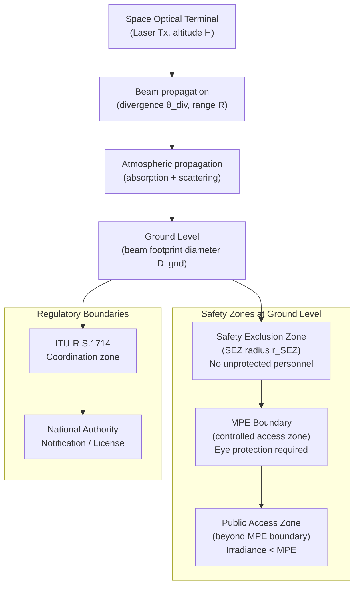

# STA 150-159 · 151-080 — Safety Eye Hazard and Regulatory Boundaries

## §1 Purpose

This document defines the **laser safety classification framework** and regulatory boundary requirements for free-space optical links within the Q+ATLANTIDE STA 151 baseline.[^baseline] It establishes the controlled methodology for assigning IEC 60825-1 hazard classes, computing Maximum Permissible Exposure (MPE) values, delineating exclusion zones, and satisfying ITU-R coordination obligations for space optical terminals.[^qdiv]

Compliance with the safety and regulatory requirements defined herein is mandatory for all Q+ATLANTIDE-registered FSO terminal designs and ground station operations, with non-conformances subject to ORB-LEG review.[^gov]

## §2 Scope

**In scope:**

- IEC 60825-1 laser hazard class taxonomy for space FSO links: Class 1M, Class 3B, Class 4 exposure at ground level under beam-spread conditions
- Maximum Permissible Exposure (MPE) calculation: wavelength-dependent MPE limits (retinal and corneal hazard), exposure duration, and beam diameter at observer distance
- Safety exclusion zone (SEZ) definition: ground-level SEZ radius as a function of transmit power, wavelength, divergence, and altitude
- ITU-R S.1714 coordination requirements: notification obligations, interference avoidance zones, and uplink/downlink operational constraints
- Q+ATLANTIDE COMSEC/safety boundary: classification of optical link parameters subject to operational security constraints
- Operational safety protocols: shutter interlocks, aircraft avoidance, and ground personnel protection

**Out of scope:** Laser terminal internal optical power levels and IEC class assignment for the terminal enclosure (covered by system safety plan); ionising radiation effects on laser components (see system reliability baseline).

## §3 Diagram

## §4 Footprint

| Attribute | Value |
|-----------|-------|
| Architecture | Space Technology Architecture (STA) |
| Master range | 100–199 |
| Code range | 150-159 |
| Section | 05 — Comunicaciones Espaciales |
| Subsection | 151 — Enlaces Ópticos |
| Subsubject | 008 — Safety Eye Hazard and Regulatory Boundaries |
| Primary Q-Division | Q-SPACE |
| Support Q-Divisions | Q-DATAGOV, Q-HPC |
| ORB support | ORB-PMO, ORB-LEG |
| Governance class | baseline |
| Folder path | `Q+ATLANTIDE/100-199_STA/150-159_Comunicaciones-Espaciales/151_Enlaces-Opticos/` |
| Document | `151-080-Safety-Eye-Hazard-and-Regulatory-Boundaries.md` |
| Parent subsection | [README.md](./README.md) · [`151-000-General.md`](./151-000-General.md) |
| Parent architecture | [../../README.md](../../README.md) |
| Parent baseline | [organization/Q+ATLANTIDE.md](../../../../organization/Q+ATLANTIDE.md) |

## §5 References & Citations

[^baseline]: Q+ATLANTIDE controlled baseline (v1.0.0).[^n001]
[^archtable]: §3 Architecture Table (parent) — see [../../README.md](../../README.md).
[^qdiv]: Q-Division authority — Q-SPACE.
[^gov]: Governance class — baseline. Safety deviations require ORB-LEG formal review.
[^ecss50]: ECSS-E-ST-50C — *Space engineering: Communications* (ESA, 2008).
[^ccsds141]: CCSDS 141.0-B — *Optical Communications — Optical Link* (CCSDS, 2015).
[^iec60825]: IEC 60825-1 — *Safety of laser products — Part 1: Equipment classification and requirements* (IEC, 2014).
[^itur]: ITU-R S.1714 — *Free-space optical links on Earth* (ITU, 2005).
[^nasa4005]: NASA-STD-4005 — *LEO Spacecraft Charging Design Standard* (NASA, 2013).
[^n001]: Note N-001: Q+ATLANTIDE is a taxonomy and traceability ecosystem, not a mission or programme.

### Applicable industry standards

- IEC 60825-1 — Safety of laser products — Part 1: Equipment classification and requirements (IEC, 2014)[^iec60825]
- ITU-R S.1714 — Free-space optical links on Earth (ITU, 2005)[^itur]
- ECSS-E-ST-50C — Space engineering: Communications (ESA, 2008)[^ecss50]
- CCSDS 141.0-B — Optical Communications — Optical Link (CCSDS, 2015)[^ccsds141]
- NASA-TM-2013-217496 — Overview of NASA's Optical Communications Program (NASA, 2013)
- ANSI Z136.1 — Safe Use of Lasers (American National Standard, 2014)
