# STA 150-159 · 151-090 — Traceability Evidence and Lifecycle Governance

## §1 Purpose

This document defines the **evidence package requirements** and **lifecycle review gate** obligations for free-space optical link subsystems governed under Q+ATLANTIDE STA 151.[^baseline] It establishes the controlled set of artefacts that must be produced, reviewed, and archived at each programme milestone to demonstrate compliance with the optical link baseline and applicable standards.[^qdiv]

The evidence and governance framework defined herein applies to all Q+ATLANTIDE-registered programmes incorporating FSO links, from concept to disposal, with non-compliance triggering formal ORB-PMO or ORB-LEG action.[^gov]

## §2 Scope

**In scope:**

- APT subsystem test records: acquisition time test, pointing residual measurement, and closed-loop bandwidth verification evidence
- Link-budget evidence packages: analysis report, margins spreadsheet, and atmospheric model reference traceability
- Atmospheric-loss model references: Cn² profile source data, cloud statistics dataset, and model validation records
- Eye-safety clearance documentation: MPE calculation worksheet, SEZ definition drawing, and safety authority sign-off
- ICD (Interface Control Document) traceability: optical terminal ↔ spacecraft ICD, OGS ↔ network gateway ICD, and cross-link ICD versioning
- Review gate evidence checklist: Preliminary Design Review (PDR), Critical Design Review (CDR), Operational Readiness Review (ORR), and In-Orbit Commissioning Review (IOCR)

**Out of scope:** Programme-level system-of-systems traceability matrix (programme-specific); software verification and validation evidence for modem firmware (covered under software baseline).

## §3 Diagram

```mermaid
flowchart LR
    subgraph CONCEPT["Concept Phase"]
        FSOR["FSO Requirements\nCapture"]
        TRADE["Trade Study\nEvidence"]
    end
    subgraph PDR_G["PDR Gate"]
        LBPDR["Link Budget\nEvidence v1"]
        APTPDR["APT Budget\nAnalysis"]
        ICDA["ICD Draft\nIssued"]
    end
    subgraph CDR_G["CDR Gate"]
        LBCDR["Link Budget\nEvidence v2 (Final)"]
        ATMPDR["Atm. Loss Model\nValidation"]
        SAFCDR["Eye-Safety\nClearance"]
        ICDCDR["ICD Baselined"]
    end
    subgraph ORR_G["ORR Gate"]
        APTTEST["APT Test\nRecords"]
        SAFORR["Safety Authority\nSign-off"]
        ICDORR["ICD Final\nVersion"]
    end
    subgraph IOCR_G["IOCR Gate"]
        INORBIT["In-orbit APT\nCommissioning Data"]
        LBVERIFY["Link Budget\nVerification (On-orbit)"]
        ARCHIVE["Evidence Archive\n(Q+ATLANTIDE Register)"]
    end

    CONCEPT --> PDR_G --> CDR_G --> ORR_G --> IOCR_G
    IOCR_G --> ARCHIVE
```

## §4 Footprint

| Attribute | Value |
|-----------|-------|
| Architecture | Space Technology Architecture (STA) |
| Master range | 100–199 |
| Code range | 150-159 |
| Section | 05 — Comunicaciones Espaciales |
| Subsection | 151 — Enlaces Ópticos |
| Subsubject | 010 — Traceability Evidence and Lifecycle Governance |
| Primary Q-Division | Q-SPACE |
| Support Q-Divisions | Q-DATAGOV, Q-HPC |
| ORB support | ORB-PMO, ORB-LEG |
| Governance class | baseline |
| Folder path | `Q+ATLANTIDE/100-199_STA/150-159_Comunicaciones-Espaciales/151_Enlaces-Opticos/` |
| Document | `151-090-Traceability-Evidence-and-Lifecycle-Governance.md` |
| Parent subsection | [README.md](./README.md) · [`151-000-General.md`](./151-000-General.md) |
| Parent architecture | [../../README.md](../../README.md) |
| Parent baseline | [organization/Q+ATLANTIDE.md](../../../../organization/Q+ATLANTIDE.md) |

## §5 References & Citations

[^baseline]: Q+ATLANTIDE controlled baseline (v1.0.0).[^n001]
[^archtable]: §3 Architecture Table (parent) — see [../../README.md](../../README.md).
[^qdiv]: Q-Division authority — Q-SPACE.
[^gov]: Governance class — baseline.
[^ecss50]: ECSS-E-ST-50C — *Space engineering: Communications* (ESA, 2008).
[^ccsds141]: CCSDS 141.0-B — *Optical Communications — Optical Link* (CCSDS, 2015).
[^iec60825]: IEC 60825-1 — *Safety of laser products* (IEC, 2014).
[^itur]: ITU-R S.1714 — *Free-space optical links on Earth* (ITU, 2005).
[^nasa4005]: NASA-STD-4005 — *LEO Spacecraft Charging Design Standard* (NASA, 2013).
[^n001]: Note N-001: Q+ATLANTIDE is a taxonomy and traceability ecosystem, not a mission or programme.

### Applicable industry standards

- ECSS-E-ST-50C — Space engineering: Communications (ESA, 2008)[^ecss50]
- ECSS-E-ST-10-03C — Space engineering: Testing (ESA, 2012)
- CCSDS 141.0-B — Optical Communications — Optical Link (CCSDS, 2015)[^ccsds141]
- ITU-R S.1714 — Free-space optical links on Earth (ITU, 2005)[^itur]
- IEC 60825-1 — Safety of laser products (IEC, 2014)[^iec60825]
- NASA-TM-2013-217496 — Overview of NASA's Optical Communications Program (NASA, 2013)
- NASA-STD-4005 — LEO Spacecraft Charging Design Standard (NASA, 2013)[^nasa4005]
- ETSI GS QKD 002 — Quantum Key Distribution; Use Cases (ETSI, 2010)
