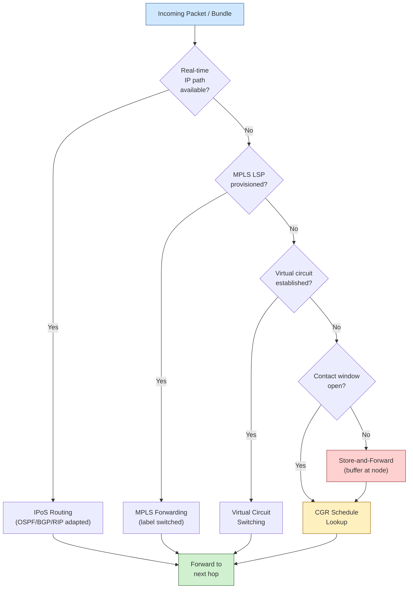

# STA 150-159 · 05.152.003 — Routing, Switching, and Store-and-Forward Patterns

## §1 Purpose

This document defines the routing and switching strategies applicable to Q+ATLANTIDE space networks, covering both real-time IP-based and disruption-tolerant forwarding paradigms.[^baseline] It establishes authoritative terminology for IP routing over satellite (IPoS), MPLS over satellite, virtual circuit switching, store-and-forward relay, and contact graph routing (CGR), enabling consistent design and implementation decisions across missions.[^archtable] The document also prescribes priority-based forwarding rules to enforce traffic class guarantees.[^n001]

## §2 Scope

**In scope:**

- IP routing over satellite (IPoS): adaptation of IPv4/IPv6 routing protocols (OSPF, BGP, RIP) for high-latency asymmetric satellite links[^ccsds702]
- MPLS over satellite: label-switched paths, traffic engineering, and fast reroute over space segments
- Virtual circuit switching: ATM-legacy and connection-oriented forwarding for deterministic latency applications
- Store-and-forward relay patterns: node-based message buffering, scheduled contact exploitation, and epidemic routing variants
- Contact graph routing (CGR): deterministic contact schedule computation, route selection based on predicted link availability, and Dijkstra/Yen algorithm adaptation for DTN[^ccsds720]
- Priority-based forwarding: strict priority queuing, weighted fair queuing, and preemption policies per traffic class

**Out of scope:** Physical-layer modulation and coding schemes (subsection 151), DTN bundle-layer custody transfer (subsubject 004), and QoS DSCP marking policies (subsubject 007).

## §3 Diagram

## §4 Footprint

| Attribute | Value |
|---|---|
| Architecture | Space Technology Architecture (STA) |
| Master range | 100–199 |
| Code range | 150-159 |
| Section | 05 — Comunicaciones Espaciales |
| Subsection | 152 — Redes Espaciales |
| Subsubject | 003 — Routing, Switching, and Store-and-Forward Patterns |
| Primary Q-Division | Q-SPACE[^qdiv] |
| Support Q-Divisions | Q-DATAGOV, Q-HPC |
| ORB support | ORB-PMO, ORB-LEG |
| Governance class | baseline[^gov] |
| Folder path | `Q+ATLANTIDE/100-199_STA/150-159_Comunicaciones-Espaciales/152_Redes-Espaciales/` |
| Document | `003_Routing-Switching-and-Store-and-Forward-Patterns.md` |
| Parent subsection | [README.md](./README.md) · [000_Overview.md](./000_Overview.md) |
| Parent architecture | [../../README.md](../../README.md) |
| Parent baseline | [organization/Q+ATLANTIDE.md](../../../../organization/Q+ATLANTIDE.md) |

## §5 References & Citations

[^baseline]: Q+ATLANTIDE controlled baseline (v1.0.0)
[^archtable]: §3 Architecture Table (parent)
[^qdiv]: Q-Division authority
[^gov]: Governance class — baseline
[^n001]: Note N-001 (Q+ATLANTIDE is a taxonomy/traceability ecosystem)

### Applicable industry standards

| Standard | Title |
|---|---|
| CCSDS 702.1-B | IP over CCSDS Space Links[^ccsds702] |
| CCSDS 720.1-G | Delay-Tolerant Networking Architecture[^ccsds720] |
| RFC 5050 | Bundle Protocol Specification[^rfc5050] |
| RFC 5326 | Licklider Transmission Protocol (LTP)[^rfc5326] |
| ECSS-E-ST-50C | Space engineering: Communications[^ecss50] |
| ITU-R S.1003 | Environmental protection of the geostationary-satellite orbit[^itur] |

[^ecss50]: ECSS-E-ST-50C — Space engineering: Communications
[^ccsds720]: CCSDS 720.1-G — Delay-Tolerant Networking Architecture
[^ccsds702]: CCSDS 702.1-B — IP over CCSDS Space Links
[^rfc5050]: RFC 5050 — Bundle Protocol Specification
[^rfc5326]: RFC 5326 — Licklider Transmission Protocol (LTP)
[^itur]: ITU-R S.1003 — Environmental protection of the geostationary-satellite orbit
