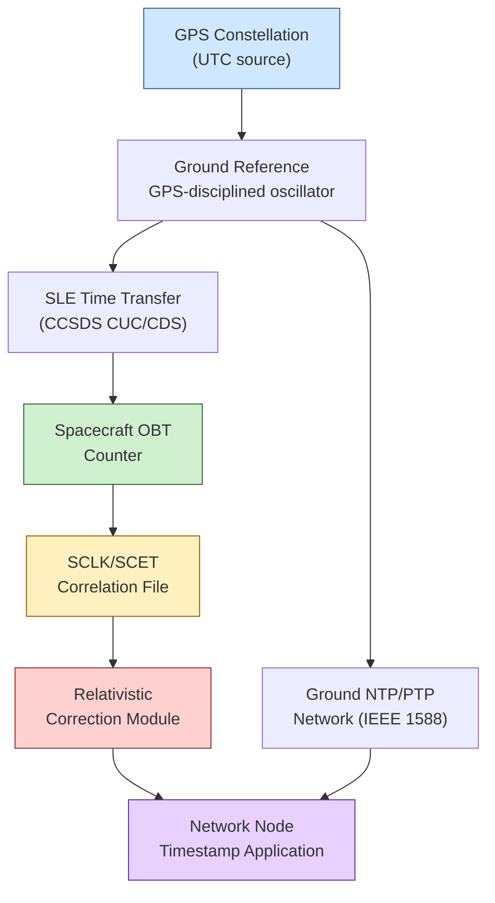

# STA 150-159 · 05.152.006 — Network Time Synchronization and Reference Frames

## §1 Purpose

This document defines the time synchronisation architecture for Q+ATLANTIDE space networks, establishing the authoritative hierarchy of time sources, distribution protocols, and reference frame mappings required for network-layer operations.[^baseline] It specifies the relationship between on-board time (OBT), spacecraft clock/event time (SCLK/SCET), GPS-disciplined ground references, and the distribution mechanisms (CCSDS Time Code Formats and IEEE 1588 PTP) used to maintain coherent time across all network nodes.[^archtable] Relativistic corrections applicable to high-velocity or deep-space missions are also addressed.[^n001]

## §2 Scope

**In scope:**

- On-board time (OBT): spacecraft oscillator-derived time counter, drift characterisation, and OBT format requirements per CCSDS
- GPS-disciplined ground reference: UTC(GPS) traceability, antenna-to-server path, and holdover behaviour during GPS outage
- SCLK/SCET mapping: spacecraft clock-to-event-time correlation, polynomial coefficient updates, and time correlation files (TCF)[^ecss50]
- Time distribution protocols: CCSDS Time Code Formats (CUC, CDS) for on-board time transfer; IEEE 1588 PTP for ground segment network synchronisation
- Relativistic corrections: special-relativistic Doppler compensation for LEO/MEO/GEO/deep-space velocity profiles, general-relativistic gravitational redshift estimates
- Time synchronisation accuracy requirements: network timestamp resolution, acceptable uncertainty budgets per traffic class

**Out of scope:** Navigation timing for orbit determination (subsection 101), absolute UTC standards governance, and application-layer event timestamping policies.

## §3 Diagram

## §4 Footprint

| Attribute | Value |
|---|---|
| Architecture | Space Technology Architecture (STA) |
| Master range | 100–199 |
| Code range | 150-159 |
| Section | 05 — Comunicaciones Espaciales |
| Subsection | 152 — Redes Espaciales |
| Subsubject | 006 — Network Time Synchronization and Reference Frames |
| Primary Q-Division | Q-SPACE[^qdiv] |
| Support Q-Divisions | Q-DATAGOV, Q-HPC |
| ORB support | ORB-PMO, ORB-LEG |
| Governance class | baseline[^gov] |
| Folder path | `Q+ATLANTIDE/100-199_STA/150-159_Comunicaciones-Espaciales/152_Redes-Espaciales/` |
| Document | `006_Network-Time-Synchronization-and-Reference-Frames.md` |
| Parent subsection | [README.md](./README.md) · [000_Overview.md](./000_Overview.md) |
| Parent architecture | [../../README.md](../../README.md) |
| Parent baseline | [organization/Q+ATLANTIDE.md](../../../../organization/Q+ATLANTIDE.md) |

## §5 References & Citations

[^baseline]: Q+ATLANTIDE controlled baseline (v1.0.0)
[^archtable]: §3 Architecture Table (parent)
[^qdiv]: Q-Division authority
[^gov]: Governance class — baseline
[^n001]: Note N-001 (Q+ATLANTIDE is a taxonomy/traceability ecosystem)

### Applicable industry standards

| Standard | Title |
|---|---|
| ECSS-E-ST-10-03C | Space engineering: Testing[^ecss1003] |
| ECSS-E-ST-50C | Space engineering: Communications[^ecss50] |
| CCSDS 702.1-B | IP over CCSDS Space Links[^ccsds702] |
| CCSDS 720.1-G | Delay-Tolerant Networking Architecture[^ccsds720] |
| RFC 5050 | Bundle Protocol Specification[^rfc5050] |
| RFC 5326 | Licklider Transmission Protocol (LTP)[^rfc5326] |
| ITU-R S.1003 | Environmental protection of the geostationary-satellite orbit[^itur] |

[^ecss50]: ECSS-E-ST-50C — Space engineering: Communications
[^ecss1003]: ECSS-E-ST-10-03C — Space engineering: Testing
[^ccsds720]: CCSDS 720.1-G — Delay-Tolerant Networking Architecture
[^ccsds702]: CCSDS 702.1-B — IP over CCSDS Space Links
[^rfc5050]: RFC 5050 — Bundle Protocol Specification
[^rfc5326]: RFC 5326 — Licklider Transmission Protocol (LTP)
[^itur]: ITU-R S.1003 — Environmental protection of the geostationary-satellite orbit
