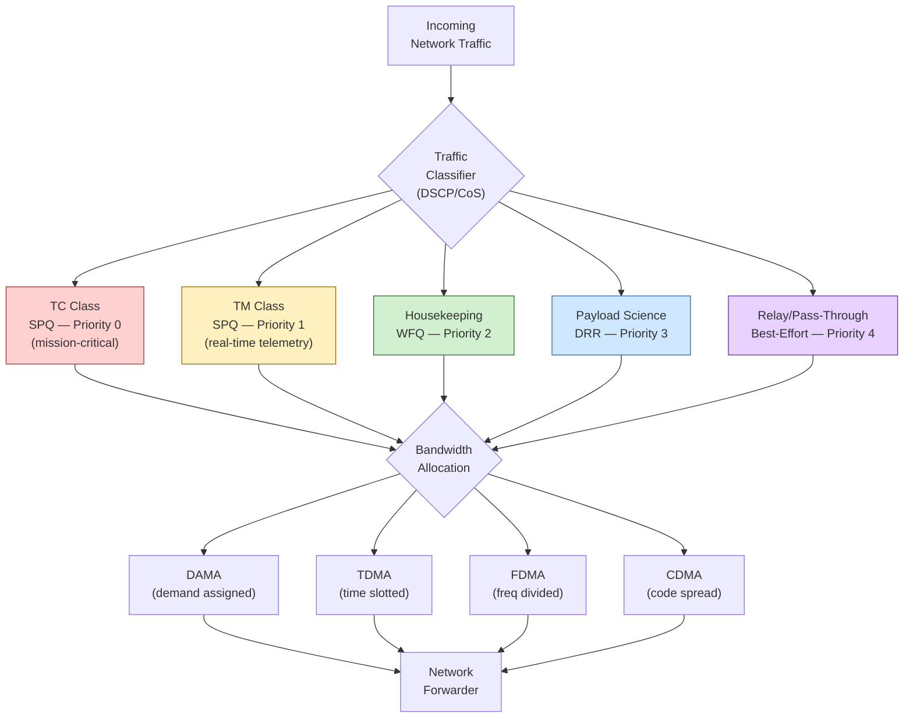

# STA 150-159 · 05.152.007 — QoS Priority and Mission Traffic Classes

## §1 Purpose

This document defines the Quality of Service (QoS) framework for Q+ATLANTIDE space networks, establishing the authoritative traffic class taxonomy, priority assignment rules, and bandwidth allocation mechanisms applicable to all mission network segments.[^baseline] It prescribes DSCP marking schemes, queuing disciplines, and multiple-access allocation methods (DAMA, FDMA, TDMA, CDMA) to ensure that mission-critical traffic receives deterministic service guarantees under nominal and degraded network conditions.[^archtable][^n001]

## §2 Scope

**In scope:**

- Traffic class definitions: Telecommand (TC), Telemetry (TM), payload science data, housekeeping/engineering data, and relay/pass-through traffic[^ecss50]
- DSCP marking: Differentiated Services Code Point assignment per traffic class, mapping to 802.1p/CoS for ground LAN segments, and PHB (per-hop behaviour) selection
- Bandwidth allocation schemes: Demand-Assigned Multiple Access (DAMA), Frequency Division Multiple Access (FDMA), Time Division Multiple Access (TDMA), and Code Division Multiple Access (CDMA)
- Priority queuing disciplines: strict priority queuing (SPQ), weighted fair queuing (WFQ), deficit round-robin (DRR), and preemption policies for emergency TC traffic
- Mission-critical traffic guarantees: maximum acceptable latency and jitter budgets per class, bandwidth reservation floors, and degraded-mode fallback policies
- QoS configuration management: parameter versioning, change authority, and on-orbit reconfiguration constraints

**Out of scope:** Physical-layer modulation and waveform selection (subsection 151), application-layer data prioritisation within payload science pipelines, and commercial satellite service SLA management.

## §3 Diagram

## §4 Footprint

| Attribute | Value |
|---|---|
| Architecture | Space Technology Architecture (STA) |
| Master range | 100–199 |
| Code range | 150-159 |
| Section | 05 — Comunicaciones Espaciales |
| Subsection | 152 — Redes Espaciales |
| Subsubject | 007 — QoS Priority and Mission Traffic Classes |
| Primary Q-Division | Q-SPACE[^qdiv] |
| Support Q-Divisions | Q-DATAGOV, Q-HPC |
| ORB support | ORB-PMO, ORB-LEG |
| Governance class | baseline[^gov] |
| Folder path | `Q+ATLANTIDE/100-199_STA/150-159_Comunicaciones-Espaciales/152_Redes-Espaciales/` |
| Document | `007_QoS-Priority-and-Mission-Traffic-Classes.md` |
| Parent subsection | [README.md](./README.md) · [000_Overview.md](./000_Overview.md) |
| Parent architecture | [../../README.md](../../README.md) |
| Parent baseline | [organization/Q+ATLANTIDE.md](../../../../organization/Q+ATLANTIDE.md) |

## §5 References & Citations

[^baseline]: Q+ATLANTIDE controlled baseline (v1.0.0)
[^archtable]: §3 Architecture Table (parent)
[^qdiv]: Q-Division authority
[^gov]: Governance class — baseline
[^n001]: Note N-001 (Q+ATLANTIDE is a taxonomy/traceability ecosystem)

### Applicable industry standards

| Standard | Title |
|---|---|
| ECSS-E-ST-50C | Space engineering: Communications[^ecss50] |
| CCSDS 702.1-B | IP over CCSDS Space Links[^ccsds702] |
| CCSDS 720.1-G | Delay-Tolerant Networking Architecture[^ccsds720] |
| ITU-R S.1003 | Environmental protection of the geostationary-satellite orbit[^itur] |
| RFC 5050 | Bundle Protocol Specification[^rfc5050] |
| RFC 5326 | Licklider Transmission Protocol (LTP)[^rfc5326] |

[^ecss50]: ECSS-E-ST-50C — Space engineering: Communications
[^ccsds720]: CCSDS 720.1-G — Delay-Tolerant Networking Architecture
[^ccsds702]: CCSDS 702.1-B — IP over CCSDS Space Links
[^rfc5050]: RFC 5050 — Bundle Protocol Specification
[^rfc5326]: RFC 5326 — Licklider Transmission Protocol (LTP)
[^itur]: ITU-R S.1003 — Environmental protection of the geostationary-satellite orbit
