# STA 150-159 · 05.152.009 — CCSDS, ECSS, ITU, and NASA Standards Mapping

## §1 Purpose

This document maps each space-network function defined within subsection 152 to its applicable industry standard, drawn from CCSDS, ECSS, ITU-R, and NASA normative sources.[^baseline] It provides the authoritative compliance traceability matrix that mission teams shall use to verify standard applicability during design reviews and certification activities.[^archtable] The mapping also identifies gaps where Q+ATLANTIDE supplementary guidance supersedes or extends a referenced standard.[^n001]

## §2 Scope

**In scope:**

- CCSDS standard applicability: CCSDS 720.1-G (DTN Architecture)[^ccsds720], CCSDS 702.1-B (IP over CCSDS Space Links)[^ccsds702] mapped to subsubjects 001–010
- ECSS standard applicability: ECSS-E-ST-50C (Space engineering: Communications)[^ecss50] and ECSS-E-ST-10-03C (Testing) mapped to interface, QoS, and verification requirements
- ITU-R standard applicability: ITU-R S.1003 (geostationary orbit protection)[^itur] mapped to frequency coordination and spectrum management functions
- NASA standard applicability: NASA-STD-4005 mapped to spectrum management and RF interference considerations
- IETF RFC applicability: RFC 5050 (Bundle Protocol)[^rfc5050] and RFC 5326 (LTP)[^rfc5326] mapped to DTN convergence layer implementations
- Gap identification: functions where no applicable standard exists and Q+ATLANTIDE supplementary guidance applies

**Out of scope:** Standards applicable to subsections outside 152, hardware qualification standards (ECSS-E-ST-10 series beyond 10-03C), and classified COMSEC standards.

## §3 Diagram

```mermaid
flowchart TD
    subgraph Functions["Subsection 152 Functions"]
        F001["001 Controlled Definition"]
        F002["002 Architecture & Topology"]
        F003["003 Routing & Switching"]
        F004["004 DTN"]
        F005["005 Interfaces & ICD"]
        F006["006 Time Sync"]
        F007["007 QoS & Traffic"]
        F008["008 Security & Resilience"]
        F010["010 Traceability"]
    end

    subgraph Standards
        C720["CCSDS 720.1-G\n(DTN)"]
        C702["CCSDS 702.1-B\n(IP/CCSDS)"]
        E50["ECSS-E-ST-50C\n(Comms)"]
        E1003["ECSS-E-ST-10-03C\n(Testing)"]
        ITU["ITU-R S.1003\n(GEO orbit)"]
        N4005["NASA-STD-4005\n(Spectrum)"]
        R5050["RFC 5050\n(Bundle)"]
        R5326["RFC 5326\n(LTP)"]
    end

    F001 --> C702 & E50
    F002 --> E50 & ITU
    F003 --> C702 & C720 & R5050
    F004 --> C720 & R5050 & R5326
    F005 --> E50 & C702
    F006 --> E50 & E1003
    F007 --> E50 & ITU & N4005
    F008 --> E50 & N4005
    F010 --> E1003

    style C720 fill:#d0e8ff,stroke:#336699
    style C702 fill:#d0f0d0,stroke:#336633
    style E50 fill:#fff0c0,stroke:#996600
    style R5050 fill:#ffd0d0,stroke:#993333
    style R5326 fill:#e8d0ff,stroke:#663399
```

## §4 Footprint

| Attribute | Value |
|---|---|
| Architecture | Space Technology Architecture (STA) |
| Master range | 100–199 |
| Code range | 150-159 |
| Section | 05 — Comunicaciones Espaciales |
| Subsection | 152 — Redes Espaciales |
| Subsubject | 009 — CCSDS, ECSS, ITU, and NASA Standards Mapping |
| Primary Q-Division | Q-SPACE[^qdiv] |
| Support Q-Divisions | Q-DATAGOV, Q-HPC |
| ORB support | ORB-PMO, ORB-LEG |
| Governance class | baseline[^gov] |
| Folder path | `Q+ATLANTIDE/100-199_STA/150-159_Comunicaciones-Espaciales/152_Redes-Espaciales/` |
| Document | `009_CCSDS-ECSS-ITU-and-NASA-Standards-Mapping.md` |
| Parent subsection | [README.md](./README.md) · [000_Overview.md](./000_Overview.md) |
| Parent architecture | [../../README.md](../../README.md) |
| Parent baseline | [organization/Q+ATLANTIDE.md](../../../../organization/Q+ATLANTIDE.md) |

## §5 References & Citations

[^baseline]: Q+ATLANTIDE controlled baseline (v1.0.0)
[^archtable]: §3 Architecture Table (parent)
[^qdiv]: Q-Division authority
[^gov]: Governance class — baseline
[^n001]: Note N-001 (Q+ATLANTIDE is a taxonomy/traceability ecosystem)

### Applicable industry standards

| Standard | Title |
|---|---|
| CCSDS 720.1-G | Delay-Tolerant Networking Architecture[^ccsds720] |
| CCSDS 702.1-B | IP over CCSDS Space Links[^ccsds702] |
| ECSS-E-ST-50C | Space engineering: Communications[^ecss50] |
| ECSS-E-ST-10-03C | Space engineering: Testing[^ecss1003] |
| ITU-R S.1003 | Environmental protection of the geostationary-satellite orbit[^itur] |
| NASA-STD-4005 | NASA Standard for Spectrum Management[^nasa4005] |
| RFC 5050 | Bundle Protocol Specification[^rfc5050] |
| RFC 5326 | Licklider Transmission Protocol (LTP)[^rfc5326] |

[^ecss50]: ECSS-E-ST-50C — Space engineering: Communications
[^ecss1003]: ECSS-E-ST-10-03C — Space engineering: Testing
[^ccsds720]: CCSDS 720.1-G — Delay-Tolerant Networking Architecture
[^ccsds702]: CCSDS 702.1-B — IP over CCSDS Space Links
[^rfc5050]: RFC 5050 — Bundle Protocol Specification
[^rfc5326]: RFC 5326 — Licklider Transmission Protocol (LTP)
[^itur]: ITU-R S.1003 — Environmental protection of the geostationary-satellite orbit
[^nasa4005]: NASA-STD-4005 — NASA Standard for Spectrum Management
