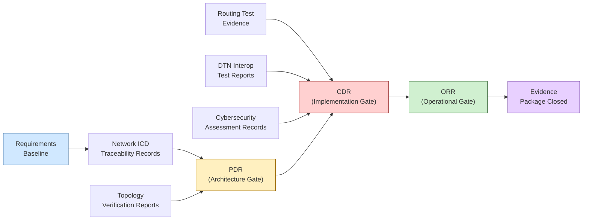

# STA 150-159 · 05.152.010 — Traceability, Evidence, and Lifecycle Governance

## §1 Purpose

This document defines the evidence package requirements, traceability record obligations, and lifecycle review gates applicable to all space network implementations within Q+ATLANTIDE missions.[^baseline] It establishes what artefacts must be produced and maintained — from network ICD traceability through routing test evidence and DTN interoperability reports — and which programme review gates (PDR, CDR, ORR) gate their acceptance.[^archtable] Compliance with this subsubject is mandatory for all missions operating under the Q+ATLANTIDE controlled baseline.[^n001]

## §2 Scope

**In scope:**

- Network ICD traceability records: bi-directional traceability from each interface control document to the applicable requirement, architecture decision, and verification evidence[^ecss50]
- Topology verification records: analysis reports confirming coverage, availability, and capacity compliance for each topology variant defined in subsubject 002
- Routing test evidence: contact graph routing simulation outputs, store-and-forward relay functional test reports, and IP routing convergence test records[^ccsds702]
- DTN interoperability test reports: bundle protocol interoperability test results against CCSDS 720.1-G reference implementations, LTP convergence layer conformance records[^ccsds720][^rfc5050][^rfc5326]
- Cybersecurity assessment records: threat model review minutes, network encryption verification evidence, penetration test reports, and anomaly detection calibration records
- Review gates: Preliminary Design Review (PDR) — architecture and ICD baseline; Critical Design Review (CDR) — implementation compliance; Operational Readiness Review (ORR) — pre-launch network validation closure

**Out of scope:** Requirements management tooling configuration, non-network subsystem evidence packages, and post-mission data archiving procedures.

## §3 Diagram

## §4 Footprint

| Attribute | Value |
|---|---|
| Architecture | Space Technology Architecture (STA) |
| Master range | 100–199 |
| Code range | 150-159 |
| Section | 05 — Comunicaciones Espaciales |
| Subsection | 152 — Redes Espaciales |
| Subsubject | 010 — Traceability, Evidence, and Lifecycle Governance |
| Primary Q-Division | Q-SPACE[^qdiv] |
| Support Q-Divisions | Q-DATAGOV, Q-HPC |
| ORB support | ORB-PMO, ORB-LEG |
| Governance class | baseline[^gov] |
| Folder path | `Q+ATLANTIDE/100-199_STA/150-159_Comunicaciones-Espaciales/152_Redes-Espaciales/` |
| Document | `010_Traceability-Evidence-and-Lifecycle-Governance.md` |
| Parent subsection | [README.md](./README.md) · [000_Overview.md](./000_Overview.md) |
| Parent architecture | [../../README.md](../../README.md) |
| Parent baseline | [organization/Q+ATLANTIDE.md](../../../../organization/Q+ATLANTIDE.md) |

## §5 References & Citations

[^baseline]: Q+ATLANTIDE controlled baseline (v1.0.0)
[^archtable]: §3 Architecture Table (parent)
[^qdiv]: Q-Division authority
[^gov]: Governance class — baseline
[^n001]: Note N-001 (Q+ATLANTIDE is a taxonomy/traceability ecosystem)

### Applicable industry standards

| Standard | Title |
|---|---|
| ECSS-E-ST-50C | Space engineering: Communications[^ecss50] |
| ECSS-E-ST-10-03C | Space engineering: Testing[^ecss1003] |
| CCSDS 720.1-G | Delay-Tolerant Networking Architecture[^ccsds720] |
| CCSDS 702.1-B | IP over CCSDS Space Links[^ccsds702] |
| RFC 5050 | Bundle Protocol Specification[^rfc5050] |
| RFC 5326 | Licklider Transmission Protocol (LTP)[^rfc5326] |
| ITU-R S.1003 | Environmental protection of the geostationary-satellite orbit[^itur] |

[^ecss50]: ECSS-E-ST-50C — Space engineering: Communications
[^ecss1003]: ECSS-E-ST-10-03C — Space engineering: Testing
[^ccsds720]: CCSDS 720.1-G — Delay-Tolerant Networking Architecture
[^ccsds702]: CCSDS 702.1-B — IP over CCSDS Space Links
[^rfc5050]: RFC 5050 — Bundle Protocol Specification
[^rfc5326]: RFC 5326 — Licklider Transmission Protocol (LTP)
[^itur]: ITU-R S.1003 — Environmental protection of the geostationary-satellite orbit
