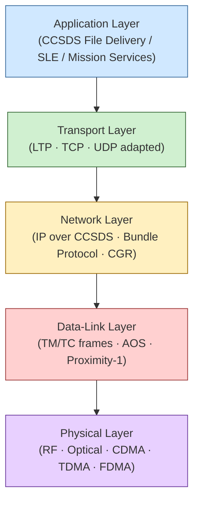

# STA 150-159 · 152-010 — Space Networks Controlled Definition

## §1 Purpose

This document establishes the controlled Q+ATLANTIDE definition of the term **"space network"** as used throughout the Redes Espaciales subsection and the broader Space Technology Architecture.[^baseline] It specifies the canonical protocol-layer model applicable to space communication systems, distinguishes space networks from terrestrial counterparts, and introduces the Q+ATLANTIDE network taxonomy that governs subsequent subsubjects.[^n001] All other documents within subsection 152 inherit and apply the definitions herein.[^archtable]

## §2 Scope

**In scope:**

- Network layer model for space systems: physical (RF/optical), data-link (framing, FEC), network (routing, addressing), transport (reliability, flow control), and application (services, formats)[^ccsds702]
- Space-specific protocol adaptations: long propagation delay handling, high bit-error-rate tolerance, asymmetric link capacity, and interrupted connectivity management
- Distinction from terrestrial networks: delay/disruption-tolerant vs. always-on, licensed spectrum vs. shared IP fabric, spacecraft autonomy requirements
- Q+ATLANTIDE network taxonomy: classification of network instances (uplink, downlink, crosslink, relay, ground backbone) and their governance attributes
- Reference to CCSDS and ECSS protocol suites as normative sources for space-layer definitions[^ecss50]
- Applicability boundaries: in-scope are all mission networks operated under Q+ATLANTIDE STA authority

**Out of scope:** Terrestrial-only IP networks, commercial internet backbone infrastructure, and RF/optical hardware specifications (addressed in other subsections).

## §3 Diagram

## §4 Footprint

| Attribute | Value |
|---|---|
| Architecture | Space Technology Architecture (STA) |
| Master range | 100–199 |
| Code range | 150-159 |
| Section | 05 — Comunicaciones Espaciales |
| Subsection | 152 — Redes Espaciales |
| Subsubject | 001 — Space Networks Controlled Definition |
| Primary Q-Division | Q-SPACE[^qdiv] |
| Support Q-Divisions | Q-DATAGOV, Q-HPC |
| ORB support | ORB-PMO, ORB-LEG |
| Governance class | baseline[^gov] |
| Folder path | `Q+ATLANTIDE/100-199_STA/150-159_Comunicaciones-Espaciales/152_Redes-Espaciales/` |
| Document | `152-010-Space-Networks-Controlled-Definition.md` |
| Parent subsection | [README.md](./README.md) · [`152-000-General.md`](./152-000-General.md) |
| Parent architecture | [../../README.md](../../README.md) |
| Parent baseline | [organization/Q+ATLANTIDE.md](../../../../organization/Q+ATLANTIDE.md) |

## §5 References & Citations

[^baseline]: Q+ATLANTIDE controlled baseline (v1.0.0)
[^archtable]: §3 Architecture Table (parent)
[^qdiv]: Q-Division authority
[^gov]: Governance class — baseline
[^n001]: Note N-001 (Q+ATLANTIDE is a taxonomy/traceability ecosystem)

### Applicable industry standards

| Standard | Title |
|---|---|
| ECSS-E-ST-50C | Space engineering: Communications[^ecss50] |
| CCSDS 702.1-B | IP over CCSDS Space Links[^ccsds702] |
| CCSDS 720.1-G | Delay-Tolerant Networking Architecture[^ccsds720] |
| RFC 5050 | Bundle Protocol Specification[^rfc5050] |
| RFC 5326 | Licklider Transmission Protocol (LTP)[^rfc5326] |
| ITU-R S.1003 | Environmental protection of the geostationary-satellite orbit[^itur] |

[^ecss50]: ECSS-E-ST-50C — Space engineering: Communications
[^ccsds720]: CCSDS 720.1-G — Delay-Tolerant Networking Architecture
[^ccsds702]: CCSDS 702.1-B — IP over CCSDS Space Links
[^rfc5050]: RFC 5050 — Bundle Protocol Specification
[^rfc5326]: RFC 5326 — Licklider Transmission Protocol (LTP)
[^itur]: ITU-R S.1003 — Environmental protection of the geostationary-satellite orbit
