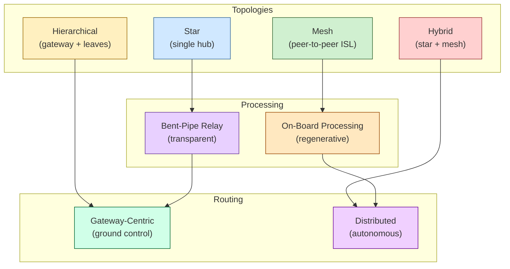

# STA 150-159 · 152-020 — Network Architecture and Topology

## §1 Purpose

This document defines the space network topology classes and high-level architectural patterns recognised within the Q+ATLANTIDE Space Technology Architecture.[^baseline] It establishes the authoritative classification of star, mesh, hierarchical, and hybrid topologies, and characterises the architectural trade between bent-pipe relay and on-board processing (OBP) approaches.[^archtable] The definitions enable consistent topology selection and documentation across all Q+ATLANTIDE space missions.[^n001]

## §2 Scope

**In scope:**

- Topology class definitions: star (single ground hub), mesh (peer-to-peer inter-satellite), hierarchical (gateway + leaf nodes), and hybrid (combined patterns)[^ccsds702]
- Bent-pipe relay architecture: transparent transponder, frequency translation, amplification without demodulation
- On-board processing (OBP) architecture: on-orbit demodulation, switching, routing, and regenerative retransmission
- Gateway-centric vs. distributed routing: centralised ground-control routing versus autonomous spacecraft routing decisions
- Coverage zone modelling: footprint, elevation angle masks, link availability windows, and handover planning
- Capacity planning parameters: link budget inputs, throughput bottlenecks, traffic aggregation nodes, and scalability considerations

**Out of scope:** RF link budget calculations (addressed in subsection 151), detailed orbital mechanics (addressed in subsection 101), and ground-segment hardware specifications.

## §3 Diagram

## §4 Footprint

| Attribute | Value |
|---|---|
| Architecture | Space Technology Architecture (STA) |
| Master range | 100–199 |
| Code range | 150-159 |
| Section | 05 — Comunicaciones Espaciales |
| Subsection | 152 — Redes Espaciales |
| Subsubject | 002 — Network Architecture and Topology |
| Primary Q-Division | Q-SPACE[^qdiv] |
| Support Q-Divisions | Q-DATAGOV, Q-HPC |
| ORB support | ORB-PMO, ORB-LEG |
| Governance class | baseline[^gov] |
| Folder path | `Q+ATLANTIDE/100-199_STA/150-159_Comunicaciones-Espaciales/152_Redes-Espaciales/` |
| Document | `152-020-Network-Architecture-and-Topology.md` |
| Parent subsection | [README.md](./README.md) · [`152-000-General.md`](./152-000-General.md) |
| Parent architecture | [../../README.md](../../README.md) |
| Parent baseline | [organization/Q+ATLANTIDE.md](../../../../organization/Q+ATLANTIDE.md) |

## §5 References & Citations

[^baseline]: Q+ATLANTIDE controlled baseline (v1.0.0)
[^archtable]: §3 Architecture Table (parent)
[^qdiv]: Q-Division authority
[^gov]: Governance class — baseline
[^n001]: Note N-001 (Q+ATLANTIDE is a taxonomy/traceability ecosystem)

### Applicable industry standards

| Standard | Title |
|---|---|
| ECSS-E-ST-50C | Space engineering: Communications[^ecss50] |
| CCSDS 702.1-B | IP over CCSDS Space Links[^ccsds702] |
| CCSDS 720.1-G | Delay-Tolerant Networking Architecture[^ccsds720] |
| ITU-R S.1003 | Environmental protection of the geostationary-satellite orbit[^itur] |
| RFC 5050 | Bundle Protocol Specification[^rfc5050] |
| RFC 5326 | Licklider Transmission Protocol (LTP)[^rfc5326] |

[^ecss50]: ECSS-E-ST-50C — Space engineering: Communications
[^ccsds720]: CCSDS 720.1-G — Delay-Tolerant Networking Architecture
[^ccsds702]: CCSDS 702.1-B — IP over CCSDS Space Links
[^rfc5050]: RFC 5050 — Bundle Protocol Specification
[^rfc5326]: RFC 5326 — Licklider Transmission Protocol (LTP)
[^itur]: ITU-R S.1003 — Environmental protection of the geostationary-satellite orbit
