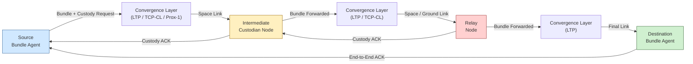

# STA 150-159 · 152-040 — Delay Tolerant Networking DTN

## §1 Purpose

This document defines the Delay-Tolerant Networking (DTN) architecture as adopted within Q+ATLANTIDE space missions, based on the CCSDS Bundle Protocol (CCSDS 720.1-G) and IETF RFC 5050.[^baseline][^ccsds720] It establishes the normative bundle-layer model, custody transfer mechanisms, convergence-layer adaptations, and the conditions under which DTN shall be selected over real-time IP networking.[^archtable] All mission network implementations requiring store-and-carry or interrupted-connectivity support shall comply with this subsubject.[^n001]

## §2 Scope

**In scope:**

- Bundle architecture: bundle agents, bundle protocol data unit (BPDU) structure, endpoint identifiers (EID), and application data units[^rfc5050]
- Custody transfer: reliability guarantee via per-hop custodian acknowledgement, custody signals, and retransmission contracts
- Convergence layers: LTP (Licklider Transmission Protocol) over space links[^rfc5326], TCP Convergence Layer (TCP-CL) for ground segments, and Proximity-1 CL for short-range proximity links
- Contact graph scheduling: planned contact windows, CGR route computation, and opportunistic contact exploitation
- Disruption causes taxonomy: orbital eclipse, signal range limits, spacecraft geometry, ground station scheduling, and link anomalies
- DTN vs. real-time IP trade criteria: latency tolerance thresholds, connectivity predictability, custody assurance requirements

**Out of scope:** Physical-layer link establishment (subsection 151), routing metric computation for IP-only paths (subsubject 003), and application-layer data formatting protocols.

## §3 Diagram

## §4 Footprint

| Attribute | Value |
|---|---|
| Architecture | Space Technology Architecture (STA) |
| Master range | 100–199 |
| Code range | 150-159 |
| Section | 05 — Comunicaciones Espaciales |
| Subsection | 152 — Redes Espaciales |
| Subsubject | 004 — Delay-Tolerant Networking DTN |
| Primary Q-Division | Q-SPACE[^qdiv] |
| Support Q-Divisions | Q-DATAGOV, Q-HPC |
| ORB support | ORB-PMO, ORB-LEG |
| Governance class | baseline[^gov] |
| Folder path | `Q+ATLANTIDE/100-199_STA/150-159_Comunicaciones-Espaciales/152_Redes-Espaciales/` |
| Document | `152-040-Delay-Tolerant-Networking-DTN.md` |
| Parent subsection | [README.md](./README.md) · [`152-000-General.md`](./152-000-General.md) |
| Parent architecture | [../../README.md](../../README.md) |
| Parent baseline | [organization/Q+ATLANTIDE.md](../../../../organization/Q+ATLANTIDE.md) |

## §5 References & Citations

[^baseline]: Q+ATLANTIDE controlled baseline (v1.0.0)
[^archtable]: §3 Architecture Table (parent)
[^qdiv]: Q-Division authority
[^gov]: Governance class — baseline
[^n001]: Note N-001 (Q+ATLANTIDE is a taxonomy/traceability ecosystem)

### Applicable industry standards

| Standard | Title |
|---|---|
| CCSDS 720.1-G | Delay-Tolerant Networking Architecture[^ccsds720] |
| RFC 5050 | Bundle Protocol Specification[^rfc5050] |
| RFC 5326 | Licklider Transmission Protocol (LTP)[^rfc5326] |
| CCSDS 702.1-B | IP over CCSDS Space Links[^ccsds702] |
| ECSS-E-ST-50C | Space engineering: Communications[^ecss50] |
| ITU-R S.1003 | Environmental protection of the geostationary-satellite orbit[^itur] |

[^ecss50]: ECSS-E-ST-50C — Space engineering: Communications
[^ccsds720]: CCSDS 720.1-G — Delay-Tolerant Networking Architecture
[^ccsds702]: CCSDS 702.1-B — IP over CCSDS Space Links
[^rfc5050]: RFC 5050 — Bundle Protocol Specification
[^rfc5326]: RFC 5326 — Licklider Transmission Protocol (LTP)
[^itur]: ITU-R S.1003 — Environmental protection of the geostationary-satellite orbit
