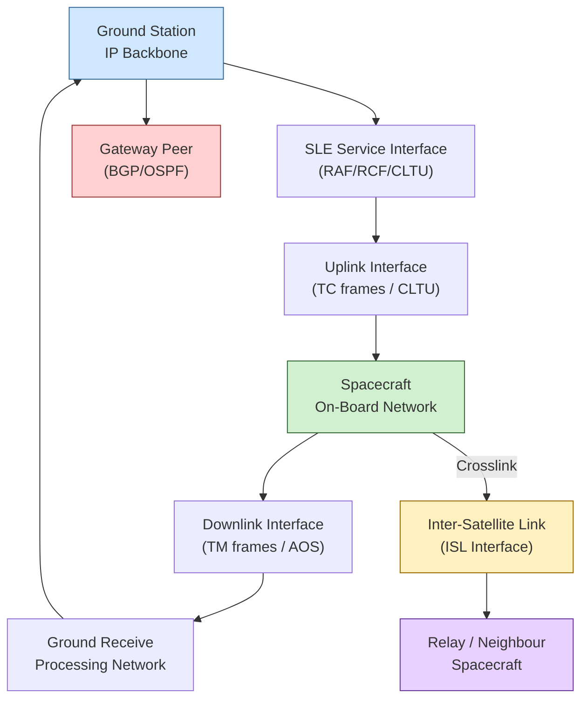

# STA 150-159 · 152-050 — Ground Space and Inter Satellite Network Interfaces

## §1 Purpose

This document defines the network interface types and Interface Control Document (ICD) requirements governing all ground-to-space, space-to-ground, and inter-satellite link (ISL) network boundaries within Q+ATLANTIDE space missions.[^baseline] It establishes the authoritative taxonomy of interface instances, their protocol responsibilities, and the minimum ICD content required for controlled baseline compliance.[^archtable] Gateway peering adaptations for terrestrial routing protocols (BGP/OSPF) at the space-ground boundary are also specified.[^n001]

## §2 Scope

**In scope:**

- Ground-to-space uplink network interface: protocol stack from ground station IP backbone through SLE service interface to spacecraft on-board network, including TM/TC framing[^ecss50]
- Space-to-ground downlink network interface: telemetry packetisation, AOS framing, and delivery to ground processing network
- Inter-satellite network crosslink interface (ISL): optical or RF crosslink, link-layer framing (AOS proximity, optical CLTUs), IP or bundle overlay
- Gateway peering adaptations: BGP/OSPF route advertisement across the space-ground boundary, AS number allocation, and route filtering policies[^ccsds702]
- Interface Control Document (ICD) requirements: mandatory sections (interface identifier, protocol stack, data rates, timing, error handling, security), review and approval process
- Interface verification testing criteria: end-to-end loopback, bit-error injection, and schedule-driven contact simulation

**Out of scope:** RF link physical parameters (subsection 151), network security cryptographic key management (subsubject 008), and application-layer service interfaces.

## §3 Diagram

## §4 Footprint

| Attribute | Value |
|---|---|
| Architecture | Space Technology Architecture (STA) |
| Master range | 100–199 |
| Code range | 150-159 |
| Section | 05 — Comunicaciones Espaciales |
| Subsection | 152 — Redes Espaciales |
| Subsubject | 005 — Ground-Space and Inter-Satellite Network Interfaces |
| Primary Q-Division | Q-SPACE[^qdiv] |
| Support Q-Divisions | Q-DATAGOV, Q-HPC |
| ORB support | ORB-PMO, ORB-LEG |
| Governance class | baseline[^gov] |
| Folder path | `Q+ATLANTIDE/100-199_STA/150-159_Comunicaciones-Espaciales/152_Redes-Espaciales/` |
| Document | `152-050-Ground-Space-and-Inter-Satellite-Network-Interfaces.md` |
| Parent subsection | [README.md](./README.md) · [`152-000-General.md`](./152-000-General.md) |
| Parent architecture | [../../README.md](../../README.md) |
| Parent baseline | [organization/Q+ATLANTIDE.md](../../../../organization/Q+ATLANTIDE.md) |

## §5 References & Citations

[^baseline]: Q+ATLANTIDE controlled baseline (v1.0.0)
[^archtable]: §3 Architecture Table (parent)
[^qdiv]: Q-Division authority
[^gov]: Governance class — baseline
[^n001]: Note N-001 (Q+ATLANTIDE is a taxonomy/traceability ecosystem)

### Applicable industry standards

| Standard | Title |
|---|---|
| ECSS-E-ST-50C | Space engineering: Communications[^ecss50] |
| CCSDS 702.1-B | IP over CCSDS Space Links[^ccsds702] |
| CCSDS 720.1-G | Delay-Tolerant Networking Architecture[^ccsds720] |
| RFC 5050 | Bundle Protocol Specification[^rfc5050] |
| RFC 5326 | Licklider Transmission Protocol (LTP)[^rfc5326] |
| ITU-R S.1003 | Environmental protection of the geostationary-satellite orbit[^itur] |

[^ecss50]: ECSS-E-ST-50C — Space engineering: Communications
[^ccsds720]: CCSDS 720.1-G — Delay-Tolerant Networking Architecture
[^ccsds702]: CCSDS 702.1-B — IP over CCSDS Space Links
[^rfc5050]: RFC 5050 — Bundle Protocol Specification
[^rfc5326]: RFC 5326 — Licklider Transmission Protocol (LTP)
[^itur]: ITU-R S.1003 — Environmental protection of the geostationary-satellite orbit
