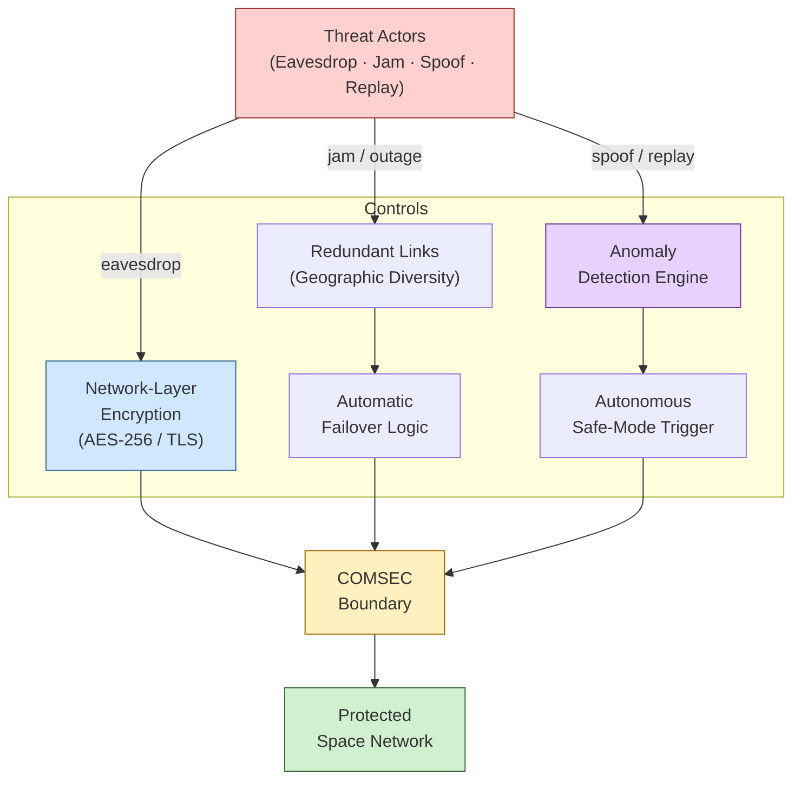

# STA 150-159 · 152-080 — Cybersecurity Resilience and Fault Tolerance

## §1 Purpose

This document defines the security and resilience architecture for Q+ATLANTIDE space networks, establishing the authoritative threat model, network-layer encryption requirements, fault-tolerance patterns, and anomaly detection mechanisms applicable to all mission network segments.[^baseline] It delineates the Q+ATLANTIDE COMSEC boundary and prescribes controls that must be implemented at every network interface to achieve the required security and availability assurance levels.[^archtable][^n001]

## §2 Scope

**In scope:**

- Threat model: eavesdropping (passive interception of telemetry/telecommand), jamming (denial of service via RF interference), spoofing (false command injection), and replay attacks (retransmission of captured valid commands)[^ecss50]
- Network-layer encryption: end-to-end encryption requirements for TC uplink and TM downlink, cipher suite selection, key distribution architecture, and COMSEC boundary definition
- Resilience patterns: redundant uplink/downlink paths (geographic diversity of ground stations), automatic link failover, cross-strapping of on-board network buses, and degraded-mode operating procedures
- Anomaly detection: network traffic baseline profiling, statistical anomaly thresholds, alert escalation paths, and autonomous safe-mode triggers
- Q+ATLANTIDE COMSEC boundary: demarcation of classified vs. unclassified network segments, crypto-boundary documentation, and COMSEC authority responsibilities
- Fault tolerance mechanisms: network watchdog timers, automatic reconfiguration, store-and-forward buffering during outages, and end-to-end retransmission upon recovery

**Out of scope:** Physical RF jamming countermeasures hardware (subsection 151), application-layer authentication tokens, and ground-segment facility physical security.

## §3 Diagram

## §4 Footprint

| Attribute | Value |
|---|---|
| Architecture | Space Technology Architecture (STA) |
| Master range | 100–199 |
| Code range | 150-159 |
| Section | 05 — Comunicaciones Espaciales |
| Subsection | 152 — Redes Espaciales |
| Subsubject | 008 — Cybersecurity, Resilience, and Fault Tolerance |
| Primary Q-Division | Q-SPACE[^qdiv] |
| Support Q-Divisions | Q-DATAGOV, Q-HPC |
| ORB support | ORB-PMO, ORB-LEG |
| Governance class | baseline[^gov] |
| Folder path | `Q+ATLANTIDE/100-199_STA/150-159_Comunicaciones-Espaciales/152_Redes-Espaciales/` |
| Document | `152-080-Cybersecurity-Resilience-and-Fault-Tolerance.md` |
| Parent subsection | [README.md](./README.md) · [`152-000-General.md`](./152-000-General.md) |
| Parent architecture | [../../README.md](../../README.md) |
| Parent baseline | [organization/Q+ATLANTIDE.md](../../../../organization/Q+ATLANTIDE.md) |

## §5 References & Citations

[^baseline]: Q+ATLANTIDE controlled baseline (v1.0.0)
[^archtable]: §3 Architecture Table (parent)
[^qdiv]: Q-Division authority
[^gov]: Governance class — baseline
[^n001]: Note N-001 (Q+ATLANTIDE is a taxonomy/traceability ecosystem)

### Applicable industry standards

| Standard | Title |
|---|---|
| ECSS-E-ST-50C | Space engineering: Communications[^ecss50] |
| NASA-STD-4005 | NASA Standard for Spectrum Management[^nasa4005] |
| CCSDS 720.1-G | Delay-Tolerant Networking Architecture[^ccsds720] |
| CCSDS 702.1-B | IP over CCSDS Space Links[^ccsds702] |
| RFC 5050 | Bundle Protocol Specification[^rfc5050] |
| RFC 5326 | Licklider Transmission Protocol (LTP)[^rfc5326] |
| ITU-R S.1003 | Environmental protection of the geostationary-satellite orbit[^itur] |

[^ecss50]: ECSS-E-ST-50C — Space engineering: Communications
[^ccsds720]: CCSDS 720.1-G — Delay-Tolerant Networking Architecture
[^ccsds702]: CCSDS 702.1-B — IP over CCSDS Space Links
[^rfc5050]: RFC 5050 — Bundle Protocol Specification
[^rfc5326]: RFC 5326 — Licklider Transmission Protocol (LTP)
[^itur]: ITU-R S.1003 — Environmental protection of the geostationary-satellite orbit
[^nasa4005]: NASA-STD-4005 — NASA Standard for Spectrum Management
