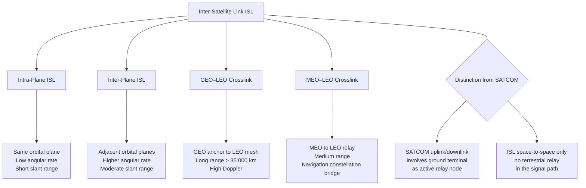

# STA 150-159 · 05.153.001 — Inter-Satellite Communication Controlled Definition

## §1 Purpose

This document establishes the controlled Q+ATLANTIDE definition of the term **Inter-Satellite Link (ISL)** and its parent concept **Inter-Satellite Communication**, as used across all STA subsections.[^baseline] It fixes the authoritative taxonomy of ISL link types recognized within the Q+ATLANTIDE register and resolves ambiguities arising from overlapping industry terminology.[^n001] All other subsection-153 documents inherit and reference this definition as their normative terminological anchor.[^qdiv]

## §2 Scope

**In scope:**

- Controlled definition of ISL as the directional radio-frequency or optical communication link between two spacecraft without terrestrial relay.
- ISL link-type taxonomy: intra-plane ISL (co-orbital plane), inter-plane ISL (adjacent orbital planes), GEO-LEO crosslink, and MEO-LEO crosslink.
- Controlled acronym: ISL (Inter-Satellite Link); recognized synonyms: crosslink, inter-sat link, space-to-space link.
- Distinction between ISL and SATCOM uplink/downlink (earth-space segment): ISLs do not involve ground terminals as active relay nodes.
- Q+ATLANTIDE ISL taxonomy hierarchy and register placement within STA 150-159 section 05.

**Out of scope:** Physical-layer technology selection (→ 003), link-budget methodology (→ 007), and routing architecture (→ 005).

## §3 Diagram

## §4 Footprint

| Field | Value |
|-------|-------|
| Architecture | Space Technology Architecture (STA) |
| Master range | 100–199 |
| Code range | 150-159 |
| Section | 05 — Comunicaciones Espaciales |
| Subsection | 153 — Comunicación Intersatélite |
| Subsubject | 001 — Inter-Satellite Communication Controlled Definition |
| Primary Q-Division | Q-SPACE |
| Support Q-Divisions | Q-DATAGOV, Q-HPC |
| ORB support | ORB-PMO, ORB-LEG |
| Governance class | baseline |
| Folder path | `Q+ATLANTIDE/100-199_STA/150-159_Comunicaciones-Espaciales/153_Comunicacion-Intersatelite/` |
| Document | `001_Inter-Satellite-Communication-Controlled-Definition.md` |
| Parent subsection | [README.md](./README.md) · [000_Overview.md](./000_Overview.md) |
| Parent architecture | [../../README.md](../../README.md) |
| Parent baseline | [organization/Q+ATLANTIDE.md](../../../../organization/Q+ATLANTIDE.md) |

## §5 References & Citations

[^baseline]: Q+ATLANTIDE controlled baseline (v1.0.0)
[^archtable]: §3 Architecture Table (parent)
[^qdiv]: Q-Division authority
[^gov]: Governance class — baseline
[^ecss50]: ECSS-E-ST-50C — Space engineering: Communications
[^ccsds401]: CCSDS 401.0-B — Radio Frequency and Modulation Systems
[^ccsds141]: CCSDS 141.0-B — Optical Communications
[^ccsds131]: CCSDS 131.0-B — TM Synchronization and Channel Coding
[^itur]: ITU-R F.1491 — Inter-satellite link characteristics
[^nasa4005]: NASA-STD-4005 — LEO Spacecraft Charging Design Standard
[^n001]: Note N-001 (Q+ATLANTIDE is a taxonomy/traceability ecosystem)

### Applicable industry standards

| Standard | Title | Relevance |
|----------|-------|-----------|
| ECSS-E-ST-50C | Space engineering: Communications | Normative ISL terminology source |
| ITU-R F.1491 | Inter-satellite link characteristics | ISL type classification basis |
| CCSDS 401.0-B | Radio Frequency and Modulation Systems | RF-ISL link type definitions |
| ITU-R V.431 | Nomenclature of the frequency and wavelength bands | Frequency-band designation for ISL types |
