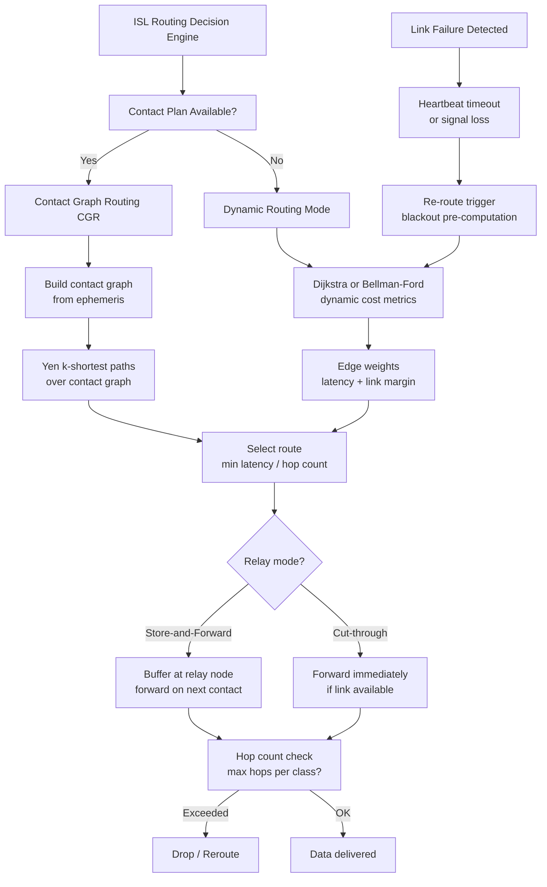

# STA 150-159 · 05.153.005 — Routing, Relay, and Mesh Network Patterns

## §1 Purpose

This document defines the constellation-level ISL routing architecture within Q+ATLANTIDE, specifying the algorithms, policies, and resilience mechanisms used to forward data across a satellite mesh network.[^baseline] It covers both deterministic contact-graph routing and dynamic shortest-path algorithms adapted for a time-varying topology.[^archtable] These routing definitions interface with the time-synchronization architecture (→ 006) and security resilience boundaries (→ 008).[^qdiv]

## §2 Scope

**In scope:**

- Contact Graph Routing (CGR): Delay-Tolerant Networking (DTN) routing over pre-computed contact plans; contact graph construction from ephemeris data; route selection via Yen's k-shortest paths over the contact graph.
- Dijkstra and Bellman-Ford adaptation for dynamic ISL topology: cost metrics (latency, hop count, link margin), time-varying edge weight updates, convergence behaviour under link churn.
- Relay hop count policy: maximum hop count per Q+ATLANTIDE ISL class; store-and-forward vs. cut-through relay mode selection criteria.
- Mesh resilience and re-routing triggers: link failure detection (heartbeat timeout, signal loss), automatic re-route invocation, blackout-period pre-computation, and graceful degradation under N-1 link failure.

**Out of scope:** Physical-layer link establishment (→ 003), APT tracking loop (→ 004), time synchronization (→ 006).

## §3 Diagram

## §4 Footprint

| Field | Value |
|-------|-------|
| Architecture | Space Technology Architecture (STA) |
| Master range | 100–199 |
| Code range | 150-159 |
| Section | 05 — Comunicaciones Espaciales |
| Subsection | 153 — Comunicación Intersatélite |
| Subsubject | 005 — Routing, Relay, and Mesh Network Patterns |
| Primary Q-Division | Q-SPACE |
| Support Q-Divisions | Q-DATAGOV, Q-HPC |
| ORB support | ORB-PMO, ORB-LEG |
| Governance class | baseline |
| Folder path | `Q+ATLANTIDE/100-199_STA/150-159_Comunicaciones-Espaciales/153_Comunicacion-Intersatelite/` |
| Document | `005_Routing-Relay-and-Mesh-Network-Patterns.md` |
| Parent subsection | [README.md](./README.md) · [000_Overview.md](./000_Overview.md) |
| Parent architecture | [../../README.md](../../README.md) |
| Parent baseline | [organization/Q+ATLANTIDE.md](../../../../organization/Q+ATLANTIDE.md) |

## §5 References & Citations

[^baseline]: Q+ATLANTIDE controlled baseline (v1.0.0)
[^archtable]: §3 Architecture Table (parent)
[^qdiv]: Q-Division authority
[^gov]: Governance class — baseline
[^ecss50]: ECSS-E-ST-50C — Space engineering: Communications
[^ccsds401]: CCSDS 401.0-B — Radio Frequency and Modulation Systems
[^ccsds141]: CCSDS 141.0-B — Optical Communications
[^ccsds131]: CCSDS 131.0-B — TM Synchronization and Channel Coding
[^itur]: ITU-R F.1491 — Inter-satellite link characteristics
[^nasa4005]: NASA-STD-4005 — LEO Spacecraft Charging Design Standard
[^n001]: Note N-001 (Q+ATLANTIDE is a taxonomy/traceability ecosystem)

### Applicable industry standards

| Standard | Title | Relevance |
|----------|-------|-----------|
| CCSDS 131.0-B | TM Synchronization and Channel Coding | ISL channel layer underpinning routing |
| CCSDS 132.0-B | TM Space Data Link Protocol | Space data link framing for ISL relay |
| ECSS-E-ST-50C | Space engineering: Communications | ISL network routing framework |
| ITU-R F.1491 | Inter-satellite link characteristics | ISL contact parameters for CGR |
