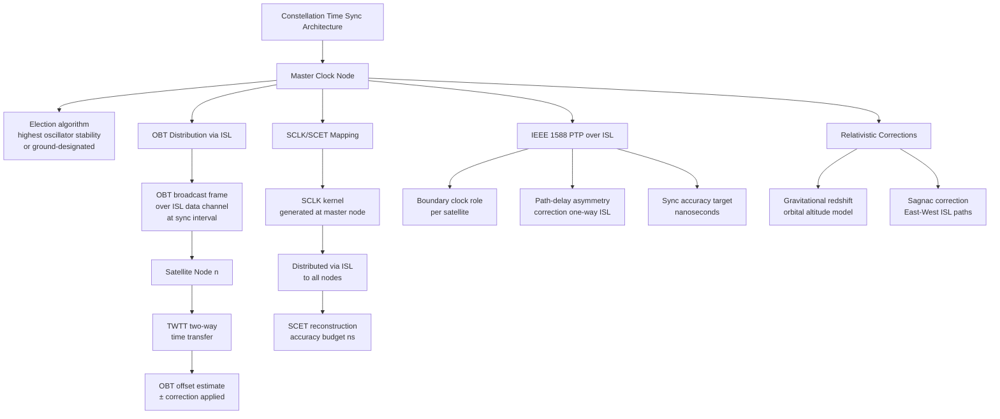

# STA 150-159 · 05.153.006 — Time Synchronization and Constellation Coordination

## §1 Purpose

This document defines the time-synchronization architecture for Q+ATLANTIDE ISL-connected constellations, specifying how on-board time (OBT) is distributed, validated, and corrected across the satellite mesh without reliance on GPS.[^baseline] It establishes the mapping between spacecraft clock (SCLK) and spacecraft event time (SCET), the application of IEEE 1588 Precision Time Protocol (PTP) over ISL, and the relativistic clock correction model.[^archtable] These definitions are foundational prerequisites for contact-graph routing (→ 005) and evidence lifecycle governance (→ 010).[^qdiv]

## §2 Scope

**In scope:**

- On-board time (OBT) distribution via ISL: master-clock node election, OBT broadcast frame format, and synchronization interval policy.
- GPS-free constellation synchronization: cross-satellite two-way time transfer (TWTT), OBT offset estimation, and holdover oscillator drift budget.
- SCLK/SCET mapping: spacecraft clock correlation record (SCLK kernel) generation, distribution via ISL, and SCET reconstruction accuracy budget.
- IEEE 1588 PTP over ISL: boundary clock and transparent clock roles per satellite, path-delay asymmetry correction for one-way ISL propagation, synchronization accuracy target (nanoseconds).
- Relativistic clock correction: gravitational redshift model for orbital altitude, Sagnac effect correction for East-West ISL paths.

**Out of scope:** ISL routing algorithms (→ 005), security authentication of time messages (→ 008), ground-segment time correlation (outside subsection 153).

## §3 Diagram

## §4 Footprint

| Field | Value |
|-------|-------|
| Architecture | Space Technology Architecture (STA) |
| Master range | 100–199 |
| Code range | 150-159 |
| Section | 05 — Comunicaciones Espaciales |
| Subsection | 153 — Comunicación Intersatélite |
| Subsubject | 006 — Time Synchronization and Constellation Coordination |
| Primary Q-Division | Q-SPACE |
| Support Q-Divisions | Q-DATAGOV, Q-HPC |
| ORB support | ORB-PMO, ORB-LEG |
| Governance class | baseline |
| Folder path | `Q+ATLANTIDE/100-199_STA/150-159_Comunicaciones-Espaciales/153_Comunicacion-Intersatelite/` |
| Document | `006_Time-Synchronization-and-Constellation-Coordination.md` |
| Parent subsection | [README.md](./README.md) · [000_Overview.md](./000_Overview.md) |
| Parent architecture | [../../README.md](../../README.md) |
| Parent baseline | [organization/Q+ATLANTIDE.md](../../../../organization/Q+ATLANTIDE.md) |

## §5 References & Citations

[^baseline]: Q+ATLANTIDE controlled baseline (v1.0.0)
[^archtable]: §3 Architecture Table (parent)
[^qdiv]: Q-Division authority
[^gov]: Governance class — baseline
[^ecss50]: ECSS-E-ST-50C — Space engineering: Communications
[^ccsds401]: CCSDS 401.0-B — Radio Frequency and Modulation Systems
[^ccsds141]: CCSDS 141.0-B — Optical Communications
[^ccsds131]: CCSDS 131.0-B — TM Synchronization and Channel Coding
[^itur]: ITU-R F.1491 — Inter-satellite link characteristics
[^nasa4005]: NASA-STD-4005 — LEO Spacecraft Charging Design Standard
[^n001]: Note N-001 (Q+ATLANTIDE is a taxonomy/traceability ecosystem)

### Applicable industry standards

| Standard | Title | Relevance |
|----------|-------|-----------|
| CCSDS 131.0-B | TM Synchronization and Channel Coding | On-board time synchronization framing |
| ECSS-E-ST-50C | Space engineering: Communications | ISL time distribution framework |
| IEEE 1588-2019 | Precision Time Protocol (PTP) | PTP-over-ISL boundary and transparent clock |
| CCSDS 301.0-B | Time Code Formats | SCLK/SCET mapping formats |
| ITU-R F.1491 | Inter-satellite link characteristics | ISL propagation delay for TWTT |
