# STA 150-159 · 05.153.008 — Security, Authentication, and Resilience Boundaries

## §1 Purpose

This document defines the ISL security architecture and COMSEC boundaries within Q+ATLANTIDE, establishing the threat model, authentication mechanisms, link-layer encryption requirements, and resilience policies applicable to all ISL implementations in STA subsection 153.[^baseline] It specifies the boundary between the secured ISL segment and other constellation elements and integrates with the routing resilience policies (→ 005) and evidence documentation (→ 010).[^archtable] The definitions herein are the normative security reference for ISL ICD content and security-assessment documentation.[^qdiv]

## §2 Scope

**In scope:**

- ISL-specific threat model: crosslink hijacking (unauthorized node insertion), ISL spoofing (false telemetry injection), jamming (denial-of-service via RF or optical dazzling), and side-channel attacks (timing analysis of ISL traffic patterns).
- Authentication mechanisms: PKI-based mutual authentication (X.509 certificates distributed via secure ground uplink) and pre-shared key (PSK) fallback for autonomous ISL establishment; key rotation policy.
- Link-layer encryption: AES-256-GCM or equivalent for ISL frame payload; key management lifecycle; IV/nonce management to prevent reuse across ISL sessions.
- Resilience: redundant ISL path activation on authenticated link failure; topology re-routing as per policy (→ 005); blackout-safe key holdover period.
- Q+ATLANTIDE COMSEC boundary definition: identifies the ISL segment boundary, trust domain for each satellite node, and inter-domain authentication handshake.

**Out of scope:** Ground segment security, uplink/downlink COMSEC (outside subsection 153), payload encryption (payload layer).

## §3 Diagram

```mermaid
flowchart TD
    A[ISL Security Architecture] --> B[Threat Model]
    B --> B1[Crosslink hijacking\nunauthorized node insertion]
    B --> B2[ISL spoofing\nfalse TM injection]
    B --> B3[Jamming\nRF or optical dazzling]
    B --> B4[Side-channel\ntiming pattern analysis]

    A --> C[Authentication Layer]
    C --> C1[PKI mutual auth\nX.509 certs from ground]
    C --> C2[PSK fallback\nautonomous ISL]
    C --> C3[Key rotation policy]

    A --> D[Link-Layer Encryption]
    D --> D1[AES-256-GCM\nISL frame payload]
    D --> D2[Key lifecycle\nIV / nonce management]

    A --> E[COMSEC Boundary]
    E --> E1[ISL segment boundary]
    E --> E2[Trust domain per node]
    E --> E3[Inter-domain auth\nhandshake]

    A --> F[Resilience]
    F --> F1[Redundant ISL path\non authenticated failure]
    F --> F2[Topology re-routing\nper routing policy]
    F --> F3[Blackout-safe\nkey holdover period]
```

## §4 Footprint

| Field | Value |
|-------|-------|
| Architecture | Space Technology Architecture (STA) |
| Master range | 100–199 |
| Code range | 150-159 |
| Section | 05 — Comunicaciones Espaciales |
| Subsection | 153 — Comunicación Intersatélite |
| Subsubject | 008 — Security, Authentication, and Resilience Boundaries |
| Primary Q-Division | Q-SPACE |
| Support Q-Divisions | Q-DATAGOV, Q-HPC |
| ORB support | ORB-PMO, ORB-LEG |
| Governance class | baseline |
| Folder path | `Q+ATLANTIDE/100-199_STA/150-159_Comunicaciones-Espaciales/153_Comunicacion-Intersatelite/` |
| Document | `008_Security-Authentication-and-Resilience-Boundaries.md` |
| Parent subsection | [README.md](./README.md) · [000_Overview.md](./000_Overview.md) |
| Parent architecture | [../../README.md](../../README.md) |
| Parent baseline | [organization/Q+ATLANTIDE.md](../../../../organization/Q+ATLANTIDE.md) |

## §5 References & Citations

[^baseline]: Q+ATLANTIDE controlled baseline (v1.0.0)
[^archtable]: §3 Architecture Table (parent)
[^qdiv]: Q-Division authority
[^gov]: Governance class — baseline
[^ecss50]: ECSS-E-ST-50C — Space engineering: Communications
[^ccsds401]: CCSDS 401.0-B — Radio Frequency and Modulation Systems
[^ccsds141]: CCSDS 141.0-B — Optical Communications
[^ccsds131]: CCSDS 131.0-B — TM Synchronization and Channel Coding
[^itur]: ITU-R F.1491 — Inter-satellite link characteristics
[^nasa4005]: NASA-STD-4005 — LEO Spacecraft Charging Design Standard
[^n001]: Note N-001 (Q+ATLANTIDE is a taxonomy/traceability ecosystem)

### Applicable industry standards

| Standard | Title | Relevance |
|----------|-------|-----------|
| MIL-STD-188-164 | Interoperability of SHF Satellite Communications | ISL COMSEC boundary and encryption |
| ECSS-E-ST-50C | Space engineering: Communications | ISL security architecture framework |
| NASA-STD-4005 | LEO Spacecraft Charging Design Standard | ISL hardware resilience environment |
| CCSDS 401.0-B | Radio Frequency and Modulation Systems | RF-ISL jamming and interference model |
| ITU-R F.1491 | Inter-satellite link characteristics | ISL frequency security and coordination |
