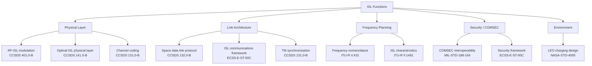

# STA 150-159 · 05.153.009 — CCSDS, ECSS, ITU, and NASA Standards Mapping

## §1 Purpose

This document maps each ISL function defined within Q+ATLANTIDE STA subsection 153 to its applicable international standards, providing a traceability bridge between the Q+ATLANTIDE architecture register and the normative bodies (CCSDS, ECSS, ITU-R, and NASA).[^baseline] It serves as the single point of reference for compliance claims and ICD normative sections across all ISL subsubjects.[^archtable] Standards mapped here are the normative basis for evidence items defined in the lifecycle governance document (→ 010).[^qdiv]

## §2 Scope

**In scope:**

- ECSS-E-ST-50C mapping: ISL communications architecture, link layer, and system-level requirements.
- CCSDS 401.0-B mapping: RF-ISL modulation, frequency, and link management.
- CCSDS 141.0-B mapping: optical-ISL physical layer, terminal design, and pointing loss allocation.
- CCSDS 131.0-B and 132.0-B mapping: channel coding, synchronization, and space data link protocol for ISL frames.
- ITU-R V.431 (frequency and wavelength nomenclature) and ITU-R F.1491 (ISL characteristics) mapping: frequency planning, coordination, and propagation.
- NASA-STD-4005 mapping: LEO charging environment for ISL hardware design.
- MIL-STD-188-164 mapping: ISL COMSEC and interoperability requirements.

**Out of scope:** Ground segment standards, launcher interface standards, payload-specific standards outside the ISL subsystem boundary.

## §3 Diagram

## §4 Footprint

| Field | Value |
|-------|-------|
| Architecture | Space Technology Architecture (STA) |
| Master range | 100–199 |
| Code range | 150-159 |
| Section | 05 — Comunicaciones Espaciales |
| Subsection | 153 — Comunicación Intersatélite |
| Subsubject | 009 — CCSDS, ECSS, ITU, and NASA Standards Mapping |
| Primary Q-Division | Q-SPACE |
| Support Q-Divisions | Q-DATAGOV, Q-HPC |
| ORB support | ORB-PMO, ORB-LEG |
| Governance class | baseline |
| Folder path | `Q+ATLANTIDE/100-199_STA/150-159_Comunicaciones-Espaciales/153_Comunicacion-Intersatelite/` |
| Document | `009_CCSDS-ECSS-ITU-and-NASA-Standards-Mapping.md` |
| Parent subsection | [README.md](./README.md) · [000_Overview.md](./000_Overview.md) |
| Parent architecture | [../../README.md](../../README.md) |
| Parent baseline | [organization/Q+ATLANTIDE.md](../../../../organization/Q+ATLANTIDE.md) |

## §5 References & Citations

[^baseline]: Q+ATLANTIDE controlled baseline (v1.0.0)
[^archtable]: §3 Architecture Table (parent)
[^qdiv]: Q-Division authority
[^gov]: Governance class — baseline
[^ecss50]: ECSS-E-ST-50C — Space engineering: Communications
[^ccsds401]: CCSDS 401.0-B — Radio Frequency and Modulation Systems
[^ccsds141]: CCSDS 141.0-B — Optical Communications
[^ccsds131]: CCSDS 131.0-B — TM Synchronization and Channel Coding
[^itur]: ITU-R F.1491 — Inter-satellite link characteristics
[^nasa4005]: NASA-STD-4005 — LEO Spacecraft Charging Design Standard
[^n001]: Note N-001 (Q+ATLANTIDE is a taxonomy/traceability ecosystem)

### Applicable industry standards

| Standard | Title | Relevance |
|----------|-------|-----------|
| ECSS-E-ST-50C | Space engineering: Communications | Master ISL communications standard |
| CCSDS 401.0-B | Radio Frequency and Modulation Systems | RF-ISL modulation and link management |
| CCSDS 141.0-B | Optical Communications | Optical-ISL physical layer |
| CCSDS 131.0-B | TM Synchronization and Channel Coding | ISL channel coding and sync |
| CCSDS 132.0-B | TM Space Data Link Protocol | ISL space data link framing |
| ITU-R V.431 | Nomenclature of frequency and wavelength bands | ISL frequency band designation |
| ITU-R F.1491 | Inter-satellite link characteristics | ISL propagation and coordination |
| NASA-STD-4005 | LEO Spacecraft Charging Design Standard | ISL hardware environment |
| MIL-STD-188-164 | Interoperability of SHF Satellite Communications | ISL COMSEC and interoperability |
