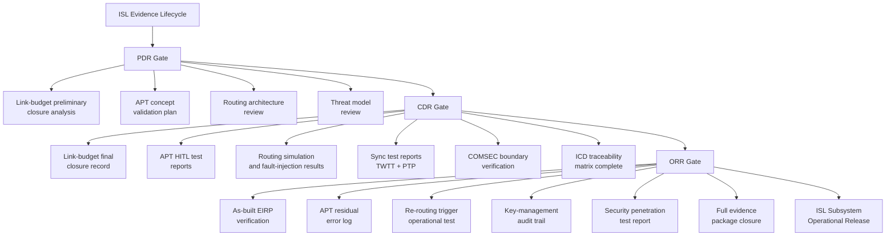

# STA 150-159 · 05.153.010 — Traceability, Evidence, and Lifecycle Governance

## §1 Purpose

This document defines the evidence-package requirements, ICD traceability model, and review-gate governance framework for all ISL subsystem elements within Q+ATLANTIDE STA subsection 153.[^baseline] It specifies which evidence artefacts must be produced, at which lifecycle review gate, and by which Q-Division authority, ensuring closure of the ISL design and verification record.[^archtable] This document is the governance capstone for subsection 153 and integrates outputs from all preceding subsubjects (001–009) into a unified lifecycle evidence trail.[^qdiv]

## §2 Scope

**In scope:**

- ISL link-budget evidence package: link-budget calculation sheets, margin closure records, and as-built EIRP verification reports, traceable to subsubject 007.
- APT validation records: hardware-in-the-loop (HITL) APT test reports, residual pointing error measurement logs, and closed-loop bandwidth verification, traceable to subsubject 004.
- Routing test evidence: contact-graph routing simulation reports, re-routing trigger test records, and mesh resilience fault-injection test results, traceable to subsubject 005.
- Synchronization test reports: TWTT accuracy measurements, PTP-over-ISL conformance test reports, and holdover drift validation, traceable to subsubject 006.
- Security assessment documentation: ISL threat-model assessment, penetration test reports, COMSEC boundary verification, and key-management audit trail, traceable to subsubject 008.
- ICD traceability matrix: mapping of each ISL interface requirement to its verification method (analysis, inspection, test, demonstration) and evidence artefact.
- Review gates: PDR (Preliminary Design Review), CDR (Critical Design Review), and ORR (Operational Readiness Review) entry and exit criteria for ISL subsystem elements.

**Out of scope:** Mission-level review governance (ORB-PMO domain), ground segment ICD content, payload data content verification.

## §3 Diagram

## §4 Footprint

| Field | Value |
|-------|-------|
| Architecture | Space Technology Architecture (STA) |
| Master range | 100–199 |
| Code range | 150-159 |
| Section | 05 — Comunicaciones Espaciales |
| Subsection | 153 — Comunicación Intersatélite |
| Subsubject | 010 — Traceability, Evidence, and Lifecycle Governance |
| Primary Q-Division | Q-SPACE |
| Support Q-Divisions | Q-DATAGOV, Q-HPC |
| ORB support | ORB-PMO, ORB-LEG |
| Governance class | baseline |
| Folder path | `Q+ATLANTIDE/100-199_STA/150-159_Comunicaciones-Espaciales/153_Comunicacion-Intersatelite/` |
| Document | `010_Traceability-Evidence-and-Lifecycle-Governance.md` |
| Parent subsection | [README.md](./README.md) · [000_Overview.md](./000_Overview.md) |
| Parent architecture | [../../README.md](../../README.md) |
| Parent baseline | [organization/Q+ATLANTIDE.md](../../../../organization/Q+ATLANTIDE.md) |

## §5 References & Citations

[^baseline]: Q+ATLANTIDE controlled baseline (v1.0.0)
[^archtable]: §3 Architecture Table (parent)
[^qdiv]: Q-Division authority
[^gov]: Governance class — baseline
[^ecss50]: ECSS-E-ST-50C — Space engineering: Communications
[^ccsds401]: CCSDS 401.0-B — Radio Frequency and Modulation Systems
[^ccsds141]: CCSDS 141.0-B — Optical Communications
[^ccsds131]: CCSDS 131.0-B — TM Synchronization and Channel Coding
[^itur]: ITU-R F.1491 — Inter-satellite link characteristics
[^nasa4005]: NASA-STD-4005 — LEO Spacecraft Charging Design Standard
[^n001]: Note N-001 (Q+ATLANTIDE is a taxonomy/traceability ecosystem)

### Applicable industry standards

| Standard | Title | Relevance |
|----------|-------|-----------|
| ECSS-E-ST-50C | Space engineering: Communications | ISL lifecycle evidence framework |
| ECSS-E-ST-10-02C | Space engineering: Verification | ISL verification method taxonomy |
| CCSDS 401.0-B | Radio Frequency and Modulation Systems | RF-ISL evidence parameters |
| CCSDS 141.0-B | Optical Communications | Optical-ISL evidence parameters |
| NASA-STD-4005 | LEO Spacecraft Charging Design Standard | ISL hardware evidence environment |
| MIL-STD-188-164 | Interoperability of SHF Satellite Communications | ISL COMSEC evidence requirements |
