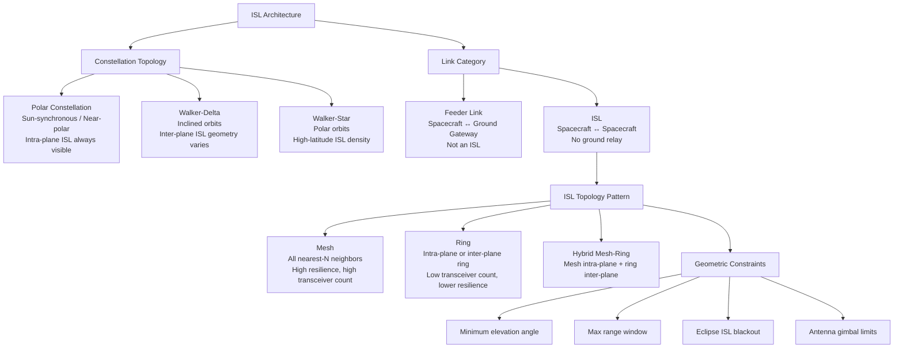

# STA 150-159 · 153-020 — ISL Architecture and Link Topology

## §1 Purpose

This document defines the system-level ISL architecture including the constellation topology patterns recognized by Q+ATLANTIDE and the geometric constraints governing ISL link availability.[^baseline] It distinguishes feeder links (satellite-to-ground) from ISLs (satellite-to-satellite) and establishes the topological vocabulary—mesh, ring, and hybrid—used throughout the subsection.[^archtable] The architecture definitions here serve as the structural foundation for physical-layer (→ 003), routing (→ 005), and link-budget (→ 007) subsubjects.[^qdiv]

## §2 Scope

**In scope:**

- Constellation topology classes: polar constellation (sun-synchronous, near-polar), Walker-delta (inclined), and Walker-star (polar), with ISL availability windows per topology.
- Feeder link vs. ISL distinction: feeder links connect spacecraft to ground gateways; ISLs connect spacecraft to spacecraft without ground involvement.
- Mesh topology: all-to-nearest-N neighbor ISL connectivity, multi-hop routing capability, high resilience.
- Ring topology: intra-plane and inter-plane ring structures, reduced transceiver count, single-failure vulnerability.
- Inter-plane link geometry constraints: minimum elevation angle, maximum range window, eclipse-induced ISL blackout periods, and antenna gimbal travel limits.

**Out of scope:** Physical-layer technology (→ 003), APT control loop (→ 004), routing algorithms (→ 005).

## §3 Diagram

## §4 Footprint

| Field | Value |
|-------|-------|
| Architecture | Space Technology Architecture (STA) |
| Master range | 100–199 |
| Code range | 150-159 |
| Section | 05 — Comunicaciones Espaciales |
| Subsection | 153 — Comunicación Intersatélite |
| Subsubject | 002 — ISL Architecture and Link Topology |
| Primary Q-Division | Q-SPACE |
| Support Q-Divisions | Q-DATAGOV, Q-HPC |
| ORB support | ORB-PMO, ORB-LEG |
| Governance class | baseline |
| Folder path | `Q+ATLANTIDE/100-199_STA/150-159_Comunicaciones-Espaciales/153_Comunicacion-Intersatelite/` |
| Document | `153-020-ISL-Architecture-and-Link-Topology.md` |
| Parent subsection | [README.md](./README.md) · [`153-000-General.md`](./153-000-General.md) |
| Parent architecture | [../../README.md](../../README.md) |
| Parent baseline | [organization/Q+ATLANTIDE.md](../../../../organization/Q+ATLANTIDE.md) |

## §5 References & Citations

[^baseline]: Q+ATLANTIDE controlled baseline (v1.0.0)
[^archtable]: §3 Architecture Table (parent)
[^qdiv]: Q-Division authority
[^gov]: Governance class — baseline
[^ecss50]: ECSS-E-ST-50C — Space engineering: Communications
[^ccsds401]: CCSDS 401.0-B — Radio Frequency and Modulation Systems
[^ccsds141]: CCSDS 141.0-B — Optical Communications
[^ccsds131]: CCSDS 131.0-B — TM Synchronization and Channel Coding
[^itur]: ITU-R F.1491 — Inter-satellite link characteristics
[^nasa4005]: NASA-STD-4005 — LEO Spacecraft Charging Design Standard
[^n001]: Note N-001 (Q+ATLANTIDE is a taxonomy/traceability ecosystem)

### Applicable industry standards

| Standard | Title | Relevance |
|----------|-------|-----------|
| ECSS-E-ST-50C | Space engineering: Communications | ISL architecture framework |
| ITU-R F.1491 | Inter-satellite link characteristics | ISL topology and geometry |
| CCSDS 401.0-B | Radio Frequency and Modulation Systems | RF-ISL system architecture |
| NASA-STD-4005 | LEO Spacecraft Charging Design Standard | Constellation environment constraints |
