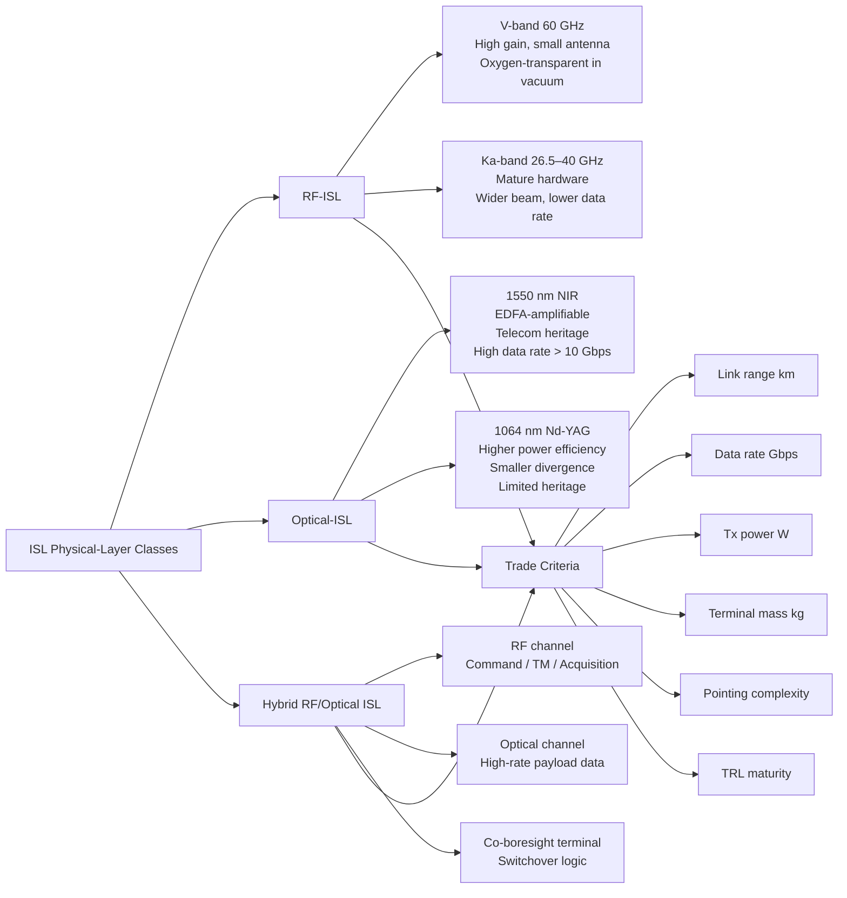

# STA 150-159 · 153-030 — RF Optical and Hybrid ISL Classes

## §1 Purpose

This document defines the physical-layer technology classes applicable to Q+ATLANTIDE ISL implementations, classifying them into RF-ISL, Optical-ISL, and Hybrid-ISL categories.[^baseline] It provides the key performance parameters, wavelength or frequency assignments, and trade criteria necessary for ISL technology selection.[^archtable] These class definitions feed directly into the link-budget methodology (→ 007) and the APT requirements (→ 004).[^qdiv]

## §2 Scope

**In scope:**

- RF-ISL class: V-band (60 GHz, oxygen-absorption-free in space), Ka-band (26.5–40 GHz); characteristics including antenna gain, atmospheric immunity in vacuum, multipath behaviour, and regulatory frequency assignment per ITU-R.
- Optical-ISL class: near-infrared 1550 nm (telecom-compatible, EDFA amplifiable) and 1064 nm (Nd:YAG, higher power efficiency); characteristics including divergence angle, beam-width, background noise, and terminal mass.
- Hybrid RF/optical ISL: RF for command/telemetry and acquisition; optical for high-rate payload data transfer; switchover logic and co-boresight requirements.
- Technology selection trade criteria: link range (km), achievable data rate (Gbps), transmit power budget (W), terminal mass (kg), pointing complexity, and TRL maturity.

**Out of scope:** APT control loop implementation (→ 004), link-budget calculations (→ 007), frequency coordination with ITU (→ 009).

## §3 Diagram

## §4 Footprint

| Field | Value |
|-------|-------|
| Architecture | Space Technology Architecture (STA) |
| Master range | 100–199 |
| Code range | 150-159 |
| Section | 05 — Comunicaciones Espaciales |
| Subsection | 153 — Comunicación Intersatélite |
| Subsubject | 003 — RF, Optical, and Hybrid ISL Classes |
| Primary Q-Division | Q-SPACE |
| Support Q-Divisions | Q-DATAGOV, Q-HPC |
| ORB support | ORB-PMO, ORB-LEG |
| Governance class | baseline |
| Folder path | `Q+ATLANTIDE/100-199_STA/150-159_Comunicaciones-Espaciales/153_Comunicacion-Intersatelite/` |
| Document | `153-030-RF-Optical-and-Hybrid-ISL-Classes.md` |
| Parent subsection | [README.md](./README.md) · [`153-000-General.md`](./153-000-General.md) |
| Parent architecture | [../../README.md](../../README.md) |
| Parent baseline | [organization/Q+ATLANTIDE.md](../../../../organization/Q+ATLANTIDE.md) |

## §5 References & Citations

[^baseline]: Q+ATLANTIDE controlled baseline (v1.0.0)
[^archtable]: §3 Architecture Table (parent)
[^qdiv]: Q-Division authority
[^gov]: Governance class — baseline
[^ecss50]: ECSS-E-ST-50C — Space engineering: Communications
[^ccsds401]: CCSDS 401.0-B — Radio Frequency and Modulation Systems
[^ccsds141]: CCSDS 141.0-B — Optical Communications
[^ccsds131]: CCSDS 131.0-B — TM Synchronization and Channel Coding
[^itur]: ITU-R F.1491 — Inter-satellite link characteristics
[^nasa4005]: NASA-STD-4005 — LEO Spacecraft Charging Design Standard
[^n001]: Note N-001 (Q+ATLANTIDE is a taxonomy/traceability ecosystem)

### Applicable industry standards

| Standard | Title | Relevance |
|----------|-------|-----------|
| CCSDS 141.0-B | Optical Communications | Optical-ISL physical layer class |
| CCSDS 401.0-B | Radio Frequency and Modulation Systems | RF-ISL modulation and frequency class |
| ITU-R F.1491 | Inter-satellite link characteristics | ISL frequency and performance parameters |
| ITU-R V.431 | Nomenclature of frequency and wavelength bands | V-band and Ka-band designations |
| ECSS-E-ST-50C | Space engineering: Communications | ISL technology class framework |
