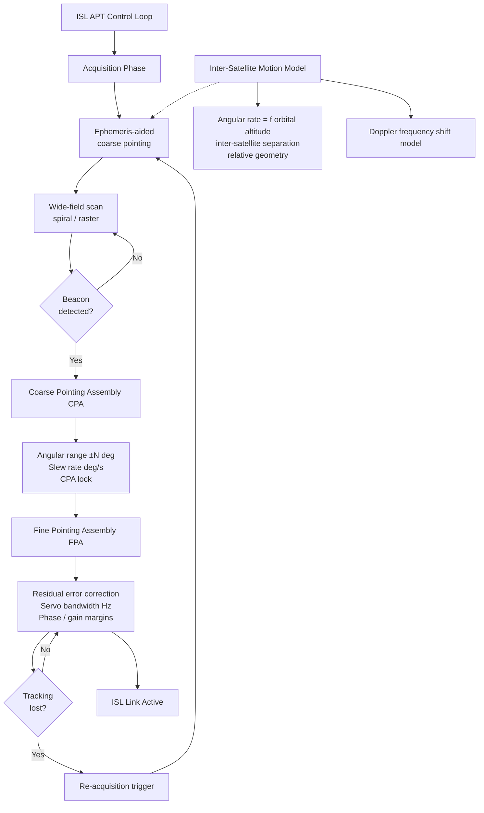

# STA 150-159 · 153-040 — Crosslink Pointing Acquisition and Tracking

## §1 Purpose

This document specifies the Acquisition, Pointing, and Tracking (APT) architecture for ISL crosslinks within the Q+ATLANTIDE framework, addressing both RF-ISL beam steering and optical-ISL fine-pointing terminal control.[^baseline] It establishes the inter-satellite motion model, pointing-residual error budget, and closed-loop tracking bandwidth requirements needed to maintain ISL availability.[^archtable] The APT definitions here are prerequisite inputs for link-budget calculations (→ 007) and security resilience analysis (→ 008).[^qdiv]

## §2 Scope

**In scope:**

- Beacon acquisition strategy: wide-field scan (spiral, raster, stochastic) followed by beacon lock and transition to tracking mode; re-acquisition trigger conditions.
- Coarse pointing assembly (CPA) and fine pointing assembly (FPA) architecture: angular range, resolution, and slew rate allocation for CPA; residual error correction and bandwidth allocation for FPA.
- Inter-satellite motion model: angular rate (deg/s) as a function of orbital altitude, inter-satellite separation, and relative orbital geometry; Doppler frequency shift model.
- Pointing residual budget: allocation across star-tracker noise, structural thermo-elastic distortion, CPA quantization, and FPA closed-loop error.
- Closed-loop tracking bandwidth: servo bandwidth (Hz) vs. platform vibration spectrum; stability margins (phase and gain).

**Out of scope:** ISL technology class selection (→ 003), link-budget margin allocation (→ 007), routing topology (→ 005).

## §3 Diagram

## §4 Footprint

| Field | Value |
|-------|-------|
| Architecture | Space Technology Architecture (STA) |
| Master range | 100–199 |
| Code range | 150-159 |
| Section | 05 — Comunicaciones Espaciales |
| Subsection | 153 — Comunicación Intersatélite |
| Subsubject | 004 — Crosslink Pointing, Acquisition, and Tracking |
| Primary Q-Division | Q-SPACE |
| Support Q-Divisions | Q-DATAGOV, Q-HPC |
| ORB support | ORB-PMO, ORB-LEG |
| Governance class | baseline |
| Folder path | `Q+ATLANTIDE/100-199_STA/150-159_Comunicaciones-Espaciales/153_Comunicacion-Intersatelite/` |
| Document | `153-040-Crosslink-Pointing-Acquisition-and-Tracking.md` |
| Parent subsection | [README.md](./README.md) · [`153-000-General.md`](./153-000-General.md) |
| Parent architecture | [../../README.md](../../README.md) |
| Parent baseline | [organization/Q+ATLANTIDE.md](../../../../organization/Q+ATLANTIDE.md) |

## §5 References & Citations

[^baseline]: Q+ATLANTIDE controlled baseline (v1.0.0)
[^archtable]: §3 Architecture Table (parent)
[^qdiv]: Q-Division authority
[^gov]: Governance class — baseline
[^ecss50]: ECSS-E-ST-50C — Space engineering: Communications
[^ccsds401]: CCSDS 401.0-B — Radio Frequency and Modulation Systems
[^ccsds141]: CCSDS 141.0-B — Optical Communications
[^ccsds131]: CCSDS 131.0-B — TM Synchronization and Channel Coding
[^itur]: ITU-R F.1491 — Inter-satellite link characteristics
[^nasa4005]: NASA-STD-4005 — LEO Spacecraft Charging Design Standard
[^n001]: Note N-001 (Q+ATLANTIDE is a taxonomy/traceability ecosystem)

### Applicable industry standards

| Standard | Title | Relevance |
|----------|-------|-----------|
| CCSDS 141.0-B | Optical Communications | Optical-ISL APT requirements |
| ECSS-E-ST-50C | Space engineering: Communications | ISL APT system framework |
| CCSDS 401.0-B | Radio Frequency and Modulation Systems | RF-ISL beam acquisition and tracking |
| ITU-R F.1491 | Inter-satellite link characteristics | Pointing loss allocation in ISL budget |
