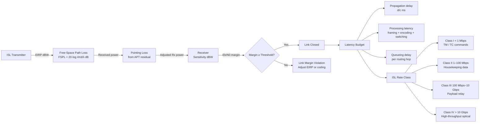

# STA 150-159 · 153-070 — Link Budget Latency and Data Rate Classes

## §1 Purpose

This document defines the ISL link-budget methodology and data-rate taxonomy used throughout Q+ATLANTIDE STA subsection 153, providing a controlled framework for ISL performance analysis.[^baseline] It decomposes the end-to-end latency budget into propagation and processing contributors and establishes the four Q+ATLANTIDE ISL rate classes (Class I–IV).[^archtable] The methodology defined here is the normative reference for evidence-package content (→ 010) and is informed by the physical-layer parameters (→ 003) and APT losses (→ 004).[^qdiv]

## §2 Scope

**In scope:**

- ISL link-budget chain: transmit EIRP (dBW), free-space path loss (FSPL = 20·log(4πd/λ) dB), pointing loss (derived from APT residual, → 004), atmospheric loss (negligible in vacuum), receiver sensitivity (dBW), and received Eb/N0 margin.
- Latency budget decomposition: one-way propagation delay (d/c ms), on-board processing latency (framing, encoding, switching), and queueing delay per routing hop.
- Q+ATLANTIDE ISL data-rate class taxonomy: Class I (< 1 Mbps, TM/TC), Class II (1–100 Mbps, housekeeping data), Class III (100 Mbps–10 Gbps, payload data relay), Class IV (> 10 Gbps, high-throughput optical).
- Link margin requirements per class: minimum Eb/N0 margin (dB) vs. modulation order and coding rate.

**Out of scope:** Physical-layer technology selection (→ 003), routing algorithm design (→ 005), security overhead impact on throughput (→ 008).

## §3 Diagram

## §4 Footprint

| Field | Value |
|-------|-------|
| Architecture | Space Technology Architecture (STA) |
| Master range | 100–199 |
| Code range | 150-159 |
| Section | 05 — Comunicaciones Espaciales |
| Subsection | 153 — Comunicación Intersatélite |
| Subsubject | 007 — Link Budget, Latency, and Data-Rate Classes |
| Primary Q-Division | Q-SPACE |
| Support Q-Divisions | Q-DATAGOV, Q-HPC |
| ORB support | ORB-PMO, ORB-LEG |
| Governance class | baseline |
| Folder path | `Q+ATLANTIDE/100-199_STA/150-159_Comunicaciones-Espaciales/153_Comunicacion-Intersatelite/` |
| Document | `153-070-Link-Budget-Latency-and-Data-Rate-Classes.md` |
| Parent subsection | [README.md](./README.md) · [`153-000-General.md`](./153-000-General.md) |
| Parent architecture | [../../README.md](../../README.md) |
| Parent baseline | [organization/Q+ATLANTIDE.md](../../../../organization/Q+ATLANTIDE.md) |

## §5 References & Citations

[^baseline]: Q+ATLANTIDE controlled baseline (v1.0.0)
[^archtable]: §3 Architecture Table (parent)
[^qdiv]: Q-Division authority
[^gov]: Governance class — baseline
[^ecss50]: ECSS-E-ST-50C — Space engineering: Communications
[^ccsds401]: CCSDS 401.0-B — Radio Frequency and Modulation Systems
[^ccsds141]: CCSDS 141.0-B — Optical Communications
[^ccsds131]: CCSDS 131.0-B — TM Synchronization and Channel Coding
[^itur]: ITU-R F.1491 — Inter-satellite link characteristics
[^nasa4005]: NASA-STD-4005 — LEO Spacecraft Charging Design Standard
[^n001]: Note N-001 (Q+ATLANTIDE is a taxonomy/traceability ecosystem)

### Applicable industry standards

| Standard | Title | Relevance |
|----------|-------|-----------|
| CCSDS 401.0-B | Radio Frequency and Modulation Systems | RF-ISL EIRP and modulation parameters |
| CCSDS 141.0-B | Optical Communications | Optical-ISL link budget parameters |
| CCSDS 131.0-B | TM Synchronization and Channel Coding | Coding gain in link-budget margin |
| ITU-R F.1491 | Inter-satellite link characteristics | ISL FSPL and frequency allocation |
| ECSS-E-ST-50C | Space engineering: Communications | ISL link-budget methodology framework |
