# STA 160-169 · Section 06 · Subsection 160 — Cargas Útiles

## 1. Purpose

Overview entry-point for the *Cargas Útiles* subsection (`160`), establishing the payload framework within the Q+ATLANTIDE STA band. This document introduces the full subsubject structure — controlled definitions, payload classes, scientific/communication/EO/navigation payloads, interface control, operations/calibration/commissioning, standards mapping, and lifecycle governance — and is designated **mission-payload critical** per the parent subsection safety boundary.

## 2. Scope

- Covers the Payloads slice of parent code range `160-169`, establishing what constitutes a payload in Q+ATLANTIDE STA-band spacecraft and distinguishing payload from bus subsystems per ECSS-E-ST-10C mission analysis conventions.
- Inherits Q-Division authority and ORB support from the parent row in [`../../README.md` §3](../../README.md#3-architecture-table).
- **Payloads Controlled Definition** (`001`) — normative boundary of payloads within STA, payload vs. platform (bus) distinction, safety classification.
- **Payload Classes and Mission Roles** (`002`) — taxonomy of payload types: scientific, communication relay, EO/remote sensing, navigation/timing, technology demonstration.
- **Scientific Payloads and Instruments** (`003`) — astrophysics, heliophysics, planetary, geophysics instrument suites; calibration evidence requirements.
- **Communication Payloads and Relay Functions** (`004`) — transponders, bent-pipe relays, regenerative payloads, frequency plans, EIRP/G-T budgets.
- **Earth Observation and Remote Sensing Payloads** (`005`) — optical imagers, SAR, hyperspectral sensors, radiometers; ground sampling distance, swath.
- **Navigation, Timing and Positioning Payloads** (`006`) — GNSS signal generation, atomic clocks, timing accuracy budgets.
- **Payload Interfaces: Power, Data, Thermal and Mechanical** (`007`) — electrical power interfaces, data buses (SpaceWire, MIL-STD-1553), thermal control interfaces, mechanical mounting and alignment.
- **Payload Operations, Calibration and Commissioning** (`008`) — operational modes, in-orbit calibration procedures, commissioning sequences.
- **ECSS-NASA-CCSDS Payload Standards Mapping** (`009`) — standards hierarchy for payload design and verification.
- **Traceability, Evidence and Lifecycle Governance** (`010`) — requirements traceability, evidence gates, lifecycle records.

## 3. Diagram — Payload Subsection Map

```mermaid
flowchart TD
    A["160 — Cargas Útiles / Payloads"]:::first
    A --> B["001 — Payloads Controlled Definition"]
    A --> C["002 — Payload Classes and Mission Roles"]
    A --> D["003 — Scientific Payloads and Instruments"]
    A --> E["004 — Communication Payloads and Relay Functions"]
    A --> F["005 — Earth Observation and Remote Sensing Payloads"]
    A --> G["006 — Navigation, Timing and Positioning Payloads"]
    A --> H["007 — Payload Interfaces: Power, Data, Thermal and Mechanical"]
    A --> I["008 — Payload Operations, Calibration and Commissioning"]
    A --> J["009 — ECSS-NASA-CCSDS Payload Standards Mapping"]
    A --> K["010 — Traceability, Evidence and Lifecycle Governance"]:::last

    classDef first fill:#1f3a93,color:#fff
    classDef last fill:#0f7a0f,color:#fff
```

## 4. Footprint

| Metric | Value |
|---|---|
| Architecture | `STA` — Space Technology Architecture |
| Master range | `100–199` |
| Code range | `160-169` |
| Section | `06` — Sensores y Carga Útil Espacial |
| Subsection | `160` — Cargas Útiles |
| Subsubject | `000` — Overview |
| Primary Q-Division | Q-SPACE[^qdiv] |
| ORB support | ORB-PMO, ORB-MKTG |
| Governance class | `baseline`[^gov] |
| Document | `000_Overview.md` (this file) |
| Parent subsection | [`README.md`](./README.md) |

## 5. References & Citations

[^qdiv]: **Q-Division authority** — See [`organization/Q+ATLANTIDE.md` §4](../../../../organization/Q+ATLANTIDE.md#4-notes).

[^gov]: **Governance class** — `baseline`.

### Applicable industry standards

| Standard | Title | Applicability |
|---|---|---|
| ECSS-E-ST-10C | Space engineering — System engineering general requirements | Mission analysis, payload definition boundary |
| ECSS-E-ST-20C | Space engineering — Electrical and electronic | Power interface requirements |
| ECSS-E-ST-31C | Space engineering — Thermal control general requirements | Thermal interface requirements |
| ECSS-E-ST-50C | Space engineering — Communications | Communication payload requirements |
| CCSDS 131.0-B | TM Synchronization and Channel Coding | Telemetry data standards |
| NASA-HDBK-8739.23 | NASA Payload Safety Policy and Requirements Handbook | Payload safety classification |
