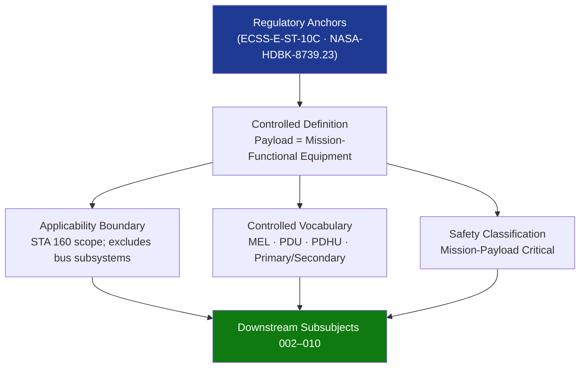

# STA 160-169 · Section 06 · Subsection 160 · Subsubject 001 — Payloads Controlled Definition

## 1. Purpose

Establishes the normative definition and controlled scope of space payloads within the Q+ATLANTIDE STA band, per the ECSS-E-ST-10C mission analysis framework. This document defines the authoritative vocabulary and applicability boundary that all downstream subsubjects (`002`–`010`) shall reference.

## 2. Scope

- **Controlled definition** — a payload is defined as the mission-functional equipment installed on a spacecraft whose primary purpose is the execution of the designated mission objective, as distinct from the platform (bus) subsystems providing power, attitude control, thermal regulation, and structural support.
- **Applicability boundary** — STA 160 covers payload systems on Q+ATLANTIDE STA-band platforms; excludes avionics (→ `141`), bus power (→ `133`), platform thermal (→ `130`), and propulsion (→ `132`).
- **Controlled vocabulary** — terms *payload*, *bus*, *mission equipment list (MEL)*, *payload data unit (PDU)*, *payload data handling unit (PDHU)*, *primary payload*, and *secondary payload* are defined normatively and shall be used consistently across the STA 160 subsubject set.
- **Safety classification** — all STA 160 payloads are classified as mission-payload critical, requiring formal safety review, hazard identification, and mitigation evidence per NASA-HDBK-8739.23.
- **Interface boundaries** — payload interfaces with avionics (`141`), on-board software (`142`), mission control (`143`), and instruments (`161`) shall be governed by a formally released Interface Control Document (ICD) at each project CDR gate.

## 3. Diagram — Payload Definition Framework

## 4. Footprint

| Metric | Value |
|---|---|
| Architecture | `STA` — Space Technology Architecture |
| Master range | `100–199` |
| Code range | `160-169` |
| Section | `06` — Sensores y Carga Útil Espacial |
| Subsection | `160` — Cargas Útiles |
| Subsubject | `001` — Payloads Controlled Definition |
| Primary Q-Division | Q-SPACE[^qdiv] |
| ORB support | ORB-PMO, ORB-MKTG |
| Governance class | `baseline`[^gov] |
| Document | `001_Payloads-Controlled-Definition.md` (this file) |
| Parent subsection | [`README.md`](./README.md) · [`000_Overview.md`](./000_Overview.md) |

## 5. References & Citations

[^qdiv]: **Q-Division authority** — See [`organization/Q+ATLANTIDE.md` §4](../../../../organization/Q+ATLANTIDE.md#4-notes).

[^gov]: **Governance class** — `baseline`.

### Applicable industry standards

| Standard | Title | Applicability |
|---|---|---|
| ECSS-E-ST-10C | Space engineering — System engineering general requirements | Mission analysis framework; payload vs. bus definition |
| NASA-HDBK-8739.23 | NASA Payload Safety Policy and Requirements Handbook | Safety classification; hazard identification requirements |
