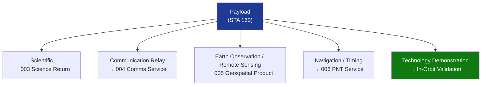

# STA 160-169 · Section 06 · Subsection 160 · Subsubject 002 — Payload Classes and Mission Roles

## 1. Purpose

Establishes the taxonomy of space payload classes and their associated mission roles within Q+ATLANTIDE STA-band spacecraft, providing the classification framework that underpins accommodation, resource allocation, and redundancy planning across all payload subsubjects.

## 2. Scope

- **Five payload classes** — scientific, communication relay, Earth observation/remote sensing, navigation/timing, and technology demonstration; each class is assigned a normative identifier and linked to its detailed subsubject.
- **Mission role mapping** — each class is mapped to its primary mission objective: science return (`003`), communications service (`004`), geospatial product (`005`), positioning/timing service (`006`), and in-orbit validation (`technology demonstration`).
- **Primary vs. secondary payload distinction** — primary payloads drive mission-critical resource allocation; secondary payloads operate within the residual resource envelope and are not permitted to degrade primary payload performance.
- **Payload accommodation constraints** — mass, power, volume, and pointing requirements are declared per class and linked to platform-level mass and power budgets; accommodation feasibility shall be confirmed at PDR.
- **Redundancy strategies** — redundancy approach (cold standby, hot standby, functional redundancy) is specified per class based on mission criticality; scientific instruments may accept lower redundancy if replacement is not operationally required.

## 3. Diagram — Payload Class Taxonomy

## 4. Footprint

| Metric | Value |
|---|---|
| Architecture | `STA` — Space Technology Architecture |
| Master range | `100–199` |
| Code range | `160-169` |
| Section | `06` — Sensores y Carga Útil Espacial |
| Subsection | `160` — Cargas Útiles |
| Subsubject | `002` — Payload Classes and Mission Roles |
| Primary Q-Division | Q-SPACE[^qdiv] |
| ORB support | ORB-PMO, ORB-MKTG |
| Governance class | `baseline`[^gov] |
| Document | `002_Payload-Classes-and-Mission-Roles.md` (this file) |
| Parent subsection | [`README.md`](./README.md) · [`000_Overview.md`](./000_Overview.md) |

## 5. References & Citations

[^qdiv]: **Q-Division authority** — See [`organization/Q+ATLANTIDE.md` §4](../../../../organization/Q+ATLANTIDE.md#4-notes).

[^gov]: **Governance class** — `baseline`.

### Applicable industry standards

| Standard | Title | Applicability |
|---|---|---|
| ECSS-E-ST-10C | Space engineering — System engineering general requirements | Mission analysis, payload accommodation feasibility |
| NASA-HDBK-8739.23 | NASA Payload Safety Policy and Requirements Handbook | Redundancy requirements per criticality class |
