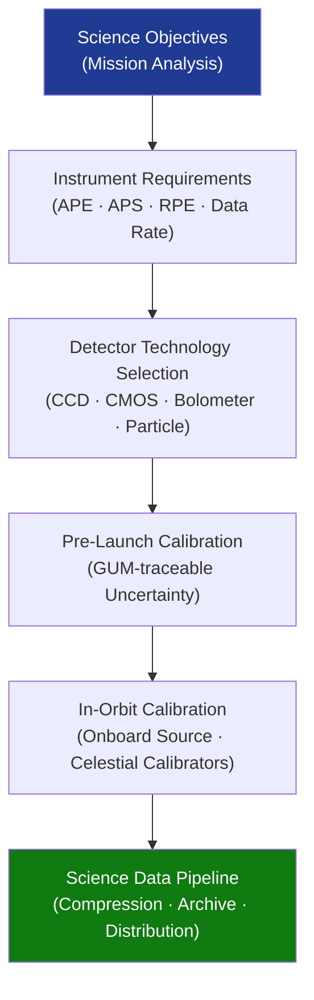

# STA 160-169 · Section 06 · Subsection 160 · Subsubject 003 — Scientific Payloads and Instruments

## 1. Purpose

Defines requirements and design constraints for scientific payloads and instruments on Q+ATLANTIDE STA-band spacecraft, covering instrument suite categories, detector technology selection, calibration evidence, pointing requirements, and data pipeline considerations essential for science return.

## 2. Scope

- **Instrument suite categories** — astrophysics (X-ray/UV/optical/IR telescopes), heliophysics (magnetometers, energetic particle detectors, solar wind analysers), planetary (mass spectrometers, radar altimeters, descent imagers), and in-situ geophysics (seismometers, gravimeters); each category carries specific environmental tolerance and cleanliness requirements.
- **Detector technologies** — charge-coupled devices (CCD), CMOS active pixel sensors, bolometric detector arrays, scintillator/photomultiplier assemblies, and solid-state particle detectors; selection criteria include quantum efficiency, dark current, radiation tolerance, and operating temperature range.
- **Calibration evidence requirements** — pre-launch calibration shall produce a traceable calibration database with uncertainties quantified per BIPM JCGM 100:2008 (GUM); in-orbit calibration shall be demonstrated via onboard calibration sources, star-tracker cross-calibration, or celestial standard observations.
- **Pointing knowledge and stability requirements** — absolute pointing error (APE), absolute pointing stability (APS), and relative pointing error (RPE) shall be allocated per instrument line-of-sight accuracy budget and verified against ECSS-E-ST-10-03C testing requirements; pointing budget shall cover mechanical alignment, AOCS residual error, and thermal distortion contributions.
- **Data volume and compression** — science data rates and onboard storage requirements shall be declared in the mission data budget; lossless and lossy compression schemes shall be evaluated for compliance with science data quality objectives.

## 3. Diagram — Scientific Payload Design Flow

## 4. Footprint

| Metric | Value |
|---|---|
| Architecture | `STA` — Space Technology Architecture |
| Master range | `100–199` |
| Code range | `160-169` |
| Section | `06` — Sensores y Carga Útil Espacial |
| Subsection | `160` — Cargas Útiles |
| Subsubject | `003` — Scientific Payloads and Instruments |
| Primary Q-Division | Q-SPACE[^qdiv] |
| ORB support | ORB-PMO, ORB-MKTG |
| Governance class | `baseline`[^gov] |
| Document | `003_Scientific-Payloads-and-Instruments.md` (this file) |
| Parent subsection | [`README.md`](./README.md) · [`000_Overview.md`](./000_Overview.md) |

## 5. References & Citations

[^qdiv]: **Q-Division authority** — See [`organization/Q+ATLANTIDE.md` §4](../../../../organization/Q+ATLANTIDE.md#4-notes).

[^gov]: **Governance class** — `baseline`.

### Applicable industry standards

| Standard | Title | Applicability |
|---|---|---|
| ECSS-E-ST-10C | Space engineering — System engineering general requirements | Instrument requirements allocation |
| ECSS-E-ST-10-03C | Space engineering — Testing | Pointing verification testing |
| NASA-HDBK-8739.23 | NASA Payload Safety Policy and Requirements Handbook | Instrument safety requirements |
| BIPM JCGM 100:2008 | Evaluation of measurement data — Guide to the Expression of Uncertainty in Measurement (GUM) | Calibration uncertainty quantification |
