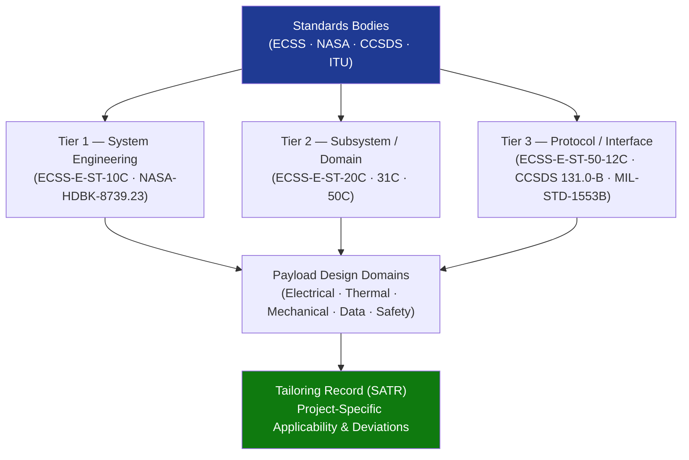

# STA 160-169 · Section 06 · Subsection 160 · Subsubject 009 — ECSS-NASA-CCSDS Payload Standards Mapping

## 1. Purpose

Maps applicable ECSS, NASA, and CCSDS standards to payload design, verification, and operational domains within Q+ATLANTIDE STA 160, providing a consolidated standards reference matrix and applicability decision logic for Q+ATLANTIDE project teams.

## 2. Scope

- **Mission analysis standards** — ECSS-E-ST-10C establishes the system engineering framework for payload requirements derivation, mission scenario analysis, and design-to-requirements traceability; all STA 160 payloads shall cite ECSS-E-ST-10C as the primary system engineering authority.
- **Electrical and electronic standards** — ECSS-E-ST-20C governs electrical power interface design, EMC/EMI compliance, and EEE parts selection; payload PCBs, harness, and connectors shall comply with ECSS-Q-ST-70C for materials and processes.
- **Thermal control standards** — ECSS-E-ST-31C mandates thermal mathematical model delivery, thermal vacuum test requirements, and operational temperature qualification margins; all payload units shall comply with ECSS-E-ST-31C Annex A test levels.
- **Communications and data standards** — ECSS-E-ST-50C and ECSS-E-ST-50-12C (SpaceWire) govern communication payload design and payload data interfaces; CCSDS 131.0-B establishes telemetry synchronisation, channel coding, and link margin methodology for downlink budgets.
- **Payload safety standards** — NASA-HDBK-8739.23 provides the payload safety policy, hazard analysis methodology, safety review structure, and safety classification criteria; ESA ECSS-Q-ST-40C (safety) supplements for European-context missions.
- **Standards hierarchy and applicability decision matrix** — ECSS standards apply as mandatory for ESA and ESA-affiliated missions; NASA standards apply for NASA-partnership missions; CCSDS standards apply across all missions using CCSDS protocols; in case of conflict, the higher-tier standard takes precedence; tailoring deviations shall be formally approved and documented.
- **Tailoring guidance** — Q+ATLANTIDE project teams shall document all tailoring decisions in the project's Standards Applicability and Tailoring Record (SATR); any reduction in a mandatory requirement shall be evidenced by a risk assessment and formal deviation approval.

## 3. Diagram — Standards Hierarchy for Payloads

## 4. Footprint

| Metric | Value |
|---|---|
| Architecture | `STA` — Space Technology Architecture |
| Master range | `100–199` |
| Code range | `160-169` |
| Section | `06` — Sensores y Carga Útil Espacial |
| Subsection | `160` — Cargas Útiles |
| Subsubject | `009` — ECSS-NASA-CCSDS Payload Standards Mapping |
| Primary Q-Division | Q-SPACE[^qdiv] |
| ORB support | ORB-PMO, ORB-MKTG |
| Governance class | `baseline`[^gov] |
| Document | `009_ECSS-NASA-CCSDS-Payload-Standards-Mapping.md` (this file) |
| Parent subsection | [`README.md`](./README.md) · [`000_Overview.md`](./000_Overview.md) |

## 5. References & Citations

[^qdiv]: **Q-Division authority** — See [`organization/Q+ATLANTIDE.md` §4](../../../../organization/Q+ATLANTIDE.md#4-notes).

[^gov]: **Governance class** — `baseline`.

### Applicable industry standards

| Standard | Title | Applicability |
|---|---|---|
| ECSS-E-ST-10C | Space engineering — System engineering general requirements | Primary system engineering authority |
| ECSS-E-ST-20C | Space engineering — Electrical and electronic | Electrical/electronic design and EMC compliance |
| ECSS-E-ST-31C | Space engineering — Thermal control general requirements | Thermal design and test |
| ECSS-E-ST-50C | Space engineering — Communications | Communication and data interface design |
| ECSS-E-ST-50-12C | Space engineering — SpaceWire | SpaceWire interface standard |
| CCSDS 131.0-B | TM Synchronization and Channel Coding | Telemetry, downlink channel coding |
| NASA-HDBK-8739.23 | NASA Payload Safety Policy and Requirements Handbook | Payload safety analysis and classification |
